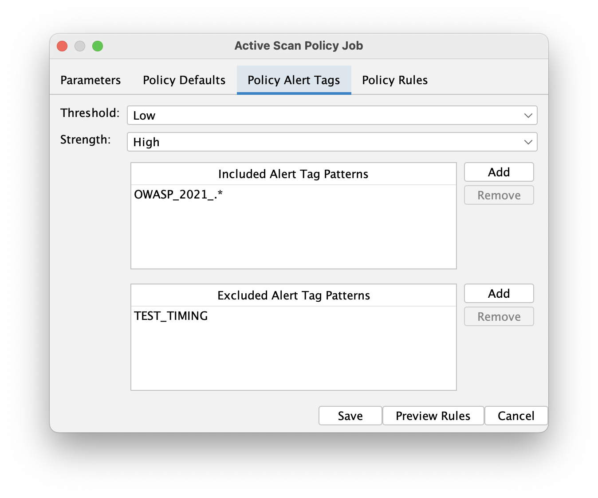

ZAP's automation framework is getting a powerful new feature that will make configuring scan policies much more intuitive and maintainable.
In addition to manually specifying individual scan rule IDs, you can now configure policies using alert tags to target specific categories of vulnerabilities.

## What are Alert Tags?

Alert tags are metadata associated with ZAP's scan rules that categorize them by various characteristics.
For example, rules might be tagged with `OWASP_2021_A01`, `PCI_DSS`, or `TEST_TIMING`.

A full list of alert tags on the default scan rules is available [here](/alerttags/).
It's also very easy to add custom alert tags to your own scan rules (e.g. via [scan rule script metadata](/blog/2024-07-17-script-scan-rules/)).

## Scan Policies

The new feature adds an `alertTags` section to policy definitions in both `activeScan` and `activeScan-policy` jobs. This allows you to:

- **Include rules by tags**: Specify patterns to include scan rules that match certain alert tags
- **Exclude rules by tags**: Exclude specific rules from your included set
- **Set strength and threshold**: Configure attack strength and alert threshold for the matched rules, overriding the default policy settings
- **Use regex patterns**: Support for regular expressions in tag matching for flexible rule selection

## Configuration Example

Here's how you can configure a scan policy using alert tags:

```yaml
jobs:
  - type: activeScan-policy
    parameters:
      name: all non-timing OWASP top 10 rules
    policyDefinition:
      defaultStrength: medium
      defaultThreshold: "off" # Disable all rules by default
      alertTags:
        include:
          - "OWASP_.*" # All OWASP Top 10 Rules
        exclude:
          - "TEST_TIMING" # Exclude timing related rules
        strength: high
        threshold: low
      rules:
        # You can still specify individual rules alongside alert tags, and these take precedence
        - id: 40012
          name: "Cross Site Scripting (Reflected)"
          strength: medium
          threshold: "off"
```

## How It Works

When ZAP processes the policy definition:

1. **Default behaviour**: All rules start with the default strength and threshold settings. We expect the default threshold to be set to `Off` in most cases.
2. **Alert tag processing**: Rules matching the `include` patterns are enabled with the specified alert tag strength and threshold, and rules matching any `exclude` pattern are removed from the included set. For a full list of default alert tags, see [Alert Tags](/alerttags/).
3. **Individual rule overrides**: Explicitly listed rules under the `rules` section take precedence over alert tag settings and policy defaults.

This hierarchy ensures that you have full control while benefiting from the convenience of tag-based selection.

## GUI Support

The feature also includes GUI support with a new "Policy Alert Tags" tab in the Automation Framework Active Scan dialogs. This provides:

- Visual interface for managing included and excluded tag patterns
- Dropdown lists populated with available alert tags from active scan rules
- Validation of regular expression patterns
- Easy addition and removal of tag patterns
- A `Preview Rules` button to preview the effective rules after applying the configured policy



## Availability

This feature has been released and is available in [version 0.52.0](https://github.com/zaproxy/zap-extensions/releases/tag/automation-v0.52.0) of the Automation Framework add-on.

The feature enhances ZAP's automation capabilities while maintaining backward compatibility with existing policy configurations. Your current `rules` sections will continue to work exactly as before.

If you have any thoughts, comments, or questions about this feature, [get in touch](/community/).
