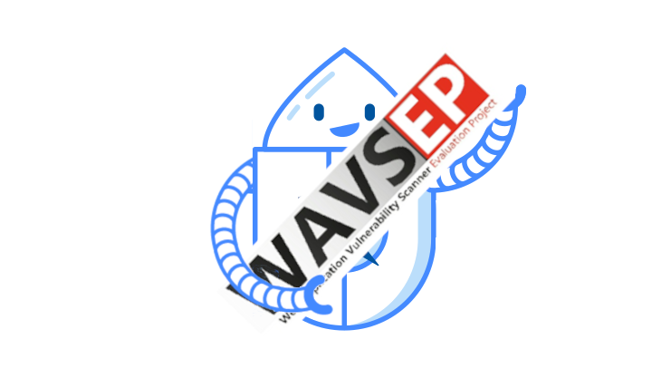

As mentioned in the [last monthly update](/blog/2025-09-02-zap-updates-august-2025/#zap-fork-of-wavsep) ZAP is adopting WAVSEP.
By that we mean that we have forked it and will be maintaining our own version going forwards.

You can find our fork at https://github.com/zaproxy/wavsep

We are also publishing the results of running [ZAP vs WAVSEP](/docs/scans/wavsep/).

### What is WAVSEP?
WAVSEP is the Web Application Vulnerability Scanner Evaluation Project.

It was created by Shay Chen: https://github.com/sectooladdict/wavsep

### Why Are We Adopting it?

Not surprisingly ZAP has a large number of unit tests in order to validate that our active and passive scan rules do what they should (along with the other parts of ZAP of course).

However, we have always been very aware that code can work differently in different environments, and just
because our rules pass all of the Unit Tests that doesn't mean that they can find the same vulnerabilities when used against a live app.

We do run regular [Test Scans](/docs/scans/) but there is no one well maintained app that covers all of the tests we want to perform.

We considered creating a new test app, but in the end WAVSEP essentially does what we want and has a good 
set of initial tests that it would take a significant amount of effort to reproduce.

### How to Get Involved

Our fork of WAVSEP, like ZAP, is a community project and so contributions are very welcome.

One advantage of WAVSEP is that it has very good documentation stating exactly what each vulnerability is
and giving example payloads which should demonstrate them.

As you will see below we found that many of the tests broke when updating the project, but those were easy to diagnose with some manual testing.

Feel free to raise issues or submit PRs.

### What Have We Done So Far

The rest of this post gives more details of the changes we have made to WAVSEP so far.

#### Updated Java and Tomcat

WAVSEP had not been changed for 12 years, and so it was using old versions of Java and Tomcat.
Our first job was to update these to Java 17 and Tomcat 9.

#### Published Docker Image

There are various examples online for running WAVSEP using Docker Compose.

We decided against using one of those as we really wanted a single docker image that can be easily pulled 
and run anywhere.

So we using a single [Dockerfile](https://github.com/zaproxy/wavsep/blob/main/Dockerfile) and publish the image at https://hub.docker.com/r/zaproxy/wavsep.

#### Fixed Broken SQL Injection Tests

When we first ran ZAP against the updated WAVSEP it failed to find a large number of "vulnerabilities".
This was surprising as we know that ZAP worked well against WAVSEP a few years ago.

It turned out that many of the SQL Injection tests were effectively broken by the Java update.
The code was assuming that a successful SQL injection attack would result in a 
`com.mysql.jdbc.exceptions.jdbc4.MySQLSyntaxErrorException` exception, whereas now the code throws
`java.sql.SQLSyntaxErrorException`.
A global find-and-replace fixed the tests, and as a result the ZAP SQL injection results improved significantly.

#### Flagged Broken Path Traversal Tests

Another set of tests that ZAP did badly against were the Path Traversal ones.
Again, manual testing showed that the tests were broken, this time by the Tomcat update.

Tomcat now blocks some requests with `Invalid character found in the request target`.
This "secure by default" setting makes a lot of sense .. unless you are trying to implement a deliberately insecure application :unamused:.

For now we have flagged the tests we know do not work as ":warning: Broken" in the [results we publish](/docs/scans/wavsep/).

There is a currently open [issue](https://github.com/zaproxy/wavsep/issues/6) for looking into fixing them.

#### Tried the ZAP SQL Time Based Rules

As you will see we are currently only using the basic [SQL Injection](/docs/alerts/40018/) rule at the moment.

We did try using the [SQL Injection - MySQL (Time Based)](/docs/alerts/40019/) rule as well, but surprisingly this resulted in ZAP scoring much worse for SQL Injection detection.

Once more it turns out that this was a problem with the tests, and potentially one that has been there for a long time.

We could see that when running the basic SQL Injection rule on its own then ZAP was able to make a very large number of requests against WAVSEP in a short period of time.
Once the Time Based rule started the number of requests dropped dramatically.

Manual testing confirmed that this was a problem with WAVSEP rather than with ZAP: once it started slowing
down then any requests that resulted in DB calls took significantly longer, even ones that did not use
timing attacks.

So what was happening was that the timing attacks destabilised WAVSEP to such an extent that it impacted the other (apparently unrelated) SQL Injection tests.

One possibility we considered was that the code leaking too many resources.
We changed all of the code to using the Java "try with resources" pattern but that did not solve the issue.

For now we have reverted to using just non timing based attacks.

#### Ported Some Reinforced Wavsep Tests

A few years ago another team forked WAVSEP and created [Reinforced-Wavsep](https://github.com/luigiurbano/Reinforced-Wavsep). We were hoping that this project would keep going, but again progress on it appears to have stalled.

We did consider forking it but we were not happy with all of the changes that were made on this fork.

Instead we plan to evaluate all of the main changes and port them across if we think they provide real value.

We have already ported the following sets of tests:

* OS Command Injection
* XML External Entity

### Conclusion

As you will have seen, adopting an old project is not always simple, and just because ZAP doesn't find specific 
vulnerabilities does not mean that the problem is with ZAP.

As WAVSEP is specifically designed to test web application scanners we do not expect it to be widely used,
but we do hope that some of you will find it useful.
