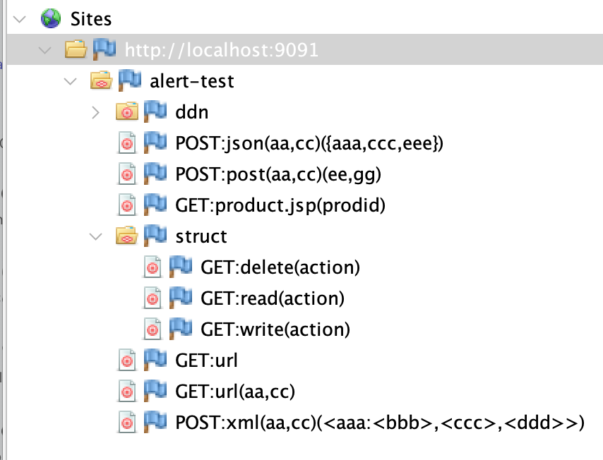
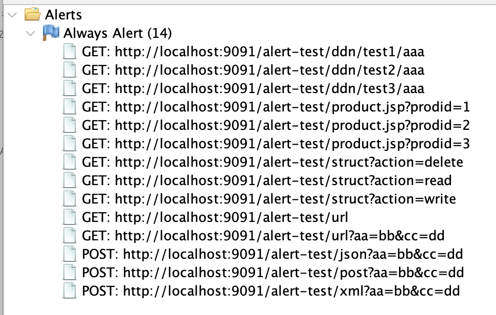
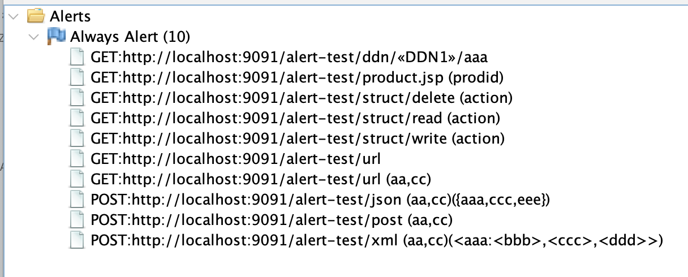
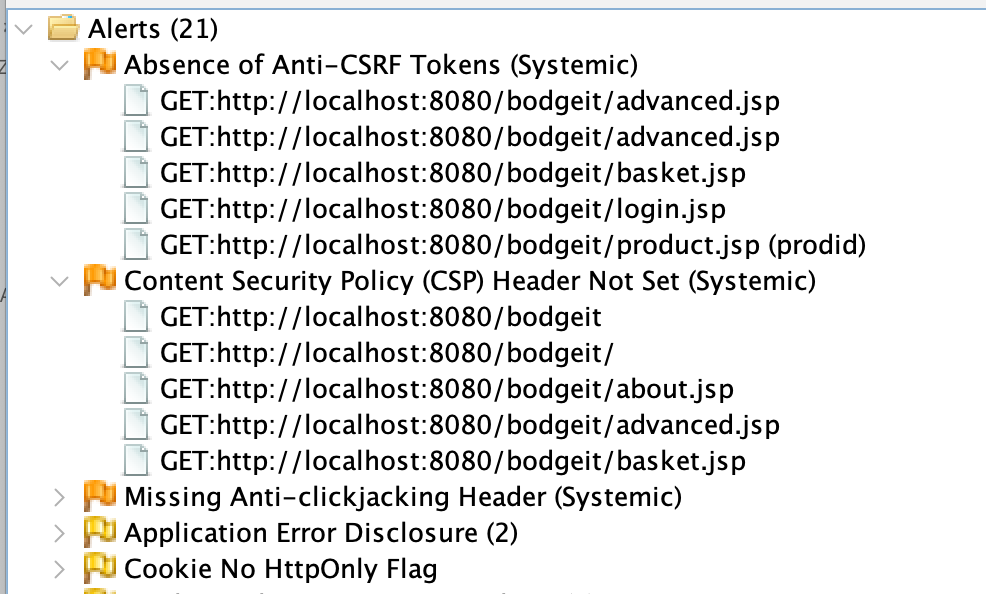

ZAP reports lots of "duplicate" alerts. That is to say alerts which essentially are the same, even if there
are some differences in the URLs which are probably not relevant.

These “duplicates” can happen for 2 reasons:
* Passive scan results are associated with URLs rather than Site Tree nodes
* Systemic alerts which affect most of the site (e.g. related to headers)

Duplicate alerts can be a problem because:
* They take time to be reviewed (if they are not ignored)
* They make comparisons between scans difficult
* They do not provide any additional value
* They increase the size of the ZAP reports

### The Sites Tree

We actually get very few duplicate active scan alerts, thanks to the [Sites Tree](/docs/desktop/start/features/sitestree/).

The Sites Tree is ZAP’s representation of the server side application - it attempts to represent the functionality of the app.

In order to do this by default it ignores application values.
For lots more details see [Sites Tree Modifiers](/blog/2020-09-22-sites-tree-modifiers/)

By using the Sites Tree to control the active scan we:
* Ignore “duplicate” URLs
* Speed up the active scan

### Passive Scanning

Passive scanning is applied to all requests and responses as they are received.

It currently does not use the Sites Tree, and that means it will often raise duplicate alerts which would not happen if it used a similar mechanism to the active scan.

For example, this is the Sites Tree where a test app has been configured to have both DDNs and Structural Modifiers:

This is the intended representation of the app.

However in the Alerts tree we see:

In this case we have:
* Multiple alerts for the same DDN
* Multiple alerts for product.jsp (only the value is different)
* The structural parameters are ignored

### Alert Tree De-duplication

We are in the process of changing the Alert Tree to use the same naming conventions (and related code) as the Sites Tree.

Any alerts which are duplicates once this convention is applied will be discarded.

With this proposal applied the Alert Tree will now look like this:

Using the Sites Tree naming conventions means that ZAP will be discarding alerts that really are duplicates, as long as the Sites Tree is a good representation of the app.

If it is not a good representation of the app then we already provide a range of options for you to change it however you need.

### Systemic Alerts

Even if we use Alert Tree De-duplication we have the problem where some alerts can be raised on most app endpoints, especially header related alerts.

Headers are typically managed in a relatively small number of places, often in configuration files, or maybe even systems external to the main application.

If an app has 1000 endpoints then it really doesn’t help to report 1000 instances of a missing security header.

We do have the option to limit the number of passive scan alerts raised. However this applies to all alerts rather than just those which we think are likely to be site-wide.

The proposal to handle this is to add a new `SYSTEMIC` alert tag, which will be used to indicate alerts which are often site-wide.

If more than a configurable number of alerts with this tag are raised then additional ones will be discarded and the Alert Tree will be changed to indicate that this has happened:

### Configuration

The number of `SYSTEMIC` alerts recorded will be configurable, and will probably default to 5.

We will not be providing an option to keep the old Alerts tree representation.

### Automation

The ZAP API and all of the ZAP reports will be changed so that all alert instances include a new `nodeName` field,
which will be the new name shown in the Alerts tree.

If you need to compare alerts for the same site across different ZAP scans then we strongly recommend using this new field instead of the alert URI field.

The API and most reports already show the alert tags, so the new `SYSTEMIC` tag will appear with the existing tags.
Any reports which show the number of instances of alerts will also be changed to show "Systemic" instead
of a count.

### Feedback

These changes will be made in a future weekly release, and then from ZAP 2.17.0.

If you have any questions or concerns about these changes then please post to the
[ZAP User Group](https://groups.google.com/group/zaproxy-users).
