In this blog post we will solve challenges on [Caido labs](https://labs.cai.do/), while this first batch only showcases some easy vulnerabilities we will use some interesting features of ZAP to solve them.

## Match and Replace

This is the first challenge and can be found on the next URL:

[https://labs.cai.do/matchAndReplace.php](https://labs.cai.do/matchAndReplace.php)

In this challenge we are shown the next site.


If we read the HTML code we can see that there is a function that checks the current role, and if it happens to be admin it executes `displayAdminUI()`.


We can validate what that function does by executing it manually.


While this uncovers the *hidden* panel, when testing a website, things are not usually that easy, and also we don't have the time to check everything, in this scenario we can create a rule to replace the text "basic" with "admin" in the responses so the JavaScript code gets executed with that role, we can do that by creating a rule in the Replacer add-on (Ctrl + R as shortcut).


If we reload the page we notice that the admin panel is shown automatically.


With that the challenge is solved.


Notice that the Replacer rule stays active even if you close ZAP, so it's always good to disable the rules when you are done with them.

## IDOR Vulnerability

This challenge can be found on the next URL:

[https://labs.cai.do/idor.php](https://labs.cai.do/idor.php)

On this challenge we are shown the next site.

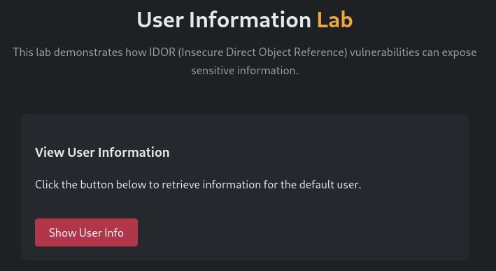

If we click the button the next information gets retrieved.

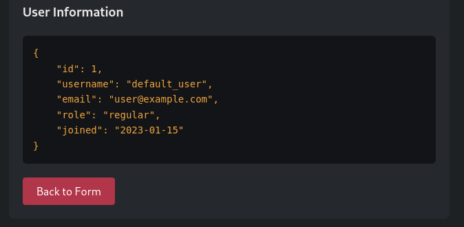

Checking the HTTP request we see that `user_id` is sent in a POST request.

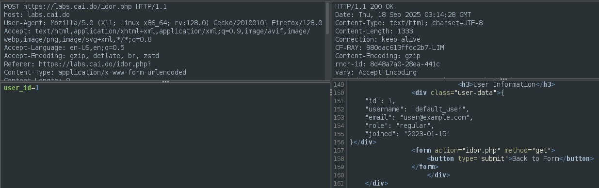

We can send the request to Requester (Ctrl + W as shortcut) and try to send a different ID.

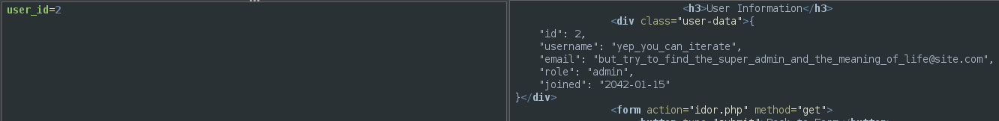

We got the information of the user Admin, but it tells us there is a kind of super admin user, to try to get it we send the request to the Fuzzer, and selecting the value of the user_id we add a payload of type "Numberzz" and set it to iterate from 1 to 50.

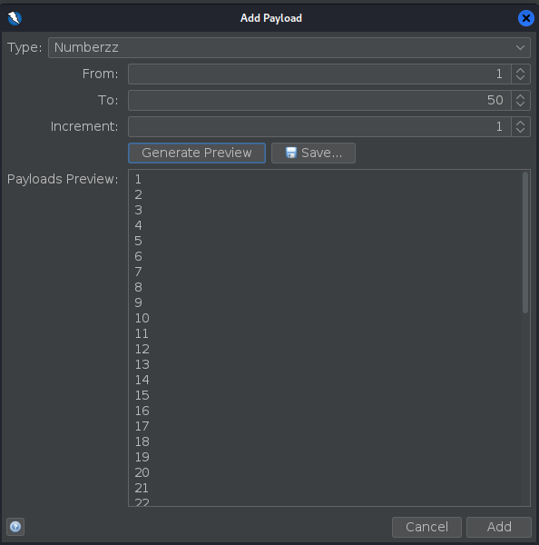

Once it's done the easier way to notice any difference is by changing the order by the size of the response Body, there we can see that besides the values "1" and "2", the value "42" is different.


Cheking that request we can verify that we found the ID of the super admin user.

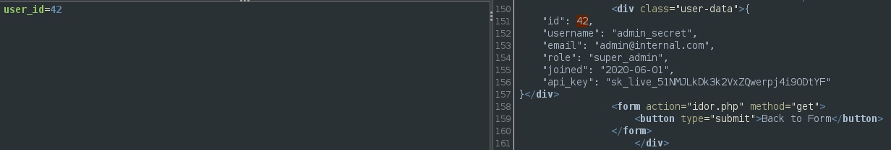

While sorting by size works most of the time, there can be occasion where we want to look for something more specific, in that case we can write a "Fuzzer HTTP Processor" script:

```js
// Auxiliary variables/constants needed for processing.
var count = 1;

function processMessage(utils, message) {

	//message.getRequestHeader().setHeader("X-Unique-Id", count);
	count++;
}

function processResult(utils, fuzzResult){

    var response = fuzzResult.getHttpMessage().getResponseBody().toString()
	if (response.indexOf("super") !== -1)
    {
		fuzzResult.addCustomState("Key Custom State","Super found")
	}
	return true;
}

function getRequiredParamsNames(){
	return [];
}

function getOptionalParamsNames(){
	return [];
}
```

All this script does is look for the word "super" in the response of the body and add a state that flags it, notice this is a very basic example and these scripts are really flexible, also if you want to know what every function does you can read the example script in ZAP since it is detailed there.
Once we have our script loaded **and** enabled we can add it before executing the Fuzzer.

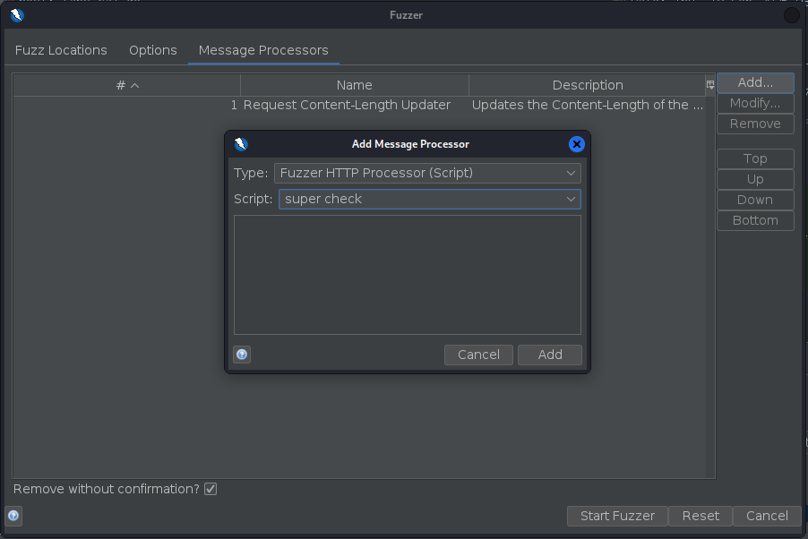

After we run the Fuzzer we can see that the responses that included the word "super" were flagged.


## Too Many Requests

This challenge can be found on the next URL:

[https://labs.cai.do/tooManyRequests.php](https://labs.cai.do/tooManyRequests.php)

On this challenge we are shown the next site.

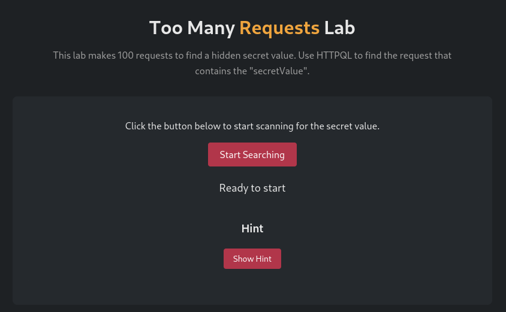

If we click the start searching button we can see that the site sends 100 requests.


If we have the ZAP session capturing a lot of traffic we can add a filter to only show the requests that include "secretValueHere" in the URL.

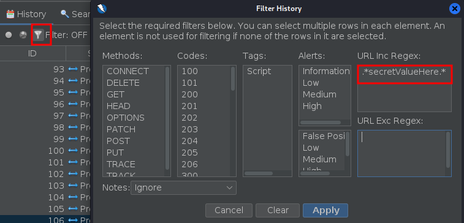

Then ordering by the size of the responses we can see one is different.

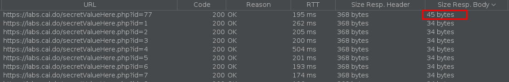

Checking the request we can find the secret value.

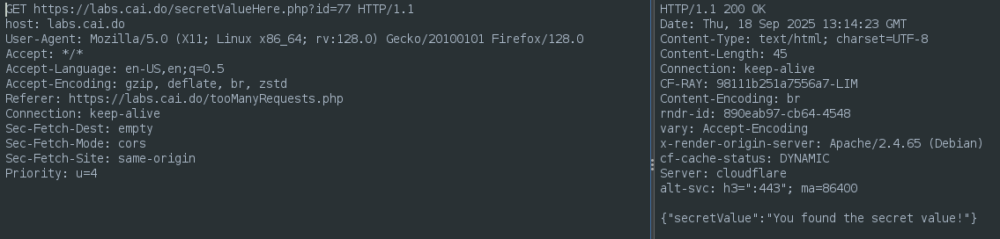

## ShaSigned

This challenge can be found on the next URL:

[https://labs.cai.do/shaSigned.php](https://labs.cai.do/shaSigned.php)

On this challenge we are shown the next site.


The challenge seems to be a modified version of the IDOR challenge. If we click the button the next request is sent.

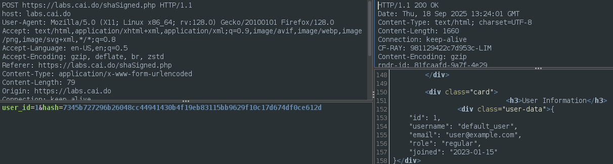

Reading the HTML code we find the next function:

```js
    <script>
        function signRequest(event) {
            event.preventDefault();
            const form = document.getElementById('userForm');
            const userId = form.querySelector('[name="user_id"]').value;
            const postData = `user_id=${userId}`;
            const hash = CryptoJS.SHA256(postData).toString();
            form.querySelector('[name="hash"]').value = hash;
            form.submit();
        }
    </script>
```
We can see that the hash value is calculated by getting the SHA256 sum of the string "user_id=" plus the current ID, we can validate this by calculating it ourselves.


Now that we know how the hash is calculated we can Fuzz the values, if we were using Burpsuite we could create the list of hashes and use a *pitchfork* attack, however in ZAP if we add more than one payload it treats it as a *Cluster Bomb* attack, since this is not what we want we'll have to use a single payload field and create a **Payload Generator** script that generates the whole body. Here is the script that we will use, everything is done in the `next()` function. To calculate the hash we are using the java `MessageDigest` class, since using it is not as straightforward as just calling it you can ask your favorite AI agent to write that part for you.

```js
var MessageDigest = Java.type("java.security.MessageDigest");
// Auxiliary variables/constants for payload generation.
var NUMBER_OF_PAYLOADS = 50;
var INITIAL_VALUE = 1;
var count = INITIAL_VALUE;

/**
 * Returns the number of generated payloads, zero to indicate unknown number.
 * The number is used as a hint for progress calculations.
 * 
 * @return {number} The number of generated payloads.
 */
function getNumberOfPayloads() {
	return NUMBER_OF_PAYLOADS;
}

/**
 * Returns true if there are still payloads to generate, false otherwise.
 * 
 * Called before each call to next().
 * 
 * @return {boolean} If there are still payloads to generate.
 */
function hasNext() {
	return (count <= NUMBER_OF_PAYLOADS);
}

/**
 * Returns the next generated payload.
 * 
 * This method is called while hasNext() returns true.
 * 
 * @return {string} The next generated payload.
 */
function next() {
  start = "user_id=";
  ID = count.toString();
  mid = "&hash="
  sign = sha256(start + ID)
	payload = start + ID + mid + sign;
	count++;
	return payload;
}

/**
 * Resets the internal state of the payload generator, as if no calls to
 * hasNext() or next() have been previously made.
 * 
 * Normally called once the method hasNext() returns false and while payloads
 * are still needed.
 */
function reset() {
	count = INITIAL_VALUE;
}

/**
 * Releases any resources used for generation of payloads (for example, a file).
 * 
 * Called once the payload generator is no longer needed.
 */
function close() {
}

function sha256(message) {
  const digest = MessageDigest.getInstance("SHA-256");
  const bytes = new java.lang.String(message).getBytes("UTF-8");
  const hash = digest.digest(bytes);

  let hex = "";
  for (let i = 0; i < hash.length; i++) {
    let byte = hash[i] & 0xff;
    // Manually pad with '0' if needed
    hex += (byte < 16 ? "0" : "") + byte.toString(16);
  }

  return hex;
}
```

Once we have the script ready and enabled we can start a Fuzzer by selecting the whole POST body and selecting our script as the payload.


After running the Fuzzer we can see the requests that included "super" in the response.


Finally we check the request to be sure we got the value of the super admin.


## CSRF via Content-Type

This challenge can be found on the next URL:

[https://labs.cai.do/csrfContentType.php](https://labs.cai.do/csrfContentType.php)

In this challenge we are shown the next site.

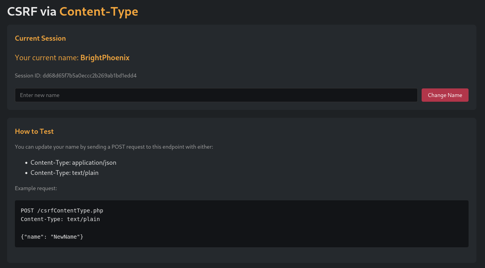

If we change our name the next request is sent.


The challenge says we can send "text/plain" as Content-Type, so we validate that.

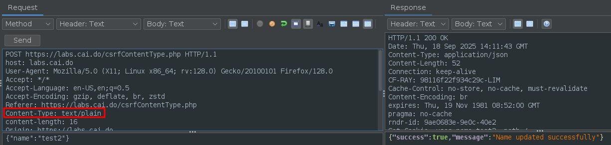

Now we can use the community script [json_csrf_poc_generator](https://github.com/zaproxy/community-scripts/blob/main/targeted/json_csrf_poc_generator.js), to use it we right click and select "Invoke with Script..." -> json_csrf_poc_generator.py, this will generate the next page:

```html
<!DOCTYPE html>
<head>
 <title>CSRF POC</title>
</head>
<body>
<form action="https://labs.cai.do/csrfContentType.php" id="formid" method="post" enctype="text/plain">
<input type ='hidden' name='{"name":"hacked","ignore_me":"' value='something"}'>
</form>
<script>document.getElementById('formid').submit();</script>
</body></html>
```

We can see that the HTML adds the value `,"ignore_me":"' value='something"}` to the request, this is because the browser expects to send a POST form as a request, not a JSON, if the request does not look like a POST form in the browser will try to format it, and that would send an invalid request.
Now we change the value of "name" and host the page using python and open it on our browser. After opening it we see that it opens the CSRF site.


If we check the request that was sent we can validate that the request came from our local python server.


If we go back to the challenge page we can validate the name was updated.

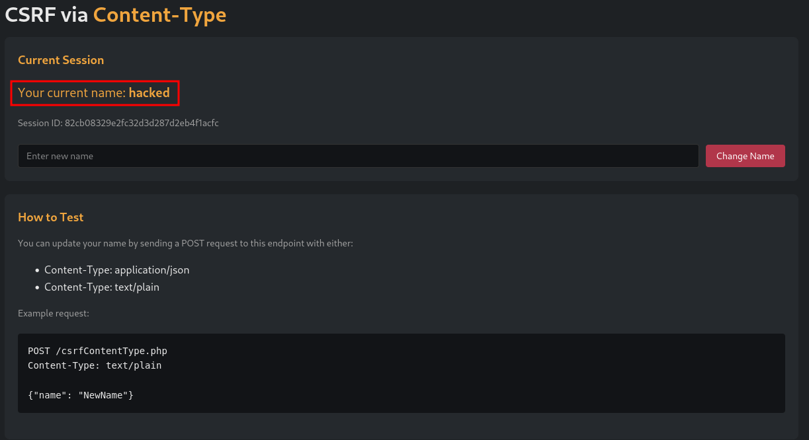

## Session Monitor

This challenge can be found on the next URL:

[https://labs.cai.do/sessionMonitor.php](https://labs.cai.do/sessionMonitor.php)

The purpose of this challenge is to learn how to store changing values from requests to an environment variable, while I don't know how Caido can make use of this information ZAP can achieve something similar using [global variables](/docs/desktop/addons/script-console/#global-variables), so let's store the current session cookie value in a new one.

When we access we are shown the next site.


This site allows us to change our current session cookie by sending this request.

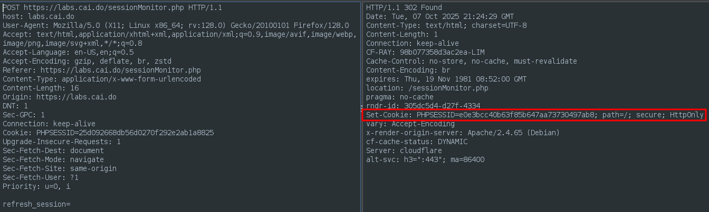

To track the current PHPSESSID we create the next **Proxy** script.

```js
function proxyRequest(msg) {
	return true
}

function proxyResponse(msg) {
    cookielist = msg.getResponseHeader().getHttpCookies("labs.cai.do");
    for (i = 0; i < cookielist.length; i++) {
        if (cookielist[i].getName() == "PHPSESSID"){
            org.zaproxy.zap.extension.script.ScriptVars.setGlobalVar("currentSession",cookielist[i].getValue())
        }
    }
	return true
}
```

As we see all it does is extract the cookies from the responses, then if it finds the cookie "PHPSESSID" it saves it in a variable called "currentSession".
We can access to this variable from any other script, in this case we make a simple print on python as a **Stand Alone** script.

```python
from org.zaproxy.zap.extension.script import ScriptVars
print (ScriptVars.getGlobalVar("currentSession"))
```

If we execute it every time we request a new cookie we can see the value changes.

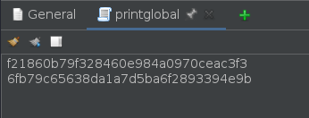

We can check the site to validate we got the correct values.

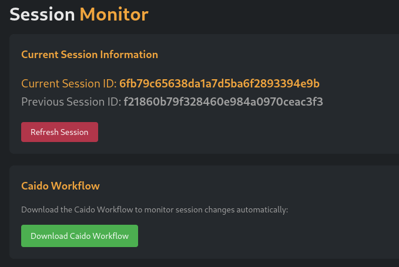

While this lab looked like a scenario to use a passive script instead of a proxy one, trying to track a changing value using passive scripts could end up not working properly. If the value changes too quick we could end up storing a previous value due the default parallel nature of passive scanning, also there can be a significant delay between receiving the cookie and the value being updated if there are many request being analyzed, given that by default there are some passive rules loaded that would need to be run on every request.

## Reflected XSS Lab

This challenge can be found on the next URL:

[https://labs.cai.do/xss.php](https://labs.cai.do/xss.php)

In this challenge we are shown the next site.

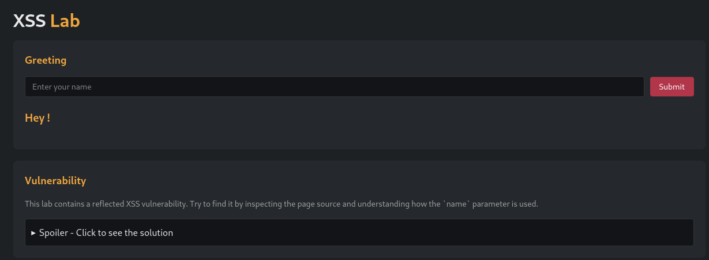

If we set the classic XSS PoC as name `<script>alert(1)</script>` we can validate the vulnerability.


On the main page the description of the challenge is the next one:
`Learn the basics of how to identify reflected XSS with two different vulnerabilities in the same lab.`
It says that there are **two** vulnerabilities, while in this case we could find the other value by reading the HTML code, that's not always possible, so we will use Param Digger (equivalent of Burp's Param Miner) to find the other parameter, since the default wordlist is too small we will use Burp's list from Seclist.

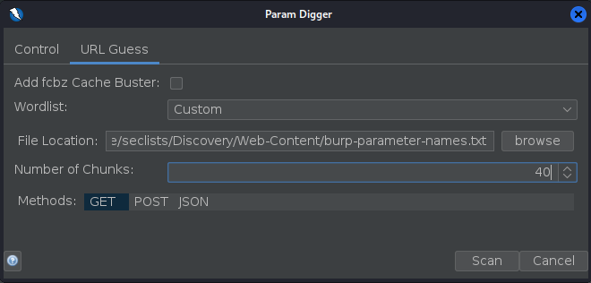

Once the scan is finished it reports the "company" parameter.


We can read the response to find out how the parameter changes the response.

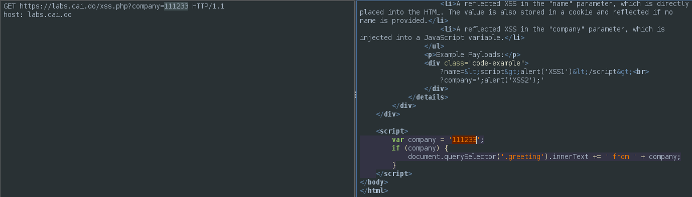

Since we are already inside a *script* tag we use a different payload `';alert(1);'`:


## HTTP Hunt Lottery

This challenge can be found on the next URL:

[https://labs.cai.do/http-hunt/index.php](https://labs.cai.do/http-hunt/index.php)

In this challenge we are shown the next site.

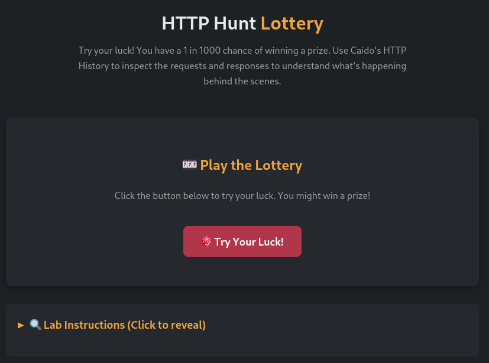

If we click the button we see the next message:

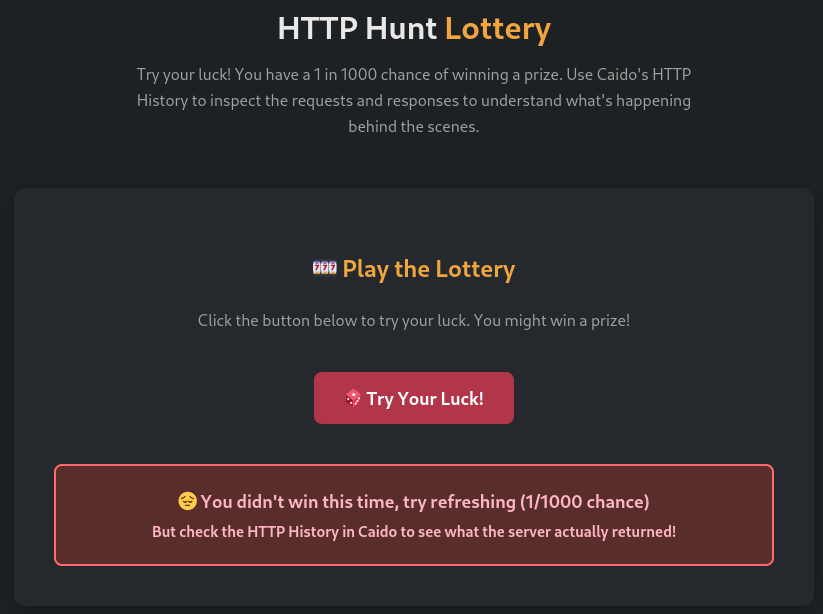

If we check the HTTP response we see extra information.


Once we enter to the revealed site we get the solution.


