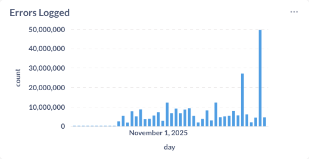
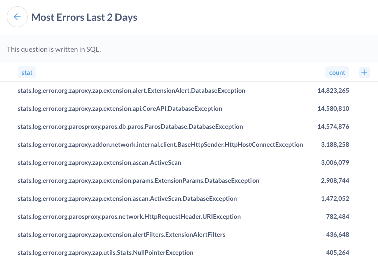
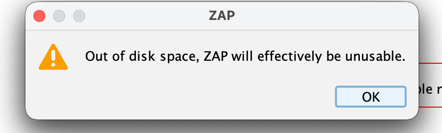
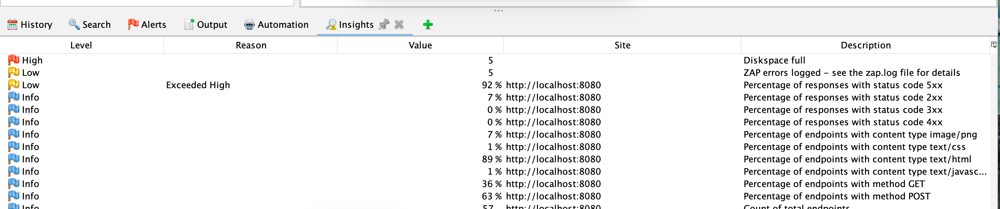

Yesterday, November 24th 2025, ZAP logged around 50 Million errors!️

We know that ZAP was started over 200 thousand times yesterday, so that means on average ZAP logged
around 250 errors every time it was run.

That is a LOT more than we would expect!

### Why Does ZAP Log Errors?

ZAP logs errors when something "unexpected" happens.
This can be a problem with the target app, with the environment in which ZAP is running, or bugs in ZAP.

The errors are logged to the "zap.log" file, and this is the one of the first things we tell people to look at when something goes wrong: [FAQ: Somethings not working. What should I do?](/faq/somethings-not-working-what-should-i-do/)

### Why Did ZAP Log So Many Errors?

We know ZAP logged so many errors because a month ago we added a count of the ZAP errors to the telemetry we collect.

We were so surprised at the high number of errors that we then added more telemetry to tell us which
ZAP Java classes were logging these errors. Following that we added the name of the related exception.

These are the classes (and related exceptions) that logged the most errors in the last 2 days:

The exception name, where available, is added to the end of the class.
As you can see, the top 3 exceptions were all DatabaseException.

We are pretty confident that the vast majority of these errors are caused by the database running out of space.
This can happen if it exceeds the size allocated to it, or if there is no space left on the disk.

Up until now ZAP did not recognise the significance of these sort of errors and just carried on doing
whatever it was instructed to do.
So running out of space was likely to result in a large number of errors logged.

Why did ZAP run out of space so many times yesterday? That we cannot tell.

Running out of space is not a problem that we can just solve in ZAP, but clearly we can do a much better job of handling it when it does occur!

### Handling Space Issues

In headless mode ZAP will no longer persist temporary active scan messages in the database. This should significantly reduce the amount of space needed when using ZAP in automation.

We have now changed the ZAP core to recognise database or diskspace issues.

If these occur then ZAP will stop attacking the app - there is no point in carrying on as there will
be no space to record anything we find.

If you are using the desktop then you will see a new popup:

If you are using ZAP in automation then ZAP will only try to log the problem once, and will attempt to close down gracefully.

Based on our testing it looks like ZAP can usually still record the initial problem to the zap.log file, even if it fails to write to the database.

This change will be included in ZAP 2.17 and is already in in the most recent weekly and nightly releases.

### What Else Can Go Wrong?

Running out of space is just one of the ways in which things can go wrong when using ZAP.

It is not unusual for the target app to crash, lock up, or just struggle to respond to the amount of data ZAP sends.

Network issues can also have an impact. These could be unrelated to ZAP, or they could be due to a firewall 
blocking or rate-limiting ZAP.

Authentication problems can also impact scans - the authentication mechanism can change, 
or the account being used can be blocked.

These sort of problems can usually be diagnosed from the errors ZAP logs, but that can be a time consuming task.

### Insights

From 2.17 we will be introducing a new [Insights](/docs/desktop/addons/insights/) add-on.

This add-on adds a new Insights tab to the desktop GUI which shows you key information which we think you should be aware of:

This information will also be added to all of the main ZAP reports, so that it will be available when you
use ZAP in automation as well.

This add-on is also available in the latest weekly and nightly releases, so please try these out and let us know how you get on.

Ideas for more insights that we can surface will also be gratefully received.

Last but definitely not least - a big thank-you to everyone who does not turn the ZAP telemetry off.
This telemetry is key to us understanding how you are using ZAP and where we need to focus our efforts.
