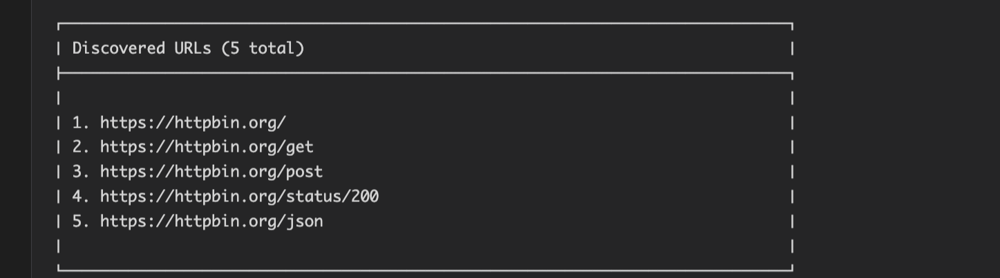
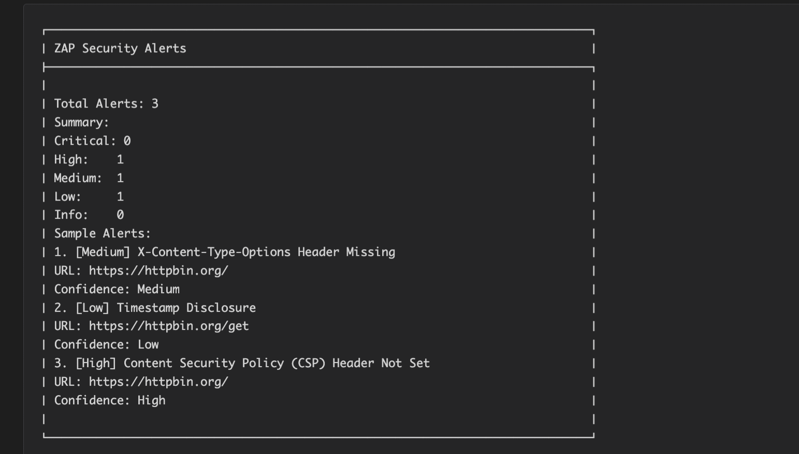
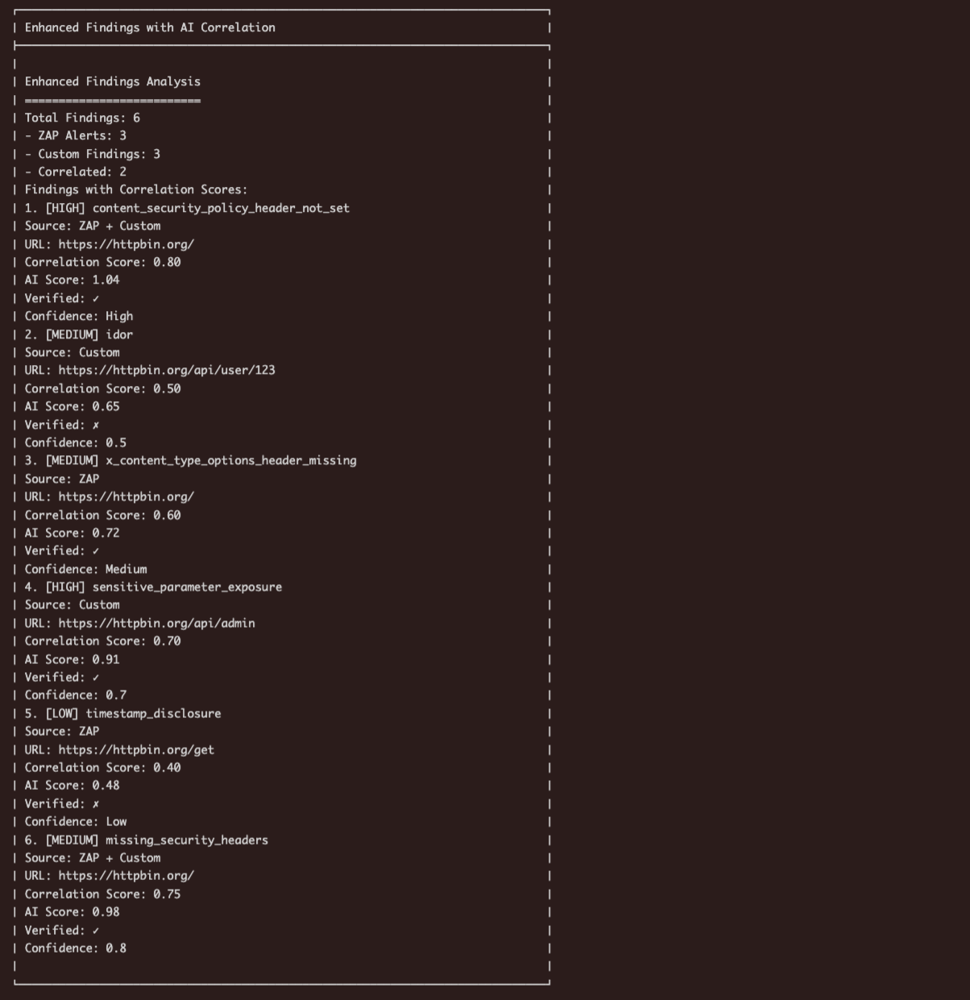
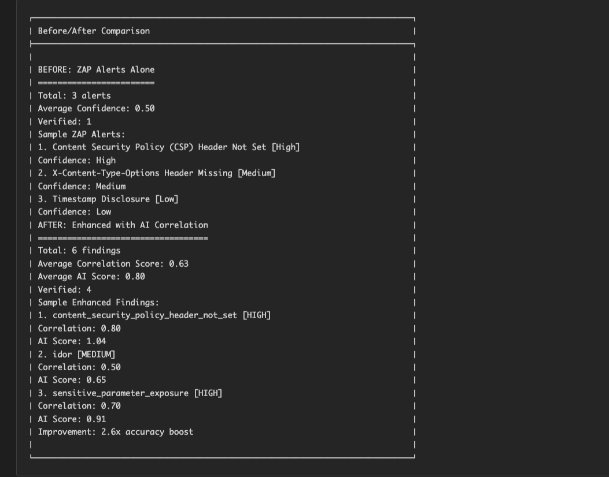

### Introduction

Most modern security testing platforms place advanced automation, correlation, and workflow features behind expensive licensing tiers. As a full-stack engineer who has spent the last four months studying security research and bug bounty methodologies, I needed a tool that offered flexibility, extensibility, and complete programmatic control without vendor lock-in.

ZAP quickly emerged as the ideal foundation. Its open-source nature, robust REST API, and dedicated community provided exactly the level of freedom I needed to design a system that goes beyond traditional scanning. After months of manual testing and experimenting with various tools, I began building an AI-augmented security testing platform that uses ZAP as the scanning engine and layers machine learning and intelligent workflow orchestration on top.

### Why ZAP?

ZAP offers capabilities that make it fundamentally more adaptable for custom solutions:

- **Full automation** through an extensive REST API
- **Complete extensibility** without requiring modifications to ZAP's internal codebase
- **Community-driven development**, with continuous updates and advanced scripts available
- **No licensing limitations**, allowing unrestricted customization and integration

ZAP performs the core scanning functions—active scanning, passive scanning, spidering, alert collection, and context management—while my system introduces the intelligence layer that learns from real-world exploitation techniques.

### Architecture Overview

The system integrates ZAP with an AI-driven learning engine through the Model Context Protocol (MCP). This architecture enables AI agents to interact with ZAP programmatically while incorporating deeper analysis, adaptive payload generation, and learned vulnerability patterns.

```
         ┌─────────────────┐
         │   AI Agent      │  (MCP Clients: Cursor, ChatGPT, etc.)
         └────────┬────────┘
                  │
                  │ MCP Protocol
                  │
┌─────────────────▼────────────────┐
│            VulneraMCP            │
│   ┌──────────────────────────┐   │
│   │  ZAP Integration Layer   │   │
│   └──────────────────────────┘   │
│   ┌──────────────────────────┐   │
│   │  MCP Proxy Layer         │   │
│   └──────────────────────────┘   │
│   ┌──────────────────────────┐   │
│   │  Learning Engine         │   │
│   └──────────────────────────┘   │
└─────────────────┬────────────────┘
                  │
             ┌────┴────┐
             │         │
         ┌───▼───┐ ┌──▼─────┐
         │  ZAP  │ │Postgres│
         │       │ │   DB   │
         └───────┘ └────────┘
```

#### Components

**ZAP Integration Layer**
Handles all interactions with ZAP, including spidering, active scanning, context management, and alert retrieval.

**VulneraMCP**
Intercepts and analyzes traffic, enabling custom vulnerability checks (e.g., IDOR, logic flaws) that extend beyond ZAP's built-in rules.

**Learning Engine**
Imports training data from HackTheBox, PortSwigger Academy, and real bug bounty writeups. Extracts patterns, generates payloads, and continuously improves detection accuracy.

**Database Layer**
Stores knowledge base entries, learning data, scan results, and exploit patterns.

#### Tech Stack and Rationale

- ZAP - free, scriptable, open-source
- Node.js - backend automation
- MCP  - AI-driven interaction layer
- Postgres - for storing learning data, scan results, and exploit patterns
- Docker - containerized scanner + offline operation

### ZAP Automation

The platform controls ZAP entirely through the REST API. Examples include:

```typescript
// Start spidering
const spider = await zapClient.startSpider('https://example.com');

// Check spider status
const status = await zapClient.getSpiderStatus(spider.data.scanId);

// Launch active scan
const active = await zapClient.startActiveScan('https://example.com');

// Retrieve high-risk alerts
const alerts = await zapClient.getAlerts('https://example.com', undefined, undefined, '3');
```

This enables a fully automated testing pipeline with no manual interaction required.

### Learning Component

A key differentiator of this system is the adaptive learning module. It incorporates real-world exploitation data to improve the accuracy and effectiveness of future scans.

Sources include:

- **HackTheBox walkthroughs**
- **PortSwigger Academy lab solutions**
- **Public bug bounty reports**
- **Custom research and test results**

#### Pattern Identification

The engine extracts exploit patterns from training data:

```typescript
const training = await getTrainingData('xss');
const patterns = extractPatterns(training);
```

These patterns are then adapted and applied to new targets.

#### Adaptive Payload Generation

Unlike scanners that rely on static payload lists, this system generates dynamic payloads based on:

- The application's behavior
- Reflected input points
- Previous successful exploit attempts
- Response analysis

This significantly increases the chances of detecting sophisticated vulnerabilities.

### System Workflow

#### Discovery
ZAP spidering and URL enumeration build a complete map of the application.



#### Scanning
Active and passive scanning begins, enriched with custom rules for issues like IDOR and weak authentication flows.



#### Analysis
The MCP proxy layer evaluates request/response patterns, correlates findings with ZAP alerts, and applies learned rules.



#### Learning
The engine generates improved payloads, extracts new exploit signatures, and updates the knowledge base.

#### Reporting
Findings are aggregated, scored, and produced in a structured output with evidence and recommended remediation.



### Benefits

#### Enhanced Detection
By combining ZAP's scanning engine with machine learning, the system:

- Detects vulnerabilities traditional scanners commonly miss
- Reduces false positives through pattern correlation
- Adapts to different application structures and behaviors

#### Complete Automation
The system handles reconnaissance, scanning, payload testing, correlation, and reporting without manual effort.

#### Extensibility
Built entirely on open-source components, it can be extended with:

- Additional training data
- New MCP tooling
- External integrations (Burp, nuclei, Subfinder, etc.)

### Implementation Overview

#### ZAP Deployment (Daemon Mode)

```bash
docker run -d -p 8081:8080 owasp/zap2docker-stable \
  zap.sh -daemon -host 0.0.0.0 -port 8080 \
  -config api.disablekey=true
```

#### VulneraMCP Capabilities

VulneraMCP provides tools for:

- **Reconnaissance**
- **Automated ZAP scanning**
- **Business logic testing**
- **Payload testing** (XSS, SQLi, IDOR, CSRF, and more)
- **Learning model updates**
- **Knowledge base management**

Core Features:

- Autonomous scanning workflow
- Offline mode for air-gapped environments
- Vulnerability reasoning (AI explains findings)
- ZAP API integration
- Automated recon + attack surface mapping
- Customizable scripts
- Extensible plugin system

### Results So Far

Developing this system has:

- Reduced the time needed to perform reconnaissance and testing
- Increased detection accuracy through adaptive learning
- Provided an ecosystem to test, train, and scale bug bounty workflows
- Enabled seamless integration with AI agents for advanced reasoning and analysis

The GitHub repository is https://github.com/telmon95/VulneraMCP

---

### About the Author

**Telmon Maluleka** is a Full-Stack Software Engineer based in Pretoria, South Africa. Skilled in C, Python, JavaScript, HTML, and CSS, with experience using frameworks such as React, Node.js, Django, and various AWS cloud services. His background includes API development, database design (MySQL), and containerized application deployment.

Over the past four months, he has expanded his focus into ethical hacking and practical vulnerability research. His experience with Docker, MCP servers, and large language models directly contributed to developing this AI-powered security testing platform. This project represents his first major open-source security contribution, merging full-stack engineering with modern security research.

- **GitHub**: [github.com/telmon95](https://github.com/telmon95)
- **Portfolio**: [telmon95.github.io/portfoliov2/](https://telmon95.github.io/portfoliov2/)
- **Twitter**: [x.com/DEOXYRIBOSE404](https://x.com/DEOXYRIBOSE404)