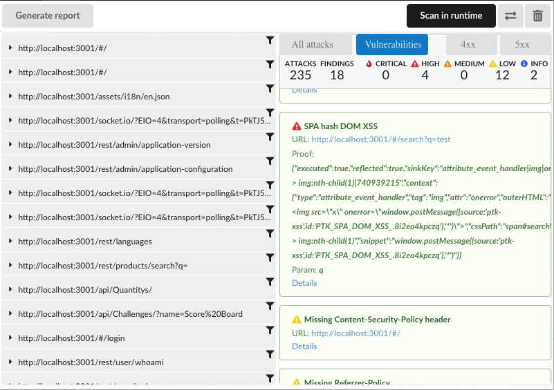
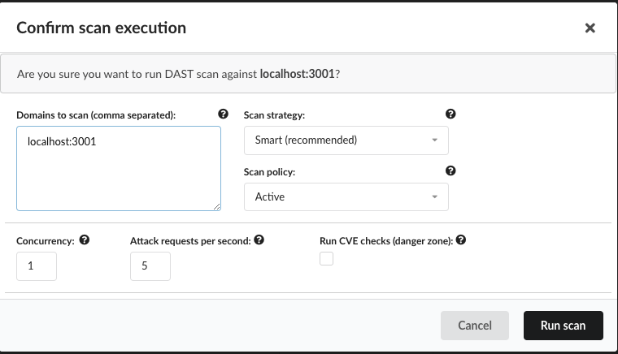
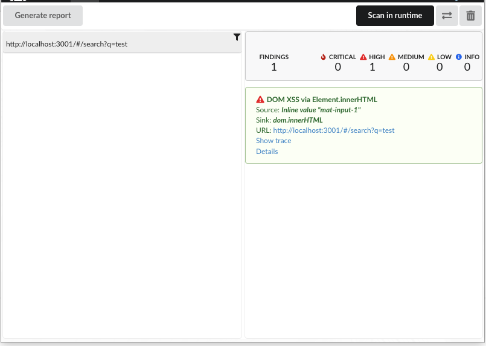
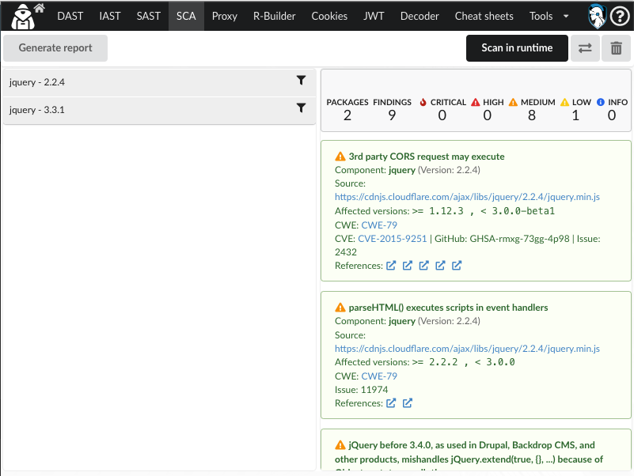
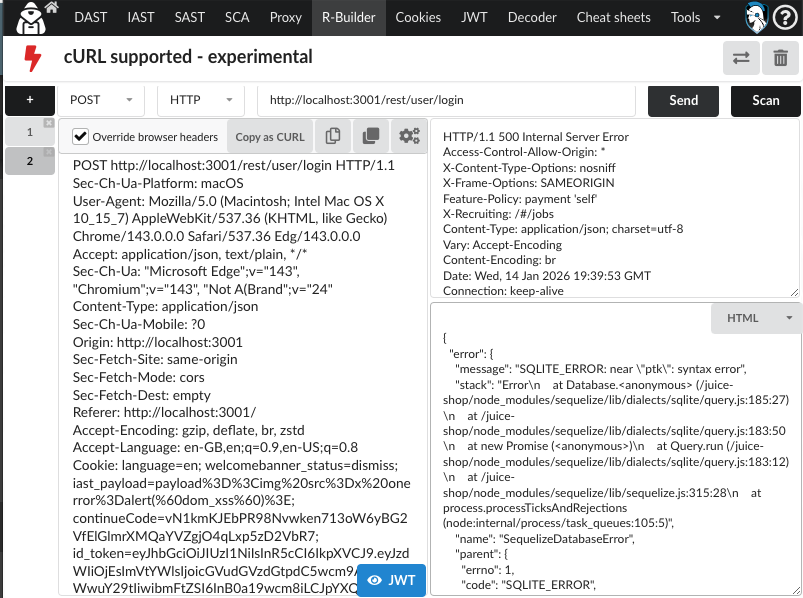
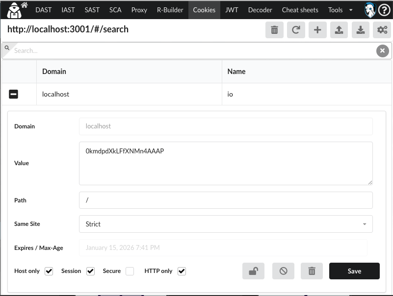

OWASP PTK (PenTest Kit) is a browser extension for practical application security testing where the **browser session is the truth**:
authenticated navigation, SPA routing, client-side behavior, and the exact requests your app generates during real use.

With this integration, **OWASP PTK is pre-installed in the browsers launched from ZAP** — **Chrome and Firefox**.
You can launch a ZAP browser and immediately use PTK’s workflows (DAST, IAST, SAST, SCA, JWT tools, cookie tools) without manual setup.

## Getting Started

1. Open ZAP and launch a browser (Chrome or Firefox) using ZAP’s browser launch feature.
2. In the launched browser, confirm you can see the OWASP PTK extension icon.
3. Navigate to your target and **log in** before starting any runtime scans.

From here you can treat ZAP as your **traffic and context hub** (Sites tree, History, passive scanning, auth/session handling),
while PTK becomes your **in-browser security toolkit** for runtime scanning and targeted testing.

---

## DAST: Scan While You Browse

PTK DAST is built around a simple flow:

**Start runtime scan → use the application normally → stop → review findings.**

This is especially effective on modern apps where coverage depends on real navigation and real user flows.

### Recommended workflow

1. Open **OWASP PTK → DAST**
2. Click **Scan in runtime**
3. Browse key flows (forms, searches, account settings, admin pages, checkout, etc.)
4. Click **Stop runtime scan**
5. Triage findings and re-test interesting requests with PTK’s request tools

### Practical advice: stay in control of scan footprint

When running active checks, tune your settings to the target environment:

- Lower **requests/sec** for production or fragile targets
- Keep **concurrency** conservative for stability
- Scope domains tightly to avoid noise and accidental off-target scans

---

## IAST: Runtime Monitoring in the Browser

PTK IAST focuses on **instrumenting runtime behavior** in the browser session.
You run it in the same way: start, browse, stop, review — but the findings are based on runtime signals rather than only response patterns.

### Recommended workflow

1. Open **OWASP PTK → IAST**
2. Click **Scan in runtime** (agent injects / begins monitoring)
3. Browse flows that matter (especially authenticated routes)
4. Stop scan and review findings

IAST is particularly useful when:

- Behavior depends on real UI state (SPA routing, DOM mutations, client-side rendering)
- You need more context to triage quickly
- You want runtime visibility while keeping your test workflow “in browser”

---

## SAST: Analyze What the Browser Actually Loads

PTK SAST is client-side focused: it analyzes **inline scripts and external scripts loaded by the page**.
This is valuable when you don’t have repository access, or when production bundles differ from source.

### Recommended workflow

1. Open **OWASP PTK → SAST**
2. Run analysis on the current page/app
3. Review findings (e.g., dangerous sinks, risky patterns)
4. Pivot from findings into targeted runtime testing (DAST/IAST) as needed

This style of SAST shines for:

- Large SPA bundles
- Third-party scripts
- “What is actually executing in production right now?”

---

## SCA: Dependency Signals from the Running App

PTK SCA surfaces signals about **software components and dependency risk** relevant to what the app is serving/using.

### Recommended workflow

1. Open **OWASP PTK → SCA**
2. Run analysis for the current target/app
3. Review packages/components and any vulnerability signals
4. Use ZAP traffic context to validate origins and loading behavior

---

## Request Builder: From “Interesting Request” to “Tested Hypothesis”

One of the fastest loops you can build with PTK + ZAP is:

**Spot something in traffic → open in PTK → modify → replay → validate behavior**

Request Builder is designed for hands-on testing:

- Edit and resend requests
- Run targeted attacks against a specific request
- Clone/export (including “copy as cURL”)
- Advanced header manipulation and repeatable request sets

---

## JWT Testing: Inspect, Modify, and Validate Assumptions

Modern apps live on tokens, and PTK’s **JWT tools** are built for practical testing loops:
decode, edit claims, switch algorithms (where relevant), and validate behavior changes quickly.

### Common JWT security checks

- Validate algorithm handling (including unsafe algorithm acceptance)
- Check for weak secrets (HMAC)
- Test claim enforcement (exp, nbf, aud, iss)
- Look for key confusion / trust errors (implementation dependent)

### Recommended workflow with ZAP + PTK

1. Use **ZAP History** to locate token-bearing requests (Authorization header, cookies)
2. Open **PTK JWT tools** to decode and modify the token
3. Replay flows and observe changes:
   - ZAP shows server responses and traffic diffs
   - PTK accelerates token manipulation and repeatability

---

## Cookie Testing: Edit, Protect, Block, and Reproduce

Cookies still drive real-world auth/session states.
PTK provides a cookie workflow aimed at fast, repeatable testing.

### Practical cookie tasks

- Add/edit/remove cookies
- Test behavior with missing/modified cookies
- Block or protect specific cookies during testing
- Import/export cookie sets for repeatability

---

## A Practical Daily Workflow

If you want a simple routine that works well on real targets:

1. Launch Chrome/Firefox from ZAP (proxied session)
2. Log in and browse the app normally
3. Run PTK **DAST runtime scan** while you exercise key flows
4. Run PTK **IAST runtime scan** for runtime context during the same flows
5. Use PTK **SAST** to spot risky client-side patterns in loaded scripts
6. Use PTK **SCA** for dependency-related signals
7. Use PTK **JWT** and **Cookie** tools to validate auth/session assumptions quickly

---

## Notes and Scope Reminders

- Only use active scanning and exploit-style testing where you have permission.
- Keep scope tight and use conservative rate/concurrency settings on production targets.
- ZAP remains your traffic backbone; PTK adds browser-native runtime workflows that speed up discovery and triage.
