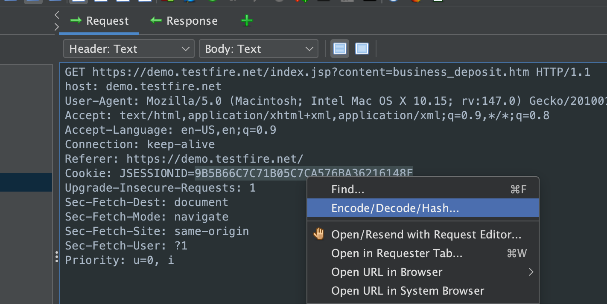

[ZAP's Encode/Decode/Hash add-on](/docs/desktop/addons/encode-decode-hash/) provides built-in operations for encoding, decoding, and hashing data; useful when crafting or inspecting requests during security testing. [CyberChef](https://gchq.github.io/CyberChef/) offers a huge set of "recipes" for the same kinds of operations, often with more options and formats.

You can get the best of both worlds by calling CyberChef-style operations from within ZAP via [**Encode/Decode Scripts**](/docs/desktop/addons/encode-decode-hash/#custom).

## What You'll Need

- ZAP with the [Encode/Decode/Hash add-on](/docs/desktop/addons/encode-decode-hash/) installed
- Script Console add-on and a script engine (e.g. GraalJS) for Encode/Decode Scripts (these are included in the main releases)
- CyberChef-server docker image (more on that below)

## Using Encode/Decode/Hash in ZAP

ZAP has a well featured Encode/Decode/Hash add-on which already provides great flexibility and power through allowing users to create their own Encode/Decode Scripts. You can find some example via [community-scripts](https://github.com/zaproxy/community-scripts/tree/main/encode-decode) as well as a summary of the default template. You can send values to the add-on by pasting them in the GUI or by using the context menu on selected text.



## Bringing in CyberChef-Style Operations

CyberChef, often referred to as the "Cyber Swiss Army Knife," is a free, open-source, web-based application designed to enable both technical and non-technical analysts to manipulate, encode, decode, and analyze data in complex ways without needing specialized, complex tools or programming languages. While the base CyberChef project/site are well known for their all client-side processing, there is also CyberChef-server which offers and API and can be hosted in your control via Docker :grinning:.

There’s some overlap with ZAP’s built-in operations, but CyberChef-server lets you call many more operations by sending a simple JSON request, so you don’t have to reimplement them in your Encode/Decode Scripts.

## Setup CyberChef-server


git clone https://github.com/gchq/CyberChef-server
cd CyberChef-server
docker build -t cyberchef-server .
docker run -it --rm --name=cyberchef-server -p 3000:3000 cyberchef-server


Once you've got that done you should be able to browse to: http://localhost:3000/, you should be greeted by the Swagger UI for CyberChef-server:


## Encode/Decode Script Template

The primary mechanism of Encode/Decode scripts is the `process(helper, value)` function. Here's a really simple example that simply takes the input and appends "foo bar" to it.

```js
function process(helper, value){
	return helper.newResult(value + "foo bar");
}
```

The script must return its value using `helper.newResult(result)` or `helper.newError(error)`; that return value is what the add-on displays in the associated output panel.

## Better Together? CyberChef URL Extractor Example

Let's say you've got a blob of text that you want to get URLs out of, inside ZAP. Here's an example script we can use to submit the input to CyberChef-server and get the extracted URLs back.

```js
// CyberChef - Extract URLs (via /bake)
// Paste this into a new Encode/Decode script in ZAP

const EncodeDecodeResult = Java.type(
  "org.zaproxy.addon.encoder.processors.EncodeDecodeResult"
);
const HttpRequestHeader = Java.type(
  "org.parosproxy.paros.network.HttpRequestHeader"
);
const HttpMessage = Java.type("org.parosproxy.paros.network.HttpMessage");
const HttpSender = Java.type("org.parosproxy.paros.network.HttpSender");

const cyberchefUrl = "http://localhost:3000/bake";

const header = new HttpRequestHeader("POST " + cyberchefUrl + " HTTP/1.1");
header.setHeader("Content-Type", "application/json");
header.setHeader("Accept", "application/json");

const msg = new HttpMessage(header);

const sender = new HttpSender(HttpSender.MANUAL_REQUEST_INITIATOR);

function process(helper, value) {
  try {
    // This is the recipe/operation(s) we're going to ask CyberChef to handle
    // In this case if the input value is empty send a single space, otherwise CyberChef complains
    var payload = JSON.stringify({
      input: !value || value === "" ? " " : value,
      recipe: [{ op: "Extract URLs" }],
    });

    msg.setRequestBody(payload);
    msg.getRequestHeader().setContentLength(msg.getRequestBody().length());

    sender.sendAndReceive(msg);

    var responseStr = msg.getResponseBody().toString();

    // CyberChef /bake returns { "value": "...", "type": "string" }
    if (msg.getResponseHeader().isJson()) {
      var json = JSON.parse(responseStr);
      // If the return value is empty tell the user there's no URLs, otherwise provide them
      // Falling back to the raw response if it isn't JSON
      var output = json.value === "" ? "No URLs" : json.value || responseStr;
      return helper.newResult(output);
    }

    return helper.newResult(responseStr);
  } catch (e) {
    return helper.newError("Error contacting CyberChef: " + e.toString());
  }
}

```

Use the [toolbar](/docs/desktop/addons/encode-decode-hash/#toolbar) in the Encode/Decode/Hash dialog to add a tab for your script processors, then add an output panel for your new script processor to it:


Now paste your text and try things out:


## Tips and Caveats

- You could expand on this idea to use CyberChef "recipes"; performing multiple actions on the input to apply multiple layers of processing.
- In case you're hitting an issue/failure make sure that CyberChef-server is running and accessible either locally or via the network.
- Getting things working in CyberChef-server weren't initially seamless :wink:. https://github.com/gchq/CyberChef-server/issues/85

## Next Steps

Share your creations and ideas via the [User Group](https://groups.google.com/g/zaproxy-users), or by opening a PR against [community-scripts](https://github.com/zaproxy/community-scripts/).

- [Encode/Decode/Hash add-on docs](/docs/desktop/addons/encode-decode-hash/)
    - [community-script samples and docs](https://github.com/zaproxy/community-scripts/tree/main/encode-decode)
    - [Source](https://github.com/zaproxy/zap-extensions/blob/main/addOns/encoder/src/main/java/org/zaproxy/addon/encoder/processors/script/EncodeDecodeScriptHelper.java) of the Encode/Decode scripts' "helper" object.
- CyberChef live, client-side processing: https://gchq.github.io/CyberChef/
    - [CyberChef GitHub](https://github.com/gchq/CyberChef)
    - [CyberChef-server GitHub](https://github.com/gchq/CyberChef-server)
