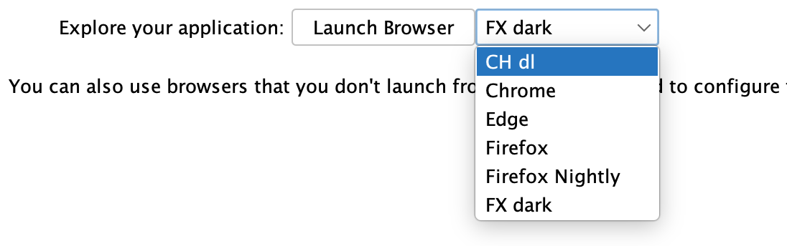
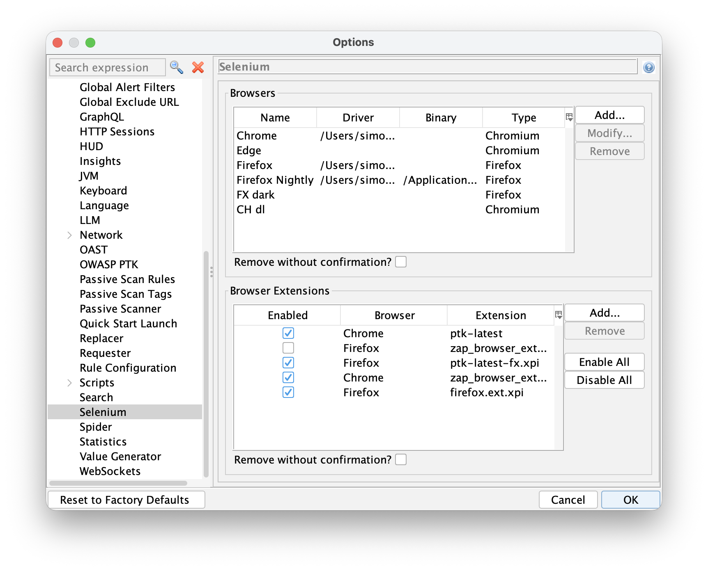
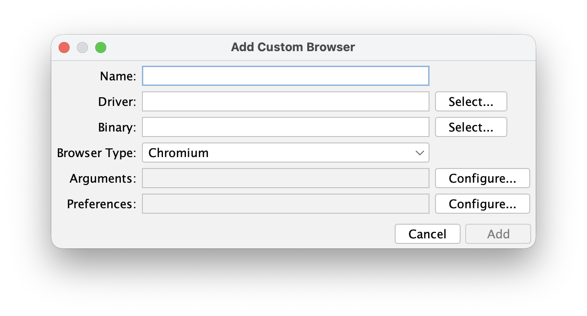
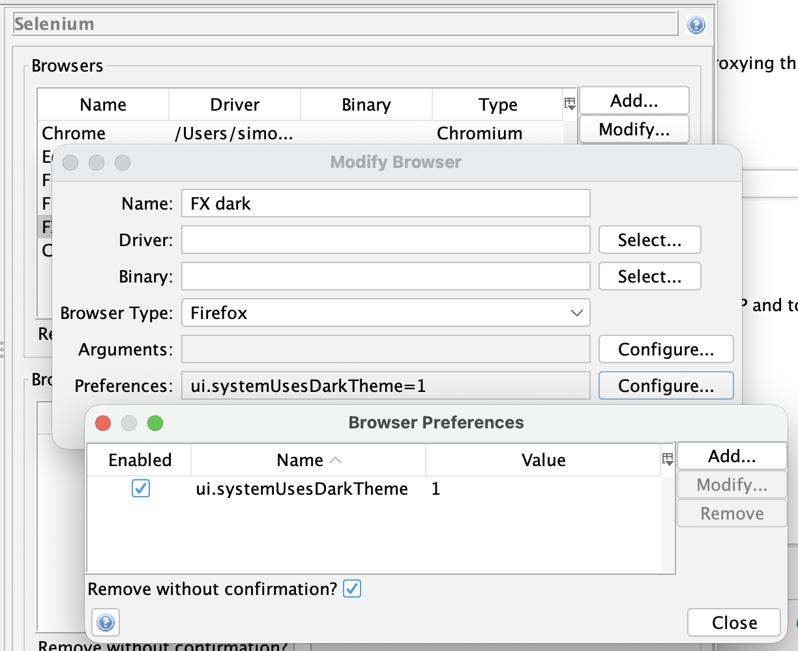

We’re excited to announce a powerful new capability: you can now add custom browsers and manage browser preferences directly within ZAP.

This enhancement gives you far more control over how ZAP drives browsers for manual exploring, the modern spiders, automation, and authenticated testing scenarios - making your scans more accurate, flexible, and aligned with real-world user behaviour.

Any custom browsers you define will be available to all of the relevant ZAP tools.

### Why Custom Browsers Matter

Modern applications behave differently depending on:
- Browser engine
- Browser version
- Installed extensions
- User preferences (privacy, security, rendering, storage)

Until now, testing was limited to the built-in browser configurations. That worked for many cases, but it didn’t always reflect how your users actually interact with your app.

With custom browsers, you can:

- ✅ Test with the same browser build your organisation standardises on
- ✅ Reproduce user-specific behaviour (e.g. disabled third-party cookies, custom CSP settings)
- ✅ Validate browser-dependent bugs
- ✅ Run automation with hardened or instrumented browsers
- ✅ Align security testing with real production environments

### Firefox and Chromium Support

Custom browsers can be based on either:
- Firefox
- Chromium

This means you can:

- Configure ZAP to use multiple Firefox profiles
- Use a corporate-managed Chromium build
- Launch browsers with custom flags or profiles
- Maintain multiple browser configurations for different test scenarios
- Test with Firefox Nightly or Chrome Canary

Each can now be defined once and reused across scans and automation jobs.

### Selenium Options

Browsers are managed via the [Selenium Options](/docs/desktop/addons/selenium/options/) screen:

Selecting the "Add..." button will allow you to add a custom browser:

If you choose not to specify a driver or binary then ZAP will default to the ones it uses for the built-in browsers.

You can manage the arguments and preferences for both the built-in browsers, and any custom browsers you add.

### Firefox Notes

Firefox tends to be very lenient with regards to the drivers, so you should be able to add Firefox Nightly without needing
to specify a new driver.

Firefox also supports many more preferences than Chrome.

### Chrome Notes

Chrome can be much more sensitive regarding the driver, so if you want to use Chrome Canary then you are likely to need to 
download and specify the correct driver.

### Better Control, Better Testing

ZAP already allowed you to configure browser arguments and install any browser extensions you need.

These changes move ZAP closer to real-world testing by:

- Giving you full control over the browser environment
- Making scans more accurate and reproducible
- Supporting advanced automation workflows
- Reducing manual setup and external tooling

In short, you can now test your applications the way your users actually experience them.

### Getting Started

To use custom browsers:

- Open the ZAP Options dialog
- Select the Selenium Options screen
- Add a new browser configuration
- Choose Firefox or Chromium as the base
- Set any required launch options
- Configure browser preferences and extensions as needed
- Select the browser in your scan or automation job

Define it once - reuse it everywhere.
