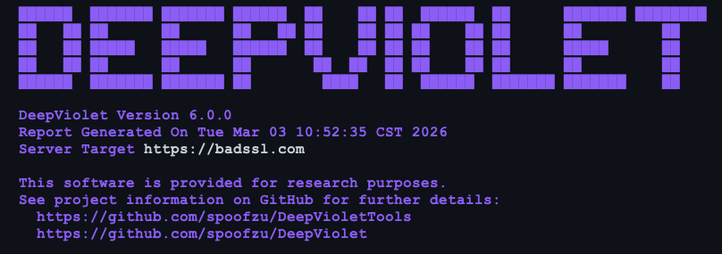

The ZAP [HTTPS Info](/docs/desktop/addons/https-info/) add-on has just been re-released to the Marketplace recently, and now delivers TLS/SSL risk assessments alongside the connection details you're used to seeing. That capability comes from **DeepViolet**, an open-source TLS/SSL analysis library I've been building since 2015, down for a brief hiatus, but now out of retirement. I wanted to take a moment to introduce the project to the ZAP community, explain what HTTPS Info is showing you, and share where things are headed.

Please note that the [HTTPS Info](/docs/desktop/addons/https-info/) add-on requires Java 21+, while the current release of ZAP only needs Java 17+.

## A Quick Introduction

I'm Milton Smith, an independent security researcher and open-source developer based in Houston, Texas area. I've been working in application security for a long time, including stints at Oracle and Yahoo, and I've presented tools at Black Hat Arsenal multiple times (DeepViolet in 2016 and 2018, and my other project JVMXRay in 2020). DeepViolet started as a standalone TLS scanning tool and has evolved into a modular API that other projects — like ZAP — can integrate directly.

[Simon Bennetts](/docs/team/psiinon/) and I have known each other for years through the security tooling community, and when the opportunity came up to bring DeepViolet's TLS analysis into ZAP via the HTTPS Info add-on, it was a natural fit. ZAP already excels at HTTP-level security testing; DeepViolet fills in the transport layer picture.

## What You're Seeing in HTTPS Info

When HTTPS Info runs a TLS assessment against a target, the output you get is powered by DeepViolet's scanning and risk evaluation engine. Here's a walkthrough of what each section means, using a scan against `revoked-rsa-dv.ssl.com` as an example.

### Risk Score and Grade

	Risk score: 77/100
	Letter grade: C

DeepViolet assigns a numeric risk score and a letter grade based on the aggregate findings. A score of 77 with a "C" grade tells you this server has real issues that need attention — it's not catastrophically broken, but it's far from clean. The scoring is weighted: a CRITICAL finding like a revoked certificate drags the score down harder than a missing low-severity header.

### Protocols & Connections

	- [SYS-0000900] ALPN not negotiated (LOW)
	- [SYS-0001000] Server does not support TLS_FALLBACK_SCSV (MEDIUM)

This section covers the TLS handshake itself. ALPN (Application-Layer Protocol Negotiation) not being negotiated is a minor issue, it means the server isn't explicitly agreeing on HTTP/2 or other protocols during the handshake. The TLS\_FALLBACK\_SCSV check is more meaningful: this mechanism prevents protocol downgrade attacks, and its absence leaves a window for an attacker to force a weaker TLS version.

### Revocation & Transparency

	- [SYS-0030100] Certificate is revoked (CRITICAL)
	- [SYS-0030200] OCSP stapling not present (MEDIUM)
	- [SYS-0030300] Must-Staple extension not present (LOW)

This is where the scan found the most serious problem. The server's certificate has been revoked — meaning the issuing CA has declared it invalid, but the server is still presenting it. In practice, not all browsers enforce revocation checking aggressively, which makes this exactly the kind of issue that slips through unless you're actively scanning for it. OCSP stapling and Must-Staple are related: they control how revocation status gets communicated to clients. Without stapling, clients have to query the CA's OCSP responder directly (which many skip for performance), and without Must-Staple, there's no enforcement that the server even bother.

### Security Headers

	- [SYS-0040100] Strict-Transport-Security header missing (HIGH)
	- [SYS-0040400] X-Content-Type-Options header missing (LOW)
	- [SYS-0040500] X-Frame-Options header missing (LOW)
	  ... (and others)

These are HTTP response headers that harden the connection beyond TLS itself. The big one here is HSTS (Strict-Transport-Security) — without it, a client can be tricked into making an initial plaintext HTTP request before upgrading to HTTPS, which is a well-known attack vector. The remaining headers (CSP, X-Frame-Options, Referrer-Policy, etc.) are defense-in-depth measures. None individually are catastrophic to miss, but collectively their absence paints a picture of a server that hasn't been hardened.

### DNS Security

	- [SYS-0050100] No CAA records (any CA can issue certificates) (MEDIUM)
	- [SYS-0050200] No DANE/TLSA records (LOW)

CAA (Certificate Authority Authorization) records let a domain owner declare which CAs are allowed to issue certificates for it. Without CAA, any CA can issue a certificate for your domain — which expands your attack surface if a CA is compromised or issues certificates carelessly. DANE/TLSA records go further by pinning certificate information directly in DNS, secured by DNSSEC. Adoption is still low, but the check is there for environments where it matters.

### Certificate Details and Cipher Suites

The remainder of the report shows the server certificate chain (subject, issuer, validity dates, signing algorithm, fingerprint) and the negotiated cipher suites. In this case, the server supports only TLS 1.3 suites — all rated STRONG — which is actually the one bright spot in an otherwise troubled configuration.

## DeepViolet API Architecture

Under the hood, DeepViolet is structured as three layers:

**DeepViolet API (Core Library)** — This is what ZAP's HTTPS Info add-on integrates against. It's a pure Java library with no UI dependencies, designed to be embedded in other tools. You call it with a target host, it performs the TLS handshake analysis, certificate chain validation, revocation checks, header inspection, and DNS lookups, and returns structured results. It's available on Maven Central, so any JVM-based project can pull it in as a dependency.

**DeepViolet Workbench** — A standalone Java Swing desktop application that wraps the API with a graphical interface. Useful for ad-hoc investigations where you want to visually walk through certificate chains, inspect individual cipher suites, or compare scan results. Not relevant to ZAP users directly, but it's how I develop and test new analysis features before they reach the API.

**DeepViolet CLI** — A command-line interface for scripting and CI/CD pipelines. Same engine, different delivery mechanism.

The architecture is intentional: the API is the product, and the Workbench and CLI are consumers of it, just like ZAP is. This means ZAP gets the same analysis depth as the standalone tools — it's not a watered-down integration.

## Beyond HTTPS Info?

What HTTPS Info delivers today is the tip of what DeepViolet can do. Here are some capabilities that exist in the broader project or are on the roadmap, features that ZAP users might eventually see in some form:

**Scan Persistence** — DeepViolet supports saving and loading scan results. This means you can capture a point-in-time snapshot of a server's TLS configuration, archive it, and reload it later for comparison. Useful for compliance workflows or tracking how a target's posture changes over time.

**AI-Augmented Reporting** — There's work underway to integrate AI into DeepViolet's report generation. Rather than just listing findings with severity codes, the goal is to produce contextual analysis — explaining what a combination of findings means in practical terms, what the likely attack scenarios are, and what the remediation priority should be. Think of it as a junior analyst layer on top of the raw scan data.   Popular AI’s are supported like Anthropic and OpenAI, but for those uncomfortable with sharing their scans offsite, local LLM’s like Ollama are supported.

**Interactive AI Chatbot** — Related to reporting, this feature lets you load scan results and have a conversation with AI about them. Ask questions like "What's the most urgent issue on this server?" or "If I can only fix three things, which three?" and get reasoned answers grounded in the actual scan data.  Like AI-Augmented reporting both popular and local LLM’s are supported.

**Customizable Risk Scoring** — The risk scoring engine uses YAML-based rules that define how findings map to severity levels, weights, and the final score. These rules are user-editable. If your organization has a different risk tolerance — say you consider missing CAA records a HIGH rather than MEDIUM — you can adjust the rules to match your policy without touching code.

**User Defined Risk Rules** — In addition to the risk rules included in the project, users can also include their own risk rules using a yaml markup which offers conditionals.  For example, this yaml rule fragment shows a rule description for embedding in a report for displaying the certificate algorithm and key size, _description: "Certificate uses ${algorithm} ${keysize}-bit key”._ The scheme facilitates flexible risk rules conformant with organizational policies.

**User-Editable Cipher Suite Evaluations** — Cipher suite strength ratings (STRONG, WEAK, etc) are also configurable. As cryptographic guidance evolves and older suites fall out of favor, you can update evaluations to reflect current best practices or your organization's standards.

**Certificate Transparency Analysis** — Deeper inspection of Certificate Transparency logs to verify that certificates have been properly logged, detect misissued certificates, and identify rogue CAs operating outside expected boundaries.

These features represent the broader vision: DeepViolet isn't just a scanner, it's a TLS analysis platform. What HTTPS Info surfaces today is the assessment layer — a curated slice that fits naturally into ZAP's workflow. But there's a lot more depth available for users and integrators who need it.

## Getting Involved

DeepViolet is open source and hosted on GitHub at https://github.com/spoofzu/DeepViolet (API) and https://github.com/spoofzu/DeepVioletTools (CLI, Workbench desktop app).  For ZAP users, the easiest way to see DeepViolet in action is to install HTTPS Info from the ZAP Marketplace and scan a target. If you find issues or have feature requests specific to the ZAP integration, those are welcome too.  Thanks to Simon Bennetts and the ZAP team for the opportunity to bring DeepViolet's analysis to the ZAP community. Building tools for defenders is what this is about, the more visibility we have into TLS configurations, the harder it is for things to slip through.

## Contacting

By day, Milton Smith works at Oracle.  Outside of Oracle, Milton works independently with the open-source community on projects like DeepViolet and JVMXRay.  These open source projects are not Oracle projects and have not been evaluated or approved by Oracle.  Milton’s opinions are his own and don’t represent Oracle.  That said, Oracle has been a long time supporter of security, the open source community, and professional security organizations.  
  
You can find Milton on [X](https://x.com/javamuffinztx) or [LinkedIn](https://www.linkedin.com/in/spoofzu/)
