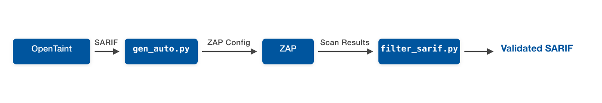
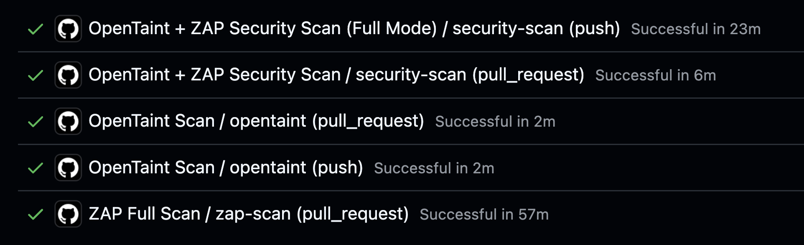
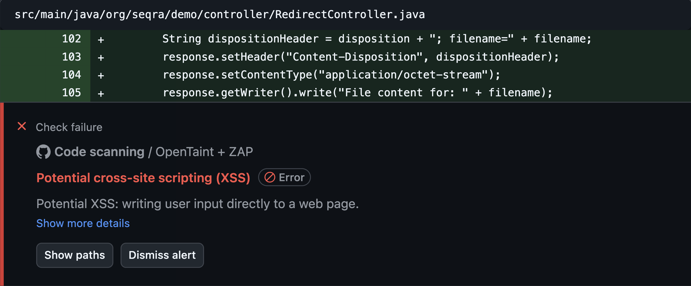

This post from the __Seqra Team__ describes an approach that uses static analysis findings to guide ZAP's active scans toward the most relevant
endpoints. The result is a faster scanning mode suited for CI/CD pipelines, built on top of ZAP's Automation Framework.

### TL;DR

- ZAP's comprehensive scanning is thorough by design — but for CI/CD pipelines, you need faster feedback on
  just the endpoints that changed or look risky
- Dataflow-aware SAST tools confirm that user input reaches dangerous operations — but can't determine whether
  a specific input actually exploits that flow at runtime
- When SAST tools output endpoint paths, HTTP methods, and vulnerability classifications, they can serve as
  input for targeted DAST scanning
- Using this approach with our static analyzer [OpenTaint](https://github.com/seqra/opentaint), we achieved an 8x speedup with the same detection
  accuracy on the OWASP Benchmark
- This is an additional scanning mode — you should still run full ZAP scans periodically for complete coverage
- Currently works with Java and Kotlin Spring and Servlet applications
- You can try the open-source integration yourself (see [Try It Yourself](#try-it-yourself) section)

### The Problem

Running full active scans in CI/CD is a familiar tradeoff: comprehensive coverage takes time, and scoping scans manually
means guessing which endpoints matter.

SAST tools solve the speed problem — they analyze code in minutes and find most vulnerabilities. But even dataflow-aware
SAST has a gap: it can confirm that user input reaches a dangerous operation — a real data flow exists — but it can't
determine whether a specific input actually triggers exploitation at runtime.

SAST and DAST tools have complementary knowledge. SAST knows where vulnerabilities might exist — the exact endpoints and
code paths with risky behavior. DAST knows how to validate they're exploitable — by crafting attacks and observing
runtime behavior. But they don't typically communicate.

The idea is straightforward: use SAST to point DAST toward the most relevant endpoints and use DAST to validate which
findings are real — a focused scanning mode for fast CI/CD feedback.

### What Makes This Work: DAST-Friendly SAST

For SAST to guide DAST effectively, the SAST tool must speak DAST's language. Most SAST tools report findings in terms
of source files, line numbers, and code snippets — useful for developers, but meaningless to a DAST scanner that
operates in a black-box way at the protocol level.

Unlike pattern-matching scanners that report potential issues based on code syntax, a dataflow-aware SAST tool
reports data flow traces — from user-controlled input to a dangerous sink. What remains uncertain is exploitability:
whether an attacker can craft an input that traverses that flow and triggers the vulnerability. That's exactly what DAST
validates.

What DAST tools need is different:

- The exact urls where vulnerabilities exist (e.g., `/api/users/{id}`)
- Vulnerability classifications ([CWE IDs](https://cwe.mitre.org/about/index.html)) to determine which scan rules to
  apply

We call this DAST-friendly SAST — static analysis designed to output information that dynamic scanners can directly
consume. Any SAST tool that provides these two pieces of information can enable targeted DAST scanning.

[SARIF](https://docs.oasis-open.org/sarif/sarif/v2.1.0/sarif-v2.1.0.html) is a JSON-based standard
for security findings that can carry all of this data along with additional metadata, making it ideal for tool-to-tool
communication.

### How It Works



[OpenTaint](https://github.com/seqra/opentaint) is an open-source taint analysis engine. It performs inter-procedural dataflow tracking, tracing untrusted data from HTTP inputs to dangerous sinks — across endpoints, persistence layers, aliased references, and async code. Its SARIF output includes endpoint paths, HTTP methods, and CWE classifications: exactly the DAST-friendly output described above.

The integration follows four steps:

1. OpenTaint scans your application and produces a SARIF report containing endpoints and CWE classifications

2. The `gen_auto.py` script parses the SARIF and a template, extracts CWE-to-endpoint mappings, and generates a targeted
   ZAP configuration with isolated contexts for each CWE category

3. ZAP executes the generated automation plan, running active scans with CWE-specific policies only against the filtered
   endpoints where those vulnerabilities were detected

4. The `filter_sarif.py` script cross-references the original SARIF against ZAP's findings and filters it to retain only
   results that ZAP successfully validated

The template is a standard [ZAP Automation Framework](/docs/desktop/addons/automation-framework/)
YAML file with configuration and a few requirements:

- At least one context in `env.contexts` that will be used for authentication and optionally endpoints filtering via
  `urls`, `includePaths`, `excludePaths`
- An `openapi` or `graphql` job for populating ZAP tree with urls
- CWE-specific scan policies using the naming format `policy-CWE-{number}`. Each policy defines which ZAP scan rules to
  enable and their strength or threshold settings. You can extend coverage by adding more CWE policies to the template.

Instead of testing every endpoint with every rule, you test only relevant combinations — achieving the same detection
accuracy in a fraction of the time.

### Benchmark Results

To validate this approach, we used [OWASP BenchmarkJava](https://github.com/OWASP-Benchmark/BenchmarkJava), a test
suite specifically designed to measure static and dynamic analyzers quality. It contains real, exploitable
vulnerabilities in a runnable web
application, making it a fair test for any security tool.

We focused on three CWE categories: XSS (CWE-79), SQL Injection (CWE-89), and Command Injection (CWE-78) — among the
most common web application vulnerabilities.

We compared the guided approach (ZAP + OpenTaint) against standalone ZAP OpenAPI scans at three strength levels (Medium,
High, Insane). For the guided approach, we used Insane strength to ensure our approach can help in the most critical
case (the best power at the worst time cost).

| Approach        | TP      | FP     | TN      | FN      | TPR      | FPR      | Requests | Time      |
|:----------------|:--------|:-------|:--------|:--------|:---------|:---------|:---------|:----------|
| ZAP Medium      | 368     | 17     | 549     | 276     | 0.57     | 0.03     | 2.4M     | 26 min    |
| ZAP High        | 374     | 22     | 544     | 270     | 0.58     | 0.04     | 3.7M     | 42 min    |
| ZAP Insane      | 376     | 45     | 521     | 268     | 0.58     | 0.08     | 5.3M     | 58 min    |
| **ZAP + OpenTaint** | **376** | **26** | **540** | **268** | **0.58** | **0.05** | **0.7M** | **7 min** |

**Reading the table**: TP = true positives (real vulnerabilities found), FP = false positives (false alarms),
TN = true negatives (correctly ignored), FN = false negatives (missed vulnerabilities). TPR = true positive rate
(detection rate, higher is better), FPR = false positive rate (noise level, lower is better). Requests = total HTTP
requests sent during scanning.

Key takeaways of ZAP + OpenTaint and ZAP Insane comparison:

- The integration achieves the same detection accuracy as ZAP Insane (TPR 0.58)
- The integration produces fewer false positives (FPR of 0.05 vs. 0.08)
- The integration sends 87% fewer requests (0.7M vs. 5.3M) and allows the guided scanning to eliminate unnecessary work
- The integration is 8x faster (7 minutes vs. 58 minutes), making DAST more practical for CI/CD pipelines

### CI/CD Integration

The GitHub Action provides two scanning modes for different CI/CD scenarios. Full mode scans the entire application and
works well for single branch validations. Differential mode is designed for pull requests — it scans both the PR branch
and the base branch, compares their SARIF fingerprints, and validates only the new or changed findings with ZAP.

To demonstrate the integration in a real CI/CD environment, we
used [java-spring-demo](https://github.com/seqra/seqra-java-spring-demo) — a Spring Boot application with
intentionally vulnerable endpoints covering various CWE
categories. [Pull request](https://github.com/seqra/java-spring-demo/pull/6) runs both scanning modes 
alongside a full ZAP scan for comparison:



The differential mode provides an 8x speedup compared to full ZAP scanning, making security validation practical for
every pull request without blocking development.

The action automatically uploads validated vulnerabilities to GitHub Security alerts. Each alert includes a full code
trace and vulnerability description, making it easy to fix.



Artifacts also contain the filtered and original SARIF reports, ZAP's detailed scan results, and generated YAML.
These artifacts are useful for deeper analysis or integration with other security tools.

### Limitations and Considerations

- An OpenAPI specification is required to map endpoints
- Currently supports only Java and Kotlin web applications with the Spring framework due to OpenTaint's JVM bytecode
  analysis
- The validation quality depends on the accuracy of both your SAST and DAST tool accuracy
- This integration is designed for fast, targeted validation—comprehensive DAST scans are still needed to find
  vulnerabilities SAST might miss

### Try It Yourself

Our GitHub Action automates the entire workflow — from OpenTaint analysis through ZAP scanning to validated results,
you only need a running app url. Here's a minimal setup you can add to your workflow:

```yaml
- name: Run security scan
  uses: seqra/opentaint/github/zap@github/v0
  with:
    mode: 'differential'  # or 'full' for single branch
    target: 'http://localhost:8080'
    template: 'template.yaml'
```

The action handles OpenTaint installation, SARIF generation, ZAP configuration, scanning, and result filtering
automatically. It uploads validated vulnerabilities to GitHub Security alerts and provides detailed artifacts for
further analysis. For further information see [action](https://github.com/seqra/opentaint/tree/main/github/zap) and workflow
[example](https://github.com/seqra/java-spring-demo/blob/demo/zap/.github/workflows/security-scan-pr.yml) in java-spring-demo.

### Conclusion

This approach lets SAST and DAST work in a symbiotic way: SAST provides the intelligence about where to look, ZAP
provides the proof of exploitability. The result is a focused scanning mode that fits into CI/CD, complementing the full
scans you already run.

The pattern is generalizable. Any SAST tool that provides endpoint-level findings with CWE
classifications can enable this kind of guided scanning — not just with ZAP, but with any DAST tool. If you're building
or evaluating SAST tools, consider DAST-consumable output as a design criterion.

Our OpenTaint integration is one implementation of this idea, and it's fully open source. We'd welcome feedback from the ZAP
community — let us know how it works for you or what you'd like to see improved.

### Links

- GitHub Action: https://github.com/seqra/opentaint/tree/main/github/zap
- Demo project: https://github.com/seqra/java-spring-demo
- OpenTaint: https://opentaint.org
- OpenTaint documentation: https://github.com/seqra/opentaint

*Thank you for your attention — Seqra Team*
