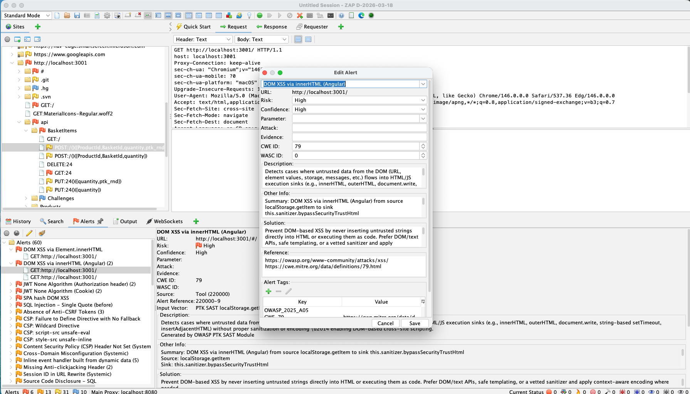
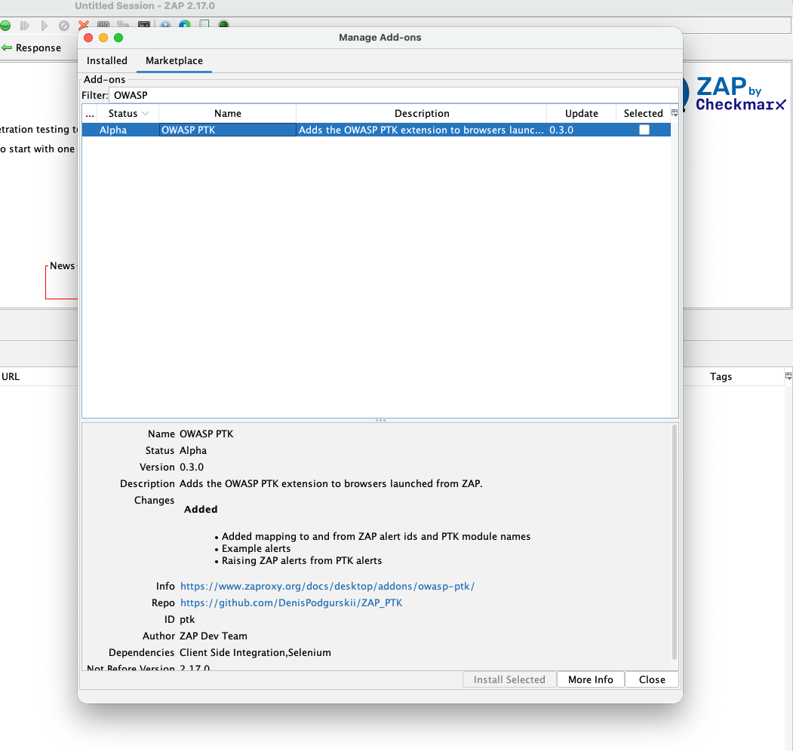
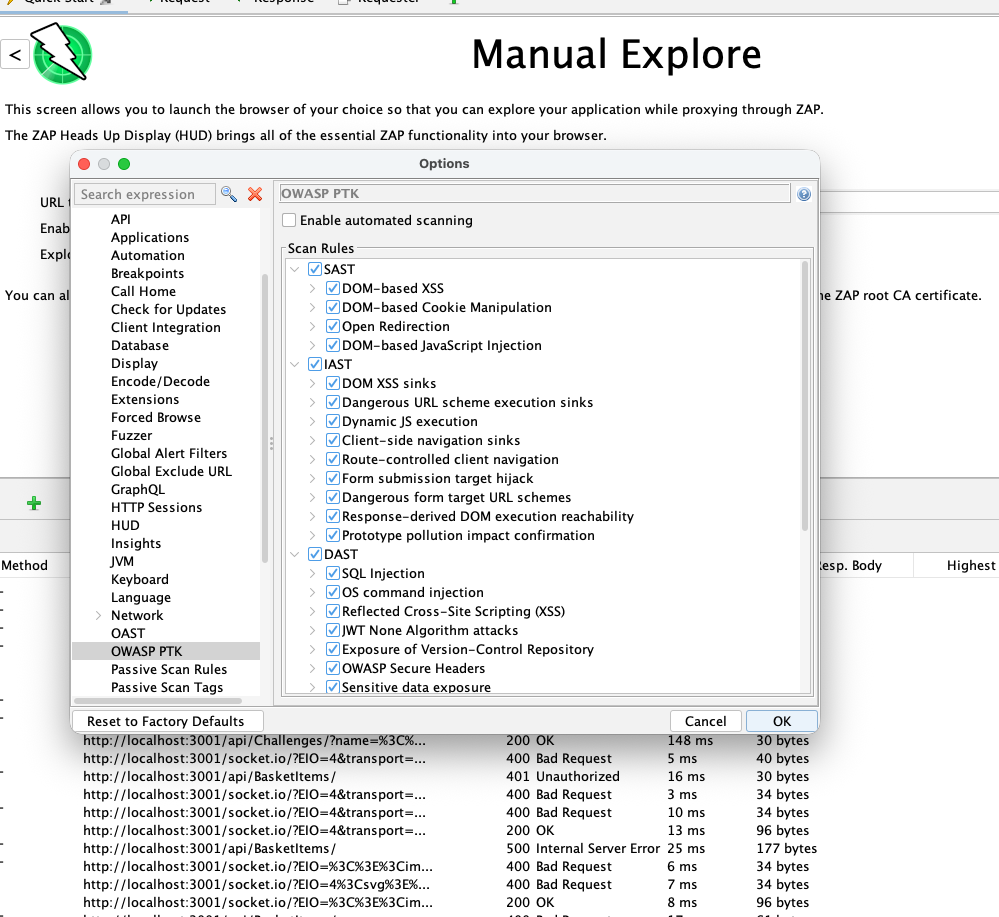
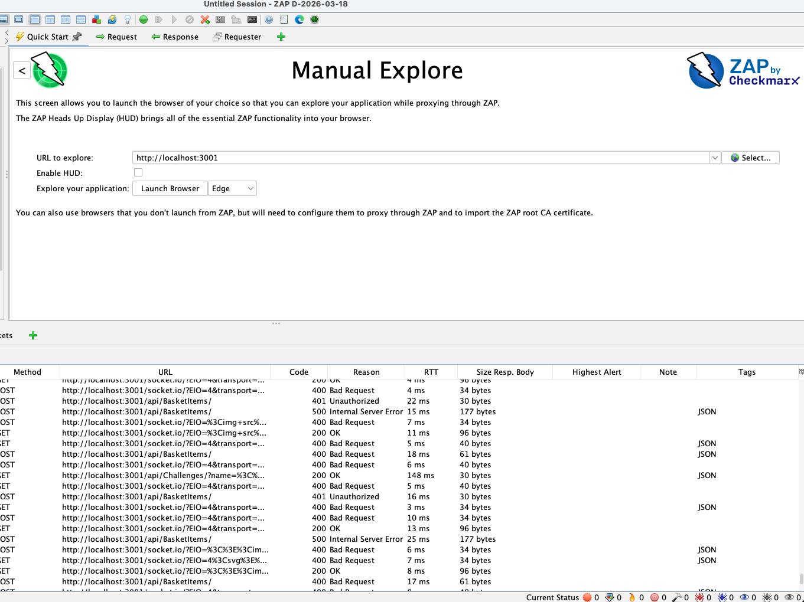
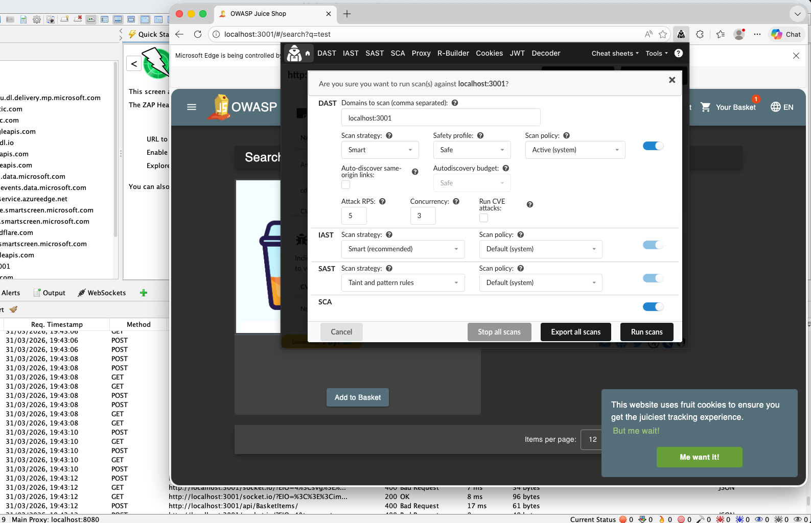
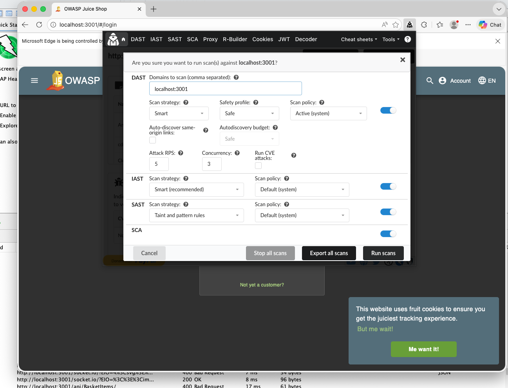
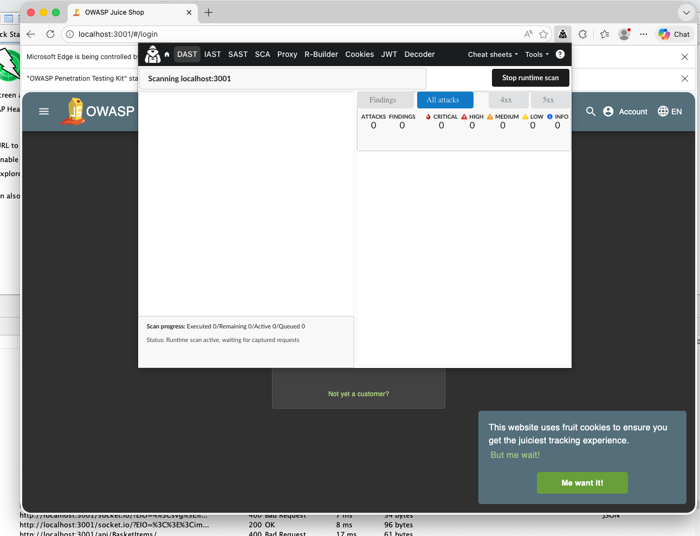
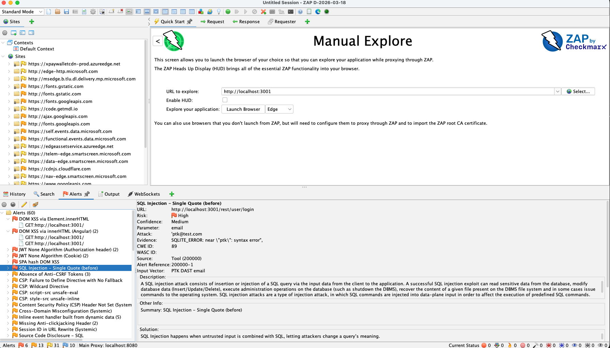
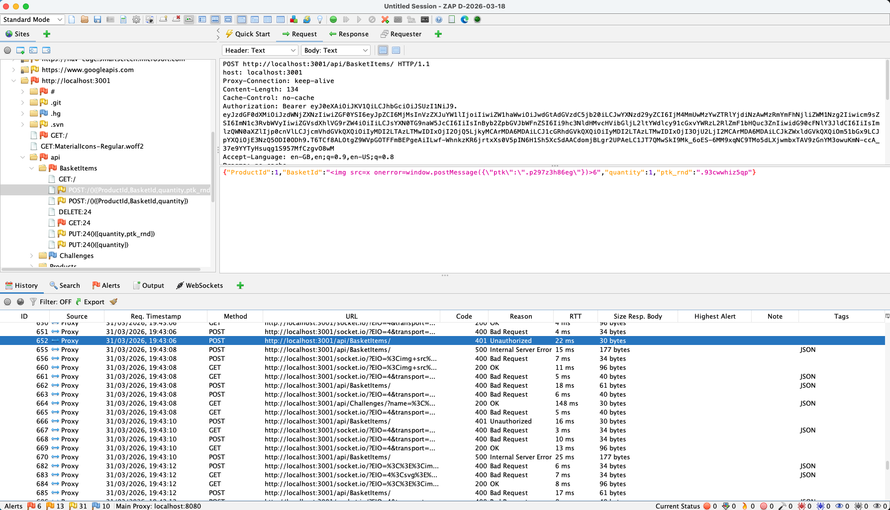

## OWASP PTK findings to ZAP alerts demo



---

## What’s new in ZAP Add-on 0.3.0

The add-on still pre-installs OWASP PTK into the browsers launched by ZAP (Chrome / Firefox / Edge), but it now adds:

- **PTK → ZAP Alerts**: findings are surfaced into ZAP as Alerts (so they show up where ZAP users already live).
- **Rule selection**: choose which PTK rule packs to run (**SAST**, **IAST**, **DAST**).
- **Auto-start option**: optionally start PTK scanning automatically when the ZAP browser launches.

OWASP PTK (PenTest Kit) turns your browser into a security testing platform. ZAP remains your traffic and context hub.

With **OWASP PTK 9.8.0** and **ZAP add-on 0.3.0**, there is a key workflow upgrade:

**ZAP can now display OWASP PTK findings as native ZAP Alerts.**

This means you can scan in the browser (where the session, SPA routing, and UI flows are real), and then review everything in ZAP’s normal alert workflow.

---

### Why this matters: a huge upgrade for ZAP’s client-side capabilities

This has a **huge impact on ZAP’s client-side capabilities**.

ZAP is excellent at what it can observe at the proxy layer: requests, responses, headers, parameters, server-side behavior, and classic active/passive scanning.

But modern applications increasingly push risk into places the proxy can’t reliably see:

- UI-driven flows that never trigger full page loads (SPA routing)
- DOM updates and client-side rendering decisions
- JavaScript sinks and dangerous patterns inside bundled/minified code
- runtime behavior that only exists inside the browser’s execution context

That’s where OWASP PTK helps. PTK runs **inside the browser**, so it can see client-side code and runtime signals directly — and with add-on **0.3.0** it can now report those findings back into ZAP as **native Alerts**.

#### IAST: runtime signals during real user flows

PTK IAST can surface issues that are hard or impossible to infer from traffic alone, because the proof is in *what the app did at runtime*:

- DOM XSS-style behavior where the payload never comes back in the response, but is used unsafely in the browser runtime
- risky data-flow patterns (tainted input reaching sensitive operations)
- evidence that a dangerous sink was reached, even when server responses look “normal”

From a proxy-only perspective, these can be invisible or ambiguous because the proxy doesn’t know what happened after the response was processed by JavaScript.

#### SAST: analyze the JavaScript the browser actually loaded

PTK SAST focuses on **inline and external scripts loaded by the page** — the real production bundles and third-party scripts your browser executed.

This helps catch issues like:

- dangerous sinks and patterns (`eval`, `Function`, unsafe `innerHTML`/template usage, etc.)
- DOM injection patterns that don’t show up as reflected payloads in HTTP responses
- risky client-side behaviors introduced by third-party scripts or production builds (even when you don’t have repo access)

ZAP can capture the scripts as responses, but it’s not designed to statically analyze the client-side codebase that the browser actually assembled and executed. PTK is — and the results now land in ZAP as Alerts.

#### Massive jump in alert coverage

And the number of new alerts is a massive jump for us: ZAP now has **142** OWASP PTK–tagged alert types available.  
You can browse the full list here: [OWASP PTK alert tags in ZAP](https://www.zaproxy.org/alerttags/tool_ptk/).

Scan in the browser. Review in ZAP.

---

## Step 0: Install or update the OWASP PTK add-on

If you haven’t installed the add-on yet (or you’re on an older version):

1. In ZAP, open **Marketplace**.
2. Search for **OWASP PTK**.
3. Install (or update) the add-on.

---

## Step 1: Configure PTK scanning options in ZAP

Open:

**Tools → Options → OWASP PTK**

You’ll see:

- **Enable automated scanning** (optional)
- A list of PTK **Scan Rules** grouped by engine:
  - **SAST**
  - **IAST**
  - **DAST**

### Recommended first-time settings

For a first run (especially on Juice Shop), a good starting point is:

- Enable **DAST**
- Enable **IAST**
- Enable **SAST**
- Leave **Enable automated scanning** **OFF** for the first run (start scans manually, so you see the workflow clearly)

Once you’re happy with the behavior, flip automated scanning on.

---

## Step 2: Launch a browser from ZAP straight into Juice Shop

Use ZAP’s browser launch feature (Quick Start / Manual Explore is the simplest entry point), and provide the target URL:

- **URL:** `http://localhost:3001` (or your Juice Shop URL)

When the browser opens, you should already be on the Juice Shop application, with OWASP PTK pre-installed.

1. Launch **Chrome** or **Firefox** from ZAP.
2. Enter `http://localhost:3001` as the URL (or your authorized Juice Shop instance).
3. Confirm the **OWASP PTK** extension icon is present in the launched browser.

---

## Step 4: Run the scan (manual or automated)

### Option A: Manual start (recommended for learning the flow)

1. Click the OWASP PTK icon.
2. Start the scan(s) you enabled (DAST / IAST / SAST).
3. Browse key Juice Shop flows while the scan runs:
   - search
   - product pages
   - login/logout
   - account/profile
   - basket/checkout flows (where permitted)

### Option B: Automated scanning on browser launch

If **Enable automated scanning** is checked in ZAP Options, PTK scanning starts automatically when you launch the ZAP browser.

This is useful for repeatable demos and “baseline scanning” workflows.

---

## Step 3: Exercise a realistic Juice Shop flow

Before (or while) running scans, drive a short, repeatable workflow so both ZAP and PTK see real authenticated traffic and UI-driven requests.

1. **Log in**
2. **Open Profile**
3. Return to the **Home** page and add **2–3 items** to your basket
4. Open the **Basket** and **remove one item**
5. Use the search box and search for: **`test`**

---

## Step 5: Review results in ZAP Alerts

The payoff of add-on 0.3.0 is that you can review PTK findings where ZAP users normally review everything:

- Open the **Alerts** tab in ZAP.
- You should see Alerts created from PTK findings.
- Alerts will also be visible in the Sites tree / context views, depending on your ZAP configuration.

### Practical tips for triage

- Use ZAP’s existing Alert workflows:
  - severity filtering
  - marking false positives
  - adding notes
  - exporting reports

- Treat PTK findings as *starting points*:
  - pivot into ZAP History for the exact request/response
  - reproduce in the browser session
  - use ZAP tooling (replay, fuzz, scripts) to deepen validation

---

## How to think about the engines (SAST / IAST / DAST)

### DAST (browser-driven)
Best for runtime request mutation and “real behavior” testing in the exact session you’re using.

### IAST (runtime instrumentation)
Best for higher-context findings during real flows, especially in SPA-heavy apps.

### SAST (loaded-script analysis)
Best for discovering risky client-side patterns in the code that actually shipped to the browser.

In this integration, you can choose the rule packs you want in ZAP’s Options, then run them as part of your normal ZAP-led workflow.

---

## OWASP PTK rules in ZAP
See all the OWASP PTK rules that can be anbled for ZAP alerts:

[OWASP PTK alert tags in ZAP](https://www.zaproxy.org/alerttags/tool_ptk/)

---

## What’s next

This is the first version of “PTK findings as ZAP Alerts”.

Next up, we’ll be working on **full automation**.

The goal is to make PTK + ZAP feel like a single automated pipeline:

- **Launch** a ZAP browser with PTK enabled
- **Auto-start** the selected PTK engines/rules (DAST / IAST / SAST)
- Run a **repeatable journey** (login, key flows, common actions) using recorded steps or scripted browser automation
- **Wait for completion** / stop conditions (time budget, coverage, confidence thresholds)
- **Stream results** into ZAP continuously as Alerts (not just at the end)
- Produce a **clean, reproducible output** you can report on in ZAP (and re-run on every build)

This is a big step for CI-style scanning: the same real browser session and the same UI flows, but automated and repeatable—while ZAP remains the place where findings are reviewed, filtered, and reported.

---

## Notes and scope reminders

- Only scan targets you have permission to test.
- Start with conservative settings (rate/concurrency) on real environments.
- Juice Shop is intentionally vulnerable — it’s perfect for demonstrating the workflow safely.

