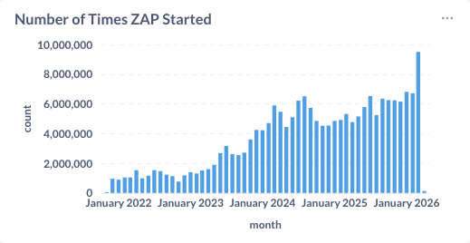

March was a huge month for the ZAP community — not just in terms of features and integrations, but also usage. ZAP was run nearly **9.5 million times** in March, a significant jump from around **7 million runs in February**. That kind of growth is a strong signal that more teams are embedding ZAP deeper into their workflows, especially in automation and CI/CD pipelines.

## Smarter Scanning for Faster Feedback

One of the standout posts this month introduced a new approach to [guided scanning using static analysis](/blog/2026-03-27-guided-zap-scans-faster-cicd-feedback-using-sast/). By feeding static analysis results into ZAP’s active scanner, we can prioritise the most relevant endpoints and dramatically reduce scan times.

This is particularly valuable for CI/CD environments, where speed and signal-to-noise ratio matter. Rather than scanning everything equally, ZAP can now focus effort where it’s most likely to find issues — helping teams get faster, more actionable feedback.

## DeepViolet: Strengthening TLS Analysis

We also introduced you to [DeepViolet](/blog/2026-03-19-introducing-deepviolet/), the engine behind ZAP’s enhanced TLS analysis capabilities. This is a great example of how we continue to evolve ZAP by building on and integrating with specialised projects.

DeepViolet brings deeper insight into TLS configurations, helping users identify weaknesses that might otherwise be missed. It’s part of a broader trend in ZAP: leveraging dedicated tools and integrating them seamlessly into the ZAP experience.

## OWASP PTK: Raising ZAP Alerts

Collaboration remains a key theme for ZAP.

This month’s post on [OWASP PTK integration](/blog/2026-04-01-owasp-ptk-findings-to-zap-alerts/) showed how findings from PTK can now be surfaced directly as ZAP alerts, making it easier to combine different testing approaches in a single workflow. Instead of switching tools, you can run SAST, IAST, DAST, and more within the same session, with ZAP acting as the central hub.

This is big!

ZAP has always been strong on testing server side apps, but has not been as effective testing the browser side.
OWASP PTK is **very** strong on the browser side, making this an incredibly powerful combination.

For now you need to enable this integration manually, but don't worry, automation support is on its way!

As a result of this collaboration we inducted [Denis Podgurskii](/docs/team/denis/) (the OWASP PTK Creator) into the ZAP Extended Team - welcome Denis!

## Working Better Together: The Wider Ecosystem

These integrations demonstrate our ongoing focus on working with other open source projects. As highlighted earlier this year, ZAP is increasingly designed to **integrate with third-party browser-based tools**, lowering the barrier to combining multiple security approaches. 

DeepViolet, OpenTaint, and OWASP PTK are just three examples — expect to see more integrations as we continue to expand the ZAP ecosystem.

If you work on an open source project that you think we should integrate with then please get in touch with [me](/team/psiinon/)!

## AI Support: Just Getting Started

At the very end of March (and into early April), we also introduced the [ZAP MCP Server](/blog/2026-04-02-zap-mcp-server/), which allows AI assistants to interact directly with ZAP — starting scans, retrieving alerts, and exploring applications through natural language.

This is just the beginning of our work in this area. As we noted in our 2026 plans, AI integration is a key focus, and we’re actively exploring how ZAP can support AI-driven workflows and intelligent automation.

## Looking Ahead

March shows how ZAP continues to evolve in three key directions:

* **Scale**: Rapid growth in usage, with nearly 9.5 million runs this month
* **Integration**: Deeper collaboration with tools like DeepViolet and PTK
* **Intelligence**: Early but exciting steps into AI-assisted security testing

As always, thanks to everyone in the community who contributes code, ideas, and feedback. With this level of momentum, the rest of 2026 is looking very promising.

## New Contributors
A very warm welcome to the people who started to contribute to ZAP this month!

* [BraulioL](https://github.com/BraulioL)
* [ridhimamathur](https://github.com/ridhimamathur)
* [iamsanjaymalakar](https://github.com/iamsanjaymalakar)
* [Karl-Seryani](https://github.com/Karl-Seryani)

## GitHub Pulse
Here are some statistics for the two main ZAP repositories:

[zaproxy](https://github.com/zaproxy/zaproxy/pulse/monthly)  
Excluding merges, 6 authors have pushed 11 commits to main and 11 commits to all branches. On main, 32 files have changed and there have been 303 additions and 147 deletions.

[zap-extensions](https://github.com/zaproxy/zap-extensions/pulse/monthly)  
Excluding merges, 10 authors have pushed 72 commits to main and 73 commits to all branches. On main, 864 files have changed and there have been 16,287 additions and 2,164 deletions.

A total of [51 human PRs were merged](https://github.com/search?q=org%3Azaproxy+type%3Apr+-author%3Azapbot+-author%3Aapp%2Fdependabot+sort%3Aupdated-asc+closed%3A2026-03+is%3Amerged&type=pullrequests) on the ZAP repos.

## Released Add-ons - Full Changelog
In March 2026, we released updated versions of 27 add-ons:

##### Active scanner rules
**v80**  
Added
- Checks for cloud metadata from IBM and OpenStack.
- Evidence for cloud metadata.
Changed
- Update dependency.
Fixed
- Cloud metadata false positives by making the evidence checks more specific.

##### Authentication Helper
**v0.37.0**  
Added
- Support for Microsoft login in a pop-up window

**v0.36.0**  
Changed
- Maintenance changes.

Fixed
- Autodetect HTTP authentication, and added more auth diagnostics.

**v0.35.0**  
Fixed
- Exception in authentication diagnostics.
- Ensure the login link verification URL has both logged in and out indicators.

Changed
- Maintenance changes.

##### Client Side Integration
**v0.21.0**  
Added
- Support for other add-ons to piggyback the secure connection established with the ZAP browser extension.
- Allow to avoid logout elements with the spider.

Changed
- Set the extension order so that it will always be available to unordered extensions.
- Maintenance changes.

##### Common Library
**v1.40.0**  
Changed
- Update dependencies.
- Use a monospaced font for the output panel.
- Remove Markdown formatting from vulnerabilities' solutions (Issue 8056).

Added
- Added OWASP Top 10 2025 and OWASP API Top 10 2023 Alert Tags.

##### Encoder
**v1.9.0**  
Changed
- Main dialog input area is now resizable via a draggable divider between input and output panels, the position is saved and restored when the dialog is opened.

##### GraalVM JavaScript
**v0.14.0**  
Added
- Document script engine lifecycle in the help.

##### GraphQL Support
**v0.32.0**  
Added
- Support for importing an introspection query response JSON from a URL (Issue 9249).

##### HTTPS Info
**v16**  
Added
- HTTPS Configuration alerts now have tags for OWASP Top 10, WSTG, systemic, and policies.

**v15**  
Changed
- Update to DeepViolet 6.1.1, no longer requires Java 21+.

**v14**  
Added
- Active scan rules Info level "HTTPS Configuration" alert and a Low, Medium or High alert if any problems reported.

Changed
- Update to DeepViolet 6.1.0 with new API. Requires Java 21+.

##### Import/Export
**v0.18.0**  
Added
- Support for plugable exporters and importers.

**v0.17.0**  
Changed
- Use the context when exporting the Sites Tree through the Automation Framework job.

##### Insights
**v0.3.0**  
Fixed
- Correct check of memory usage.

**v0.2.0**  
Fixed
- Do not attempt to prompt when exiting on high insight and headless.

##### Linux WebDrivers
**v190**  
Changed
- Update ChromeDriver to 146.0.7680.165.

**v189**  
Changed
- Update ChromeDriver to 146.0.7680.153.

**v188**  
Changed
- Update ChromeDriver to 146.0.7680.80.

**v187**  
Changed
- Update ChromeDriver to 146.0.7680.76.

**v186**  
Changed
- Update ChromeDriver to 146.0.7680.72.

**v185**  
Changed
- Roll back ChromeDriver to 145.0.7632.160.

##### Network
**v0.26.0**  
Added
- Method to expose if proxy enabled.

##### OpenAPI Support
**v53**  
Changed
- Dependency update.

Fixed
- Issue with data generation for arrays in OpenAPI 3.1 definitions (Issue 9261).

##### Passive scanner rules
**v72**  
Added
- Loosely scoped cookie rule to include evidence.
Changed
- Loosely scoped cookie rule to just include cookie names in the "Other Info".

**v71**  
Changed
- Information Disclosure - Suspicious Comments scan rule:
  - Attempts to collect comments from JavaScript content using the ANTLR library, which should be more accurate.
  - Provides more context in the evidence (Issue 9185).
- The Content Security Policy scan rule leverages an updated version of the htmlunit-csp library that includes support for the trusted-types and require-trusted-types-for directives.

##### Quick Start
**v55**  
Fixed
- Attacking domain level URLs with a trailing slash.

**v54**  
Fixed
- Address exception when using configurations in the Automation Framework plan in command line mode.

##### Replacer
**v22**  
Added
- Method parameter matcher to allow rules to apply to specific HTTP methods (Issue 9016).

Changed
- Support multiline replacements in GUI.

Fixed
- Correct error message which was shown as missing.

##### Report Generation
**v0.44.0**  
Added
- "Other Info" to the modern HTML report

Changed
- Maintenance changes.
- "Other Info" sections of the HTML reports to split the text on newlines.

##### Requester
**v7.10.0**  
Fixed
- Save Requester panel and Manual Request Editor dialog options (Issue 6985).

##### Retire.js
**v0.55.0**  
Changed
- Updated with upstream retire.js pattern changes.

##### Scan Policies
**v0.8.0**  
Changed
- Updated based on Rules' Policy Tag assignments.

##### Script Console
**v45.18.0**  
Changed
- Update dependency.

Added
- The Script Job Run action now supports:
    - Passing authentication details (context and user) for standalone Zest client script execution.
    - Executing a chain of one or more Zest standalone scripts using the chain parameter.

##### Selenium
**v15.46.0**  
Added
- Allow custom browser builders to define preferences

**v15.45.0**  
Fixed
- Close all webdrivers when ZAP exits.

##### Technology Detection
**v21.54.0**  
Changed
- Updated with enthec upstream icon and pattern changes.

##### WebSockets
**v36**  
Fixed
- Correct shutdown state.

##### Windows WebDrivers
**v191**  
Changed
- Update ChromeDriver to 146.0.7680.165.

**v190**  
Changed
- Update ChromeDriver to 146.0.7680.153.

**v189**  
Changed
- Update ChromeDriver to 146.0.7680.80.

**v188**  
Changed
- Update ChromeDriver to 146.0.7680.76.

**v187**  
Changed
- Update ChromeDriver to 146.0.7680.72.

**v186**  
Changed
- Roll back ChromeDriver to 145.0.7632.160.

##### Zest - Graphical Security Scripting Language
**v48.13.0**  
Added
- Internal support for creating a single runnable chain script from multiple Zest scripts.
- Support for import and export.

##### macOS WebDrivers
**v190**  
Changed
- Update ChromeDriver to 146.0.7680.165.

**v189**  
Changed
- Update ChromeDriver to 146.0.7680.153.

**v188**  
Changed
- Update ChromeDriver to 146.0.7680.80.

**v187**  
Changed
- Update ChromeDriver to 146.0.7680.76.

**v186**  
Changed
- Update ChromeDriver to 146.0.7680.72.

**v185**  
Changed
- Roll back ChromeDriver to 145.0.7632.160.

