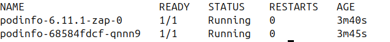
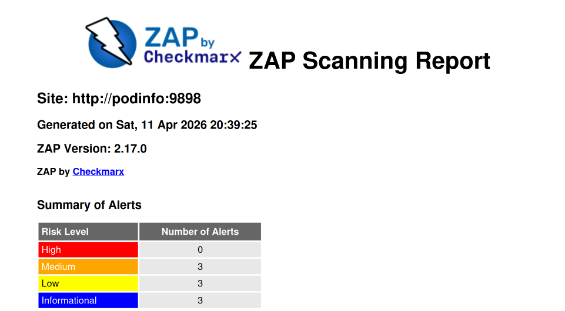

Kubernetes Resource Operator (KRO) is a lightweight way to define custom resources in your Kubernetes cluster that provide an interface to create workloads in your cluster without surfacing all the details of the underlying resources. When using KRO to provide these kinds of abstractions for deployments, ZAP can be included to run scans on each new deploy.

## Prerequisites
This demo assumes a few things are already available
- A Kubernetes cluster
- [KRO](https://kro.run/docs/getting-started/Installation) installed and running in the Kubernetes cluster 
- [Kubectl](https://kubernetes.io/docs/tasks/tools/#kubectl)

## Set up the Kubernetes namespace
1. Create the `zap-demo` namespace where we will be deploying all of our resources to
    ```
    kubectl create namespace zap-demo
    ```

## Create custom resource with KRO

With KRO, we use a `ResourceGraphDefinition` (RGD) manifest to create our custom schema definition and configure the underlying resources that it will use.

1. First we will set up our RGD and add our custom schema. Create a file called `my-application.yaml` and add the following:
    ```
    apiVersion: kro.run/v1alpha1
    kind: ResourceGraphDefinition
    metadata:
      name: my-application
    spec:
      schema:
        apiVersion: v1alpha1
        kind: Application
        spec:
          name: string | required=true
          image:
            repository: string | required=true
            tag: string | required=true
          replicas: integer | default=1
          command: "[]string"
          httpPort: integer | default=8080
          forceRedeployCounter: integer | default=0
          zap:
            storageClassName: string | required=true
            urls: "[]string | required=true"
            excludePaths: "[]string | default=[]"
            includePaths: "[]string | default=[]"
            openApi:
              apiUrl: string | required=true
              targetUrl: string | required=true
    ```
    - With this RGD we are creating a custom resource definition in the cluster called `Application` with a version of `v1alpha1`. `Application` can then be the resource definition used for deploying workloads in our cluster instead of the build in definitions like `Deployment`.
    - In `spec.schema.spec` we define the parameters to be set when deploying each `Application`
        - The top level parameters are going to be used for the settings of the main workload we are deploying.
        - `spec.schema.spec.forceRedeployCounter` will be a counter we can update in order to force a redeployment of the workload, as well as retrigger ZAP.
    - There is a `spec.schema.spec.zap` section to define all the settings related to ZAP
    - `spec.schema.spec.zap.storageClassName` will be used in order to save the ZAP report in persistent storage. In my own cluster, I use a storage class that is saving the report to blob storage that is easy for me to access. Alternatively, you could set up the RGD using a ZAP script that sends the report elsewhere using HTTP. Or a sidecar container could be that watches for the ZAP report to appear and then sends that report elsewhere.
    - The rest of the `spec.schema.spec.zap` parameters will be used in the ZAP Automation Plan

2. Next, will start setting up the `resources` section of the RGD. First, we add the defintions we need for deploying the main workload.

    ```
    #spec:
      resources:
      - id: deployment
        readyWhen:
          - ${deployment.status.availableReplicas > 0}
          - ${deployment.status.conditions.exists(c, c.type == "Available" && c.status == "True")}
        template:
          apiVersion: apps/v1
          kind: Deployment
          metadata:
            name: ${schema.spec.name}
            namespace: ${schema.metadata.namespace}
          spec:
            replicas: ${schema.spec.replicas}
            selector:
              matchLabels:
                app: ${schema.spec.name}
            template:
              metadata:
                labels:
                  app: ${schema.spec.name}
                  forceRedeployCounter: "${string(schema.spec.forceRedeployCounter)}"
              spec:
                containers:
                  - name: ${schema.spec.name}
                    image: "${schema.spec.image.repository}:${schema.spec.image.tag}"
                    ports:
                    - name: http
                      containerPort: ${schema.spec.httpPort}
                      protocol: TCP
                    command: ${schema.spec.command}
      - id: service
        template:
          apiVersion: v1
          kind: Service
          metadata:
            name: ${schema.spec.name}
            namespace: ${schema.metadata.namespace}
          spec:
            selector: ${deployment.spec.selector.matchLabels}
            ports:
            - name: http
              port: ${schema.spec.httpPort}
              protocol: TCP
              targetPort: http
    ```
    - Here we're adding a `Deployment` and `Service` for our main workload. KRO will then deploys these when we create an `Application`
    - You can see that using the `${}` syntax we are able to reference values from the schema, as well as from other resources. When one resource references another, it creates a dependency and orders the creation of the resources.
    - Using the `readyWhen` configuration allows us to define when KRO will consider this resource as done being applied. Resources that depend on it will not get applied until the KRO finds that the dependency is ready. 

3. Third, we'll add the ZAP Automation Plan to our resources list.
    ```
    #spec:
      #resources:
      - id: zapConfig
        template:
          apiVersion: v1
          kind: ConfigMap
          metadata:
            labels:
              app.kubernetes.io/name: zap
            name: ${schema.spec.name}-zap
            namespace: ${schema.metadata.namespace}
          data:
            af-plan.yaml: |
              env:
                contexts:
                - authentication:
                    parameters: {}
                    verification:
                      method: response
                      pollFrequency: 60
                      pollUnits: seconds
                  excludePaths: ${"[" + schema.spec.zap.excludePaths.map(item, '"' + item + '"').join(", ") + "]"}
                  includePaths: ${"[" + schema.spec.zap.includePaths.map(item, '"' + item + '"').join(", ") + "]"}
                  name: Default Context
                  sessionManagement:
                    method: cookie
                    parameters: {}
                  technology:
                    exclude: []
                  urls: ${"[" + schema.spec.zap.urls.map(item, '"' + item + '"').join(", ") + "]"}
                parameters:
                  failOnError: false
                  failOnWarning: false
                  progressToStdout: true
                vars: {}
              jobs:
              - name: openapi
                parameters:
                  apiUrl: ${schema.spec.zap.openApi.apiUrl}
                  targetUrl: ${schema.spec.zap.openApi.targetUrl}
                  context: Default Context
                type: openapi
              - name: activeScan
                parameters:
                  context: Default Context
                  maxAlertsPerRule: 0
                  maxRuleDurationInMins: 0
                  maxScanDurationInMins: 0
                  policy: ""
                  threadPerHost: 2
                  user: ""
                policyDefinition:
                  defaultStrength: medium
                  defaultThreshold: medium
                  rules: []
                type: activeScan
              - name: pdf-report
                parameters:
                  reportDescription: ""
                  reportDir: /zap/reports
                  reportTitle: ZAP Scanning Report
                  template: traditional-pdf
                risks:
                - info
                - low
                - medium
                - high
                confidences:
                - low
                - medium
                - high
                - confirmed
                sections:
                - instancecount
                - alertdetails
                - alertcount
                type: report
              - name: sarif-report
                parameters:
                  template: sarif-json
                  reportDir: /zap/reports
                  reportTitle: ZAP Scanning Report
                  reportDescription: ""
                  displayReport: false
                risks:
                - low
                - medium
                - high
                confidences:
                - low
                - medium
                - high
                - confirmed
                sites: []
                type: report
    ```
    - The ZAP Automation plan is getting saved as a ConfigMap, which we will later pass along to our ZAP workload.
    - Since the Automation Plan is being saved as a string within the ConfiMap, we have to do some extra work to take values from the `Application` schema, and add them as strings instead of objects. For example, since `schema.spec.zap.urls` is an array, we have to convert the array into a string in order to inject into the Automation Plan. But that string still needs to be converted in a way that ZAP will be able to read it as a yaml list.
    - In this plan we're reading the OpenAPI spec, attacking the workload, and then generating a report. However, other strategies could be used depending on how you deploy your workloads. For example KRO could be combined with the methods demonstrated in [Use ZAP with Flagger in Kubernetes](/blog/2024-12-24-use-zap-with-flagger-in-kubernetes/) to proxy traffic through ZAP for giving ZAP requests to use to attack.

4. Next, we'll add the rest of the resources need for ZAP
    ```
    #spec:
      #resources:
      - id: zapPvc
        template:
          apiVersion: v1
          kind: PersistentVolumeClaim
          metadata:
            labels:
              app.kubernetes.io/name: zap
            name: ${schema.spec.name}-zap
            namespace: ${schema.metadata.namespace}
          spec:
            accessModes:
            - ReadWriteOnce
            resources:
              requests:
                storage: 50Mi
            storageClassName: ${schema.spec.zap.storageClassName}
      - id: zapPod
        template:
          apiVersion: v1
          kind: Pod
          metadata:
            labels:
              app.kubernetes.io/name: zap
              dependency: ${deployment.metadata.name}
            name: ${schema.spec.name}-${schema.spec.image.tag}-zap-${string(schema.spec.forceRedeployCounter)}
            namespace: ${schema.metadata.namespace}
          spec:
            containers:
            - args:
              - ./zap.sh
              - -cmd
              - -autorun
              - /zap/config/af-plan.yaml
              - -host
              - 0.0.0.0
              - -config
              - api.disablekey=true
              - -config
              - api.addrs.addr.name=.*
              - -config
              - api.addrs.addr.regex=true
              image: ghcr.io/zaproxy/zaproxy:stable
              name: zaproxy
              ports:
              - containerPort: 8080
                name: zaproxy
                protocol: TCP
              startupProbe:
                failureThreshold: 3
                httpGet:
                  path: /
                  port: 8080
                  scheme: HTTP
                initialDelaySeconds: 60
                periodSeconds: 10
                successThreshold: 1
                timeoutSeconds: 3
              volumeMounts:
              - mountPath: /zap/config
                name: config
              - mountPath: /zap/reports
                name: pvc
            restartPolicy: Never
            volumes:
            - name: config
              configMap:
                name: ${zapConfig.metadata.name}
            - name: pvc
              persistentVolumeClaim:
                claimName: ${zapPvc.metadata.name}
    ```
    - A `PersistentVolumeClaim` is created using our defined `schema.spec.zap.storageClassName` for saving the ZAP reports.
    - A `Pod` resource is used for running the ZAP container. Other resources such as a `Job` could be used instead, but we're going to make the lifecycle of the Pod align with the main workload, and not previously completed Pods behind.
    - **Note**: ZAP's authentication features are being disabled to make this demo straightforward.
    - The pod is getting the label `dependency: ${deployment.metadata.name}` to make sure that it depends on our main workload deploying first, and so ZAP won't get deployed until that workload is ready.
    - For the name of the Pod, `${schema.spec.name}-${schema.spec.image.tag}-zap-${string(schema.spec.forceRedeployCounter)}` we're basing it off of the image tag of the main workload. This will ensure that when the tag gets updated, ZAP will get deployed again so that it can scan the new container version. We're also adding the `forceRedeployCounter` so that there is an easy way to retrigger the run of new ZAP pod, without having to deploy a new version.
        - A new ZAP pod will run until completion whenever `schema.spec.image.tag` or `forceRedeployCounter` is changed. KRO will automatically remove the old completed pod because it's name no longer matches what the name of the ZAP pod should be.
    - The ZAP `pod` mounts the our Automation Plan ConfigMap as a file to be used with ZAP and it also uses the `PersistentVolumeClaim` to mount storage for the ZAP report.

5. Finally, with all that configuration saved in `my-application.yaml`, we can apply the RGD with `kubectl apply -f my-application.yaml`
    - Running `kubectl describe rgd my-application` should let you know if there are any issues with your RGD
    - Running `kubectl get crds` should show `applications.kro.run` as an available CRD in your cluster.

## Deploy an Instance of an Application

We'll deploy our application now. I'm going to use the `podinfo` demo application for this example.

1. Create a `podinfo.yaml` file and create an Application definition:
    ```
    apiVersion: kro.run/v1alpha1
    kind: Application
    metadata:
      name: podinfo
      namespace: zap-demo
    spec:
      name: podinfo
      replicas: 1
      forceRedeployCounter: 0
      image:
        repository: ghcr.io/stefanprodan/podinfo
        tag: "6.11.1"
      httpPort: 9898
      command:
      - ./podinfo
      - --port=9898
      - --level=info
      zap:
        storageClassName: default
        urls:
        - http://podinfo:9898
        excludePaths:
        - http://podinfo:9898/panic
        - http://podinfo:9898/status/10
        includePaths:
        - http://podinfo:9898.*
        openApi:
          apiUrl: http://podinfo:9898/swagger.json
          targetUrl: http://podinfo:9898
    ```

2. Create the podinfo application by running `kubectl apply -f podinfo.yaml`
    - Running `kubectl describe application -n zap-demo podinfo` should let you know the status of your application

3. Run `kubectl get pod -n zap-demo` and you should see the podinfo pod as well as the ZAP pod running.

    

4. Eventually the ZAP pod should show as `Completed` and you should have a ZAP report in your storage location.

    
