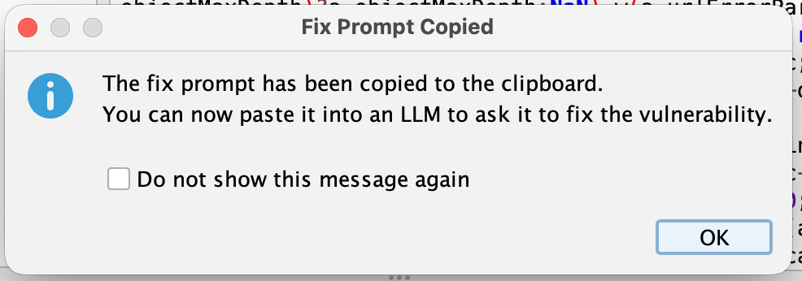

We want to be very clear upfront: ZAP is absolutely, definitively, 100% not jumping on the AI bandwagon.

We are, however, adding a feature that generates prompts for LLMs.

These are completely different things and we will not be taking questions.

## The Numbers

ZAP was run **[9.5 million times in March 2026](/blog/2026-04-03-zap-updates-march-2026/)**. 
That's up from 7 million runs in February - a 35% jump in a single month. 
To put that in perspective, it took years to get from zero to 7 million monthly runs, and
we added another 2.5 million on top in just four weeks.

We think we know why. **Vibe coding** - the practice of describing what you want to an AI and shipping whatever
comes back - is everywhere right now. It's fast, it's fun, and it produces a *remarkable* quantity of
security vulnerabilities. Developers who have never thought about XSS or SQL injection are suddenly running
security scanners because their AI assistant told them to, their CI pipeline requires it, or they got a very
bad surprise in a code review.

ZAP fits that workflow well: run a scan, get a list of alerts, fix the problems. The last step is the hard one
if you're not a security engineer. Which brings us to the new feature.

## Generate Fix Prompt

ZAP knows a lot about a vulnerability when it raises an alert - the URL, the affected parameter, the attack
payload it used, the evidence it found in the response, a full description of the vulnerability class, and
recommended remediation guidance. What ZAP *doesn't* know is anything about your codebase. That's a job for
an LLM with access to your code.

The new **[Generate Fix Prompt](/docs/desktop/addons/common-library/generate-fix-prompt/)** option bridges that gap. 
Right-click any alert in the Alerts tab and select **Generate Fix Prompt**. 
ZAP bundles everything it knows about the vulnerability into a well-structured
prompt and copies it to your clipboard. Paste it into ChatGPT, Claude, GitHub Copilot Chat, or whichever
LLM you happen to be using, and ask it to find and fix the problem in your code.

The prompt includes:

- The vulnerability name, risk level, and confidence
- The URL, HTTP method, and affected parameter
- The attack payload and evidence ZAP observed
- A full description of the vulnerability class
- ZAP's remediation guidance
- References for further reading

No LLM subscription or API key required on the ZAP side - the prompt is just text on your clipboard, ready
to paste wherever you like.

## Systemic Vulnerabilities

Some issues aren't isolated to a single endpoint. For example a missing `Content-Security-Policy` header or an insecure
cookie flag tends to affect every response the application sends. ZAP uses the
[SYSTEMIC alert tag](/docs/desktop/addons/common-library/alerttags/#systemic)
to mark these, and the generated prompt includes a note telling the LLM that the issue is likely to appear in
multiple places across the codebase - not just the one URL ZAP happened to test.

## Where to Find It

The feature is part of the **Common Library** add-on, which means it's available to all ZAP users without
any additional installation. Update your ZAP add-ons, right-click an alert in the Alerts tab and the option will be there.
See the [help](/docs/desktop/addons/common-library/generate-fix-prompt/) for more details.

The first time you use it, a confirmation dialog tells you the prompt has been copied to your clipboard.
If you find that confirmation unnecessary you can check **Do not show this message again** and it won't
bother you again.

## A Note on LLM Output

LLMs are good at recognising vulnerability patterns and proposing fixes, but they can also hallucinate,
misread context, or suggest changes that introduce new problems. Treat the output as a starting point,
not a final answer. Read the suggested fix, understand what it's doing, and test it. ZAP can help with
that last part too.

Happy scanning - and happy vibe coding, we suppose.