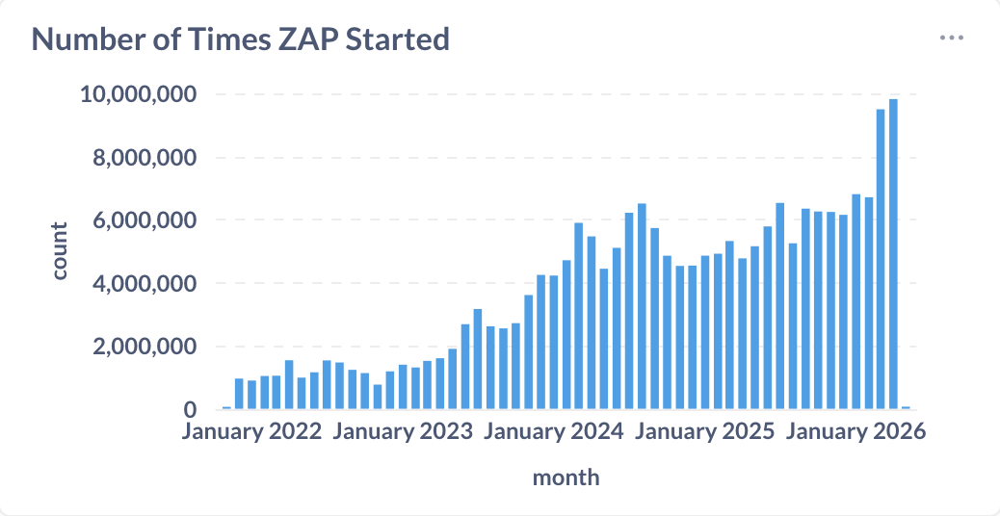

April was another strong month for ZAP. ZAP was started nearly **10 million times** — continuing the rapid growth from 9.5 million in March and 7 million in February. At this rate, hitting 10 million in a single month is no longer a question of if, but when.

On top of that, the main [zaproxy](https://github.com/zaproxy/zaproxy) repository crossed **15,000 GitHub stars** this month. That's a meaningful milestone for an open source security project, and a reflection of how widely ZAP is used and trusted across the community.

## Highlights

### OWASP PTK Findings as ZAP Alerts

The month kicked off with a major post on [OWASP PTK integration](/blog/2026-04-01-owasp-ptk-findings-to-zap-alerts/). With PTK add-on 0.3.0, ZAP can now display OWASP PTK findings directly as native ZAP Alerts. This is a significant step forward for client-side security testing: PTK runs inside the browser and can surface DOM XSS, risky data-flow patterns, and dangerous JavaScript sinks — things the proxy layer can't reliably observe — while all the results land in ZAP's familiar alert workflow.

This adds **[142 new OWASP PTK–tagged alert types](/alerttags/tool_ptk/)** to ZAP, covering SAST, IAST, and DAST findings from within the browser.

### The ZAP MCP Server

We also announced the [ZAP MCP Integration](/blog/2026-04-02-zap-mcp-server/) add-on, which lets AI assistants like Claude, ChatGPT, and Cursor interact with ZAP using the [Model Context Protocol](https://modelcontextprotocol.io/). You can now ask your AI assistant to spider an app, run active scans, retrieve alerts, and more — all through natural conversation. This is an alpha release, and we're actively gathering feedback on which tools and resources are most useful.

### ZAP with KRO in Kubernetes

Guest author Trevor showed how to [integrate ZAP with KRO in Kubernetes](/blog/2026-04-13-use-zap-with-kro-in-kubernetes/). Using KRO's `ResourceGraphDefinition`, you can define a custom `Application` resource that automatically deploys your workload and triggers a ZAP scan on every new deployment — including generating PDF and SARIF reports saved to persistent storage.

### Vibe Coding Security Fixes

We introduced the new [Generate Fix Prompt](/blog/2026-04-15-vibe-coding-security-fixes/) feature, which right-click-copies everything an LLM needs to fix a vulnerability — URL, parameter, attack payload, evidence, description, and remediation guidance — straight to your clipboard. Paste it into any LLM and ask it to fix the issue in your code. The feature is part of the Common Library add-on, so no additional installation is needed.

## Ongoing Work

### OWASP PTK Automation — Phase 1 Nearly Ready

The first phase of full OWASP PTK automation is nearly complete. As described in the [PTK blog post](/blog/2026-04-01-owasp-ptk-findings-to-zap-alerts/), the goal is to make PTK + ZAP work as a single automated pipeline: launch a ZAP browser with PTK enabled, auto-start the selected scan engines, run a repeatable scripted journey, and stream findings into ZAP as Alerts throughout. This will be a big step for CI-style scanning with real browser sessions.

## New Contributors
A very warm welcome to the people who started to contribute to ZAP this month!

* [sarathivengadesh](https://github.com/sarathivengadesh)
* [2020ashish](https://github.com/2020ashish)
* [Alejandr0ar](https://github.com/Alejandr0ar)
* [maxullman](https://github.com/maxullman)
* [samrachnouv](https://github.com/samrachnouv)
* [msrivas-7](https://github.com/msrivas-7)
* [time4tea](https://github.com/time4tea)
* [Nik-ui](https://github.com/Nik-ui)
* [miguel-baptista07](https://github.com/miguel-baptista07)
* [Adarshkumar0509](https://github.com/Adarshkumar0509)
* [brookecc](https://github.com/brookecc)

## GitHub Pulse
Here are some statistics for the two main ZAP repositories:

[zaproxy](https://github.com/zaproxy/zaproxy/pulse/monthly)  
Excluding merges, 4 authors have pushed 11 commits to main and 11 commits to all branches. On main, 16 files have changed and there have been 481 additions and 98 deletions.

[zap-extensions](https://github.com/zaproxy/zap-extensions/pulse/monthly)  
Excluding merges, 19 authors have pushed 82 commits to main and 82 commits to all branches. On main, 1,646 files have changed and there have been 43,101 additions and 28,586 deletions.

A total of [73 human PRs were merged](https://github.com/search?q=org%3Azaproxy+type%3Apr+-author%3Azapbot+-author%3Aapp%2Fdependabot+sort%3Aupdated-asc+closed%3A2026-04+is%3Amerged&type=pullrequests) on the ZAP repos.

## Released Add-ons - Full Changelog
In April 2026, we released updated versions of 28 add-ons:

##### Access Control Testing
**v12**  
Changed
- Maintenance changes.
- The alerts now have new tags for the OWASP Top 10 2025.
- Depends on an updated version of the Common Library add-on.

Fixed
- Prevent GUI freeze on result selection.

##### Active scanner rules
**v81**  
Changed
- Maintenance changes.
- The scan rules now have new tags for the OWASP Top 10 2025, and API Top 10 2023.
- Depends on an updated version of the Common Library add-on.

##### Active scanner rules (alpha)
**v56**  
Changed
- The SQL Injection - SQLite (Time Based) scan rule now includes example alert functionality for documentation generation purposes (Issue 6119).
- The scan rules now have new tags for the OWASP Top 10 2025, and API Top 10 2023.
- Depends on an updated version of the Common Library add-on.

##### Active scanner rules (beta)
**v65**  
Changed
- Dependency update.
- Maintenance changes.
- The scan rules now have new tags for the OWASP Top 10 2025, and API Top 10 2023.
- Depends on an updated version of the Common Library add-on.
- The Possible Username Enumeration scan rule now includes example alert functionality for documentation generation purposes (Issue 6119).

##### Advanced SQLInjection Scanner
**v17**  
Changed
- Update minimum ZAP version to 2.17.0.
- The scan rule now has the "TEST_TIMING" alert tag, as well as new tags for the OWASP Top 10 2025, and API Top 10 2023.
- Depends on an updated version of the Common Library add-on.

##### Ajax Spider
**v23.30.0**  
Changed
- Update Crawljax to version 3.8.0 (Issues 3412 and 7138).

##### Authentication Helper
**v0.38.0**  
Fixed
- Correct reported username/password fields' state in the Authentication Report.

##### Automation Framework
**v0.59.0**  
Added
- Allow to load a plan from the contents of the clipboard.
- Access to the progress of long running jobs

Changed
- Move the Automation panel to the workspace window.
- Use the main output panel for plan output messages.
- Add a status panel to inform users about the panel relocation.

Fixed
- Correct error message.

##### Call Home
**v0.21.0**  
Added
- MCP stats to telemetry.

##### Client Side Integration
**v0.22.0**  
Added
- Persist Client History entries in the session.
- Add a button in the Client History tab to clear the history from both the GUI and session.
- Support exporting the Client Map via the Automation Framework export job (requires the Import/Export add-on).

Changed
- Allow callback implementors to handle browsers closing.
- Depend on Database add-on.

##### Common Library
**v1.41.0**  
Added
- Generate Fix Prompt alert menu item.

Changed
- Update dependencies.

##### DOM XSS Active scanner rule
**v24**  
Changed
- The scan rule now has new tags for the OWASP Top 10 2025.
- Depends on an updated version of the Common Library add-on.

##### GraphQL Support
**v0.33.0**  
Changed
- The alerts now have new tags for the OWASP Top 10 2025, and API Top 10 2023.
    - The "OWASP_2023_API4" tag was dropped in favor of the new unified mapping entry "API_2023_API4_UNRESTRICTED_RESOURCE_CONSUMPTION". This may be a breaking change for users that depended on the tag to define scan policies.
- Depends on an updated version of the Common Library add-on.

##### Image Location and Privacy Scanner
**v8**  
Changed
- Update minimum ZAP version to 2.17.0.
- The scan rule now has new tags for the OWASP Top 10 2025.
- Depends on an updated version of the Common Library add-on.
- Update dependency.

##### Import/Export
**v0.19.0**  
Added
- Support for add-on provided source exporters, allowing add-ons to provide new data sources for the export job (e.g. the Client Map via the Client Side Integration add-on).

Fixed
- Save the context when saving the export job.

##### Insights
**v0.4.0**  
Changed
- Elevated insight.auth.failure from Medium to High severity so that exitAutoOnHigh can stop scans with persistent auth failures.
- Reduced minimum auth request threshold from 10 to 5 to detect browser-based auth failures earlier.

##### Linux WebDrivers
**v194**  
Changed
- Update ChromeDriver to 147.0.7727.137.

**v193**  
Changed
- Update ChromeDriver to 147.0.7727.116.

**v192**  
Changed
- Update ChromeDriver to 147.0.7727.101.

**v191**  
Changed
- Update ChromeDriver to 147.0.7727.56.

##### MCP Integration
**v0.0.1**  
- First version with initial resources, tools, and prompts.

##### OpenAPI Support
**v55**  
Changed
- Dependency update.

Fixed
- Address exception importing definition with indirect `additionalProperties` referencing an `oneOf` (Issue 9305).

**v54**  
Changed
- Dependency update to fix stack overflows when importing the definitions.
- The scan rule script now has new tags for the OWASP Top 10 2025, and API Top 10 2023.
- Depends on an updated version of the Common Library add-on.

##### Passive scanner rules
**v73**  
Changed
- The scan rules now have new tags for the OWASP Top 10 2025.
- The Charset Mismatch scan rule also now has tags for the Top 10 2021 and 2017.
- Depends on an updated version of the Common Library add-on.
- Add alert references to Hash Disclosure scan rule alerts (Issue 9144).

##### Passive scanner rules (alpha)
**v49**  
Changed
- Maintenance changes.
- The scan rules now have new tags for the OWASP Top 10 2025.
- The Fetch Metadata Request Headers scan rule now has alert tags for the Top 10 2021 and 2017.
- The Full Path Disclosure scan rule now also has an alert tag for the 2017 Top 10.
- Depends on an updated version of the Common Library add-on.

##### Passive scanner rules (beta)
**v50**  
Changed
- The scan rules now have new tags for the OWASP Top 10 2025.
- The Content Cacheability scan rule now includes alert tags for the 2021 and 2017 Top 10s.
- Depends on an updated version of the Common Library add-on.

##### Retire.js
**v0.56.0**  
Changed
- Updated with upstream retire.js pattern changes.
- The scan rule now has new tags for the OWASP Top 10 2025, and API Top 10 2023.
- Depends on an updated version of the Common Library add-on.

##### SOAP Support
**v30**  
Changed
- The scan rules now have new tags for the OWASP Top 10 2025, and API Top 10 2023.
- Depends on an updated version of the Common Library add-on.

##### Selenium
**v15.47.0**  
Changed
- Update Selenium to version 4.43.0.

##### Spider
**v0.20.0**  
Added
- Access to the spider job status.

##### Windows WebDrivers
**v195**  
Changed
- Update ChromeDriver to 147.0.7727.137.

**v194**  
Changed
- Update ChromeDriver to 147.0.7727.116.

**v193**  
Changed
- Update ChromeDriver to 147.0.7727.101.

**v192**  
Changed
- Update ChromeDriver to 147.0.7727.56.

##### macOS WebDrivers
**v194**  
Changed
- Update ChromeDriver to 147.0.7727.137.

**v193**  
Changed
- Update ChromeDriver to 147.0.7727.116.

**v192**  
Changed
- Update ChromeDriver to 147.0.7727.101.

**v191**  
Changed
- Update ChromeDriver to 147.0.7727.56.

