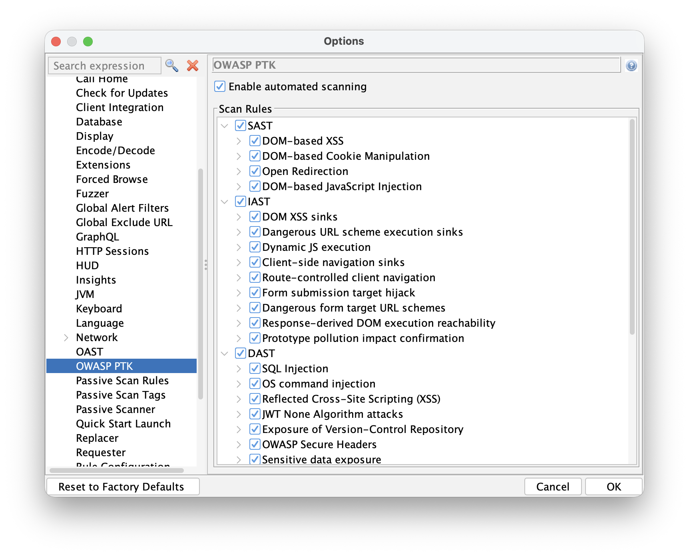
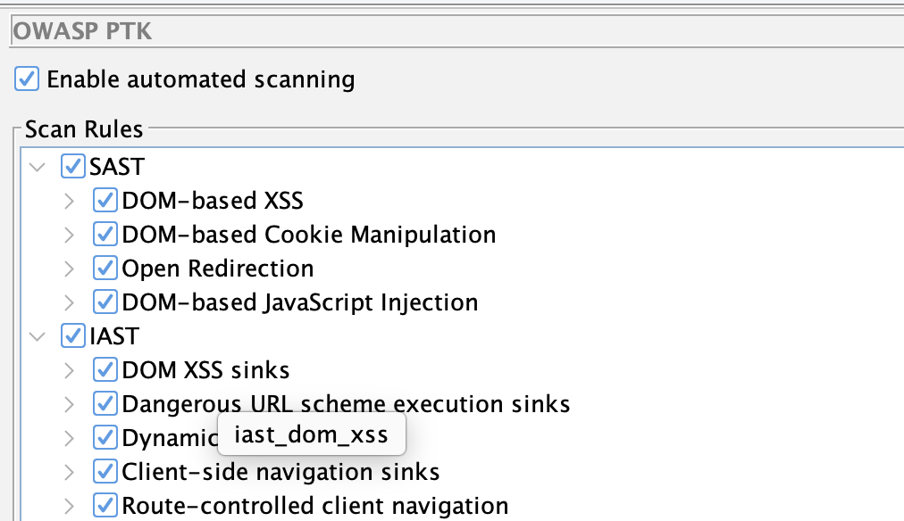

## Early Release - We Want Your Feedback

Before we get into the details: this is a **Phase 1** release.

The integration works, and you can use it today to run [OWASP PTK](https://pentestkit.co.uk/) scans as part of an automated pipeline.
But it is not the polished, fully-integrated experience we are working toward. We are publishing it
now because we want real-world feedback to guide Phase 2, not because we think it is done.

If you try it and run into friction, that friction is exactly what we want to hear about.
Please let us know via the [ZAP User Group](https://groups.google.com/group/zaproxy-users).

## How PTK is Different from ZAP

ZAP is a proxy. It sits between your browser and the target, intercepting and analyzing HTTP traffic.
Its active and passive scan rules work on requests and responses - what travels over the wire.

**OWASP PTK works differently.** PTK is a browser extension. It runs entirely inside the browser,
which means it has access to things that a proxy simply cannot see:

- The DOM as it exists after JavaScript has run
- Client-side code execution paths and data flows
- Runtime behavior in single-page applications
- Dangerous JavaScript patterns in production bundles

If you missed the earlier post introducing PTK in ZAP, start there:
[OWASP PTK Integration with ZAP](/blog/2026-01-19-owasp-ptk-add-on/).

Because PTK lives in the browser, automating it requires driving a real browser - not just firing
HTTP requests. That is why the Automation Framework integration uses the **Client Spider**.

## The Automation Approach: Client Spider + PTK

The [Client Spider](/docs/desktop/addons/client-side-integration/spider/) launches a real browser,
explores the target application by interacting with it the way a user would, and drives PTK scanning
along the way.

The overall flow looks like this:

1. ZAP starts and runs the Automation Framework with your plan
2. The `spiderClient` job opens a browser with PTK pre-installed
3. PTK runs its configured scan rules (SAST, IAST, DAST) as the spider browses the application
4. PTK findings are raised as ZAP alerts, visible in the Alerts tab and included in reports

## Prerequisites

Make sure you have the following add-ons installed and updated in ZAP before running the plan:

- **OWASP PTK add-on** (from the ZAP Marketplace)
- **Client Side Integration add-on** (provides the Client Spider)
- **Automation Framework add-on**

## An Example Automation Plan

Below is a minimal AF plan that runs the Client Spider against a target, with PTK enabled.
Replace the URL and context name with your own target.

```yaml
---
env:
  contexts:
  - name: "default"
    urls:
    - "https://your-target.example.com"
  parameters:
    failOnError: true
    failOnWarning: false
    progressToStdout: true
  configs:
    ptk.automatedScanning.enabled: true

jobs:
- type: spiderClient
  parameters:
    numberOfBrowsers: 2
    maxDuration: 3
    browserId: "firefox-headless"
- type: report
  parameters:
    template: "modern"
    reportFile: "ptk-report.html"
```

Save this as `ptk-plan.yaml` and run it with:

```
zap.sh -cmd -autorun ptk-plan.yaml
```

Or via Docker weekly (which includes the PTK add-on by default):

```
docker run -v $(pwd):/zap/wrk/:rw \
  ghcr.io/zaproxy/zaproxy:weekly \
  zap.sh -cmd -autorun /zap/wrk/ptk-plan.yaml
```

Or via Docker stable (which needs the PTK add-on to be installed):

```
docker run -v $(pwd):/zap/wrk/:rw \
  ghcr.io/zaproxy/zaproxy:stable \
  zap.sh -cmd -addoninstall ptk -autorun /zap/wrk/ptk-plan.yaml
```


## Configuring PTK Rules

PTK has its own set of scan rule configurations, separate from ZAP's active and passive scan rules.
You configure them in the ZAP UI at:

**Tools → Options → OWASP PTK**



Here you will find:

- **Enable Automated Scanning** - when checked, PTK starts scanning automatically when a ZAP browser
  launches. Turn this on for automation runs.
- **Scan Rules** - a tree of all available PTK rules, grouped by engine:
  - **SAST** - static analysis of JavaScript loaded by the page
  - **IAST** - runtime instrumentation during browser interaction
  - **DAST** - dynamic testing driven from inside the browser

Enable the rule groups you want to run, then save your options. These settings persist and will be
used when the Automation Framework launches a browser.

PTK rules can also be configured via the Automation Framework's `configs` section. By default all
PTK rules are enabled. You can disable an entire engine group at a high level:

```yaml
env:
  configs:
    ptk.scanrules.IAST.enabled: false
```

Individual rules can be enabled or disabled using the key shown when you hover over the rule in the
PTK Options screen - for example:




```yaml
env:
  configs:
    ptk.scanrules.IAST.enabled: false
    ptk.scanrules.IAST.iast_dom_xss.enabled: true
```

> **Note:** This is one of the things we plan to improve. The goal for Phase 2 is to integrate
> PTK rules into ZAP's standard scan rule management, so everything is configured in one place.

## What the Plan Does

The [spiderClient](/docs/desktop/addons/client-side-integration/automation/#job-spiderclient) job launches a headless Firefox with PTK pre-installed. Because you have
**Enable Automated Scanning** turned on in configs, PTK starts its configured scan rules automatically
as the spider explores the application.

As PTK finds issues, it reports them back to ZAP, which raises them as standard ZAP alerts.
Those alerts are available in the ZAP UI, in reports, and in any downstream tooling that reads
ZAP output.

The report job generates an HTML report in the same directory in which you saved your plan.

You can use any of ZAP's [report templates](/docs/desktop/addons/report-generation/).

## Resource Considerations

Browsers are heavyweight processes, and PTK adds further overhead on top - it instruments the
runtime, monitors the DOM, and runs analysis as the page executes. Running multiple browsers in
parallel with PTK active will consume significantly more CPU and memory than a typical Client Spider
run.

If you normally use several browsers to speed up crawling, consider dropping to one or two when
PTK is enabled:

```yaml
- type: spiderClient
  parameters:
    numberOfBrowsers: 1
```

Start low and increase only if your environment has the headroom for it.

## Current Limitations

This is Phase 1, so there are real limitations to be aware of:

- **No active or passive scan integration.** PTK is currently configured separately from the existing 
  active and passive scan rules.
  We plan to provide an integrated way to configure all of the ZAP scan rules in a future release.
  
- **PTK runs via the Client Spider.** 
  We plan to add a specific PTK active scan rule so that the PTK DAST and IAST rules run when you run an
  active scan.

- **Duplicate findings.** Some of the PTK rules overlap with the ZAP ones, for example some of the rules 
  related to security headers.
  We plan to configure PTK to not overlap with the existing ZAP rules by default, while giving you the option
  to configure whichever ZAP and PTK rules you like.

## What Phase 2 Looks Like

Our goal is to make PTK feel like a first-class part of ZAP's scanning pipeline:

- **One place for all scan rule configuration.** PTK rules integrated into ZAP's standard active
  and passive scan rule management - no separate Options screen.
- **PTK integrated with ZAP's active and passive scanners.** Rather than being a separate system
  that reports findings back to ZAP, PTK will be wired into ZAP's core scan engines.
- **AF plan control over PTK rules.** Configure which PTK rules run, and with what settings,
  directly in your `ptk-plan.yaml`.
- **Better authenticated scanning support.** Tighter integration with ZAP's authentication handling
  so PTK covers authenticated flows reliably.

## Try It and Tell Us What You Think

The best thing you can do right now is try this against an application you own or have permission
to test - targets like [Broken Crystals](https://brokencrystals.com/) or [OWASP Juice Shop](https://owasp.org/www-project-juice-shop/) are perfect -
and then tell us what worked, what did not, and what you wish was different.

We are actively working on Phase 2. Your feedback shapes what we prioritize.

- [ZAP User Group](https://groups.google.com/group/zaproxy-users)

## Links

- [OWASP PTK add-on docs](/docs/desktop/addons/owasp-ptk/)
- [OWASP PTK Options](/docs/desktop/addons/owasp-ptk/ptk-options/)
- [Client Spider docs](/docs/desktop/addons/client-side-integration/spider/)
- [Client Side Integration Automation Framework support](/docs/desktop/addons/client-side-integration/automation/)
- [Automation Framework docs](/docs/desktop/addons/automation-framework/)
- [OWASP PTK alert tags in ZAP](/alerttags/tool_ptk/)
- [OWASP PTK Findings as ZAP Alerts (Juice Shop Walkthrough)](/blog/2026-04-01-owasp-ptk-findings-to-zap-alerts/)
- [OWASP PTK Integration with ZAP](/blog/2026-01-19-owasp-ptk-add-on/)
