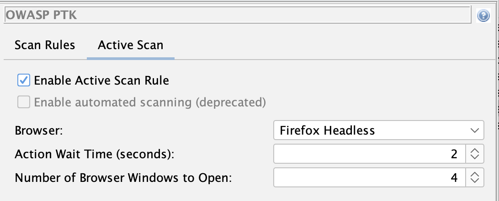
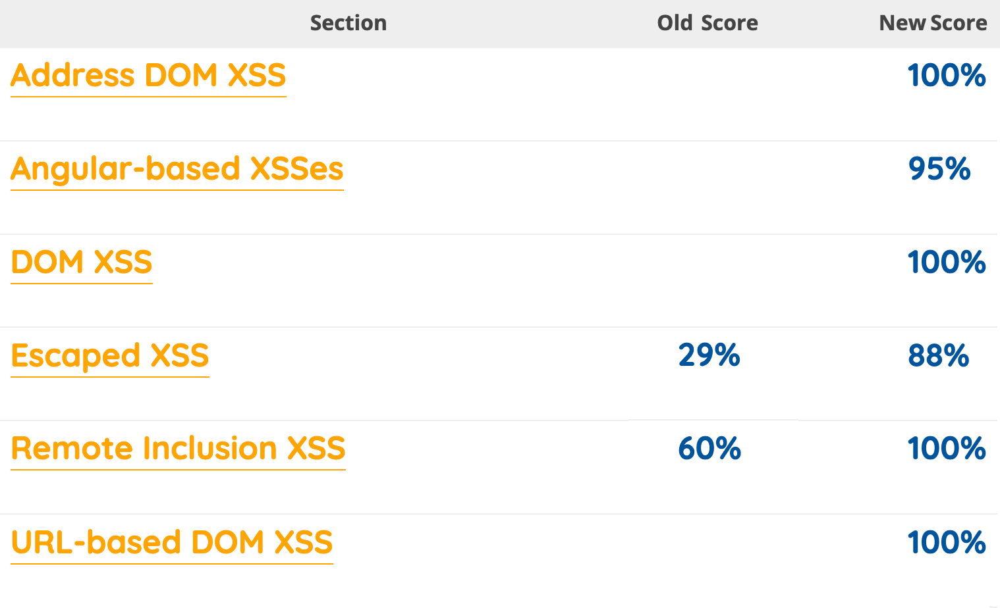

## Recap

In [Phase 1](/blog/2026-05-06-automating-owasp-ptk-with-zap-phase-1/) we wired
[OWASP PTK](https://pentestkit.co.uk/) into the Automation Framework via the 
[Client Spider](/docs/desktop/addons/client-side-integration/spider/).
That worked, but let's face it - it was a bit of a hack!

In ZAP we aim to have a strict separation of concerns - exploring is a very different process from
attacking, and the spiders should only explore an app, not do bad things to it.

Phase 2 fixes that problem - PTK now ships with a dedicated **active scan rule**. 
When you run an active scan, the PTK engines run too.

## The New Active Scan Rule

The new rule is called [**PTK Scan Rules**](/docs/alerts/230000/). It lives in the
**Browser** category and behaves a little differently from a typical active scan rule.

It does not itself raise alerts. PTK's in-browser engines (SAST, IAST, DAST) raise the
findings, exactly as they do today.

The rule actually still uses the Client Spider in the background, although you will not see it as a Client Spider
scan in the UI. It does this because the more traditional rules run against the 
[Sites Tree](/docs/desktop/start/features/sitestree/) - ZAP's representation of the server side of the target.
PTK runs in browsers, and so it needs to work on the [Client Map](/docs/desktop/addons/client-side-integration/#client-map) - 
ZAP's representation of the client (browser) side of the target.

A side effect of this is that the PTK rule will currently explore your application in the same way as the Client Spider.
The plan is to disable this so that in the future it will only run against nodes in the Client Map that have been previously discovered.

## Configuring the Rule

The rule is **disabled by default** - existing scans will not change behaviour until you turn
it on. There are two ways to enable it.

### From the UI

Open **Tools → Options → OWASP PTK** and switch to the new **Active Scan** tab.



Tick **Enable Active Scan Rule** and configure:

- **Browser** - which browser the Client Spider should launch (e.g. `firefox-headless`).
- **Action wait time** - seconds the Client Spider waits between interactions, giving PTK
  time to register each page.
- **Thread count** - number of parallel browsers. As in Phase 1, browsers + PTK are
  resource-heavy, so start low.

### From the Automation Framework

The rule can be enabled and configured entirely from configs - no UI required:

```yaml
env:
  contexts:
  - name: "default"
    urls:
    - "https://your-target.example.com"
  parameters:
    failOnError: true
    progressToStdout: true
  configs:
    ptk.activescan.rule.enabled: true
    ptk.activescan.browserId: "firefox-headless"
    ptk.activescan.threadCount: 1
    ptk.activescan.actionWaitTime: 2

jobs:
- type: spider
- type: activeScan
- type: report
  parameters:
    template: "modern"
    reportFile: "ptk-report.html"
```

> [!IMPORTANT]
> You will need to explore your app in some way before running the activeScan job, for example by using one or more of the spiders.


## The "Old" Automation Option

You can still control which PTK engines and rules run via the existing `ptk.scanrules.*`
configs from [Phase 1](/blog/2026-05-06-automating-owasp-ptk-with-zap-phase-1/),
but we plan to disable this option at some point in the future.

## Firing Range Impact

So what difference does PTK make?

We track [**and publish**](/docs/scans/firingrange/) how well ZAP performs against
[Google's Firing Range](https://public-firing-range.appspot.com/) as a measure of scan
rule coverage and quality. Enabling the new PTK active scan rule has had a **very
significant** impact on some of those results:



As you will see there are **4 sections** of Firing Range where we did not publish any results because ZAP
was unable to find those sorts of browser side vulnerabilities.

PTK changes that - PTK's in-browser engines find classes of issue that ZAP on its own struggled to find - DOM XSS triggered after JavaScript execution, client-side sinks, runtime behaviours.

For the full details of the latest results see the [ZAP vs Firing Range](/docs/scans/firingrange/) page.

## What's Still on the Roadmap

Phase 2 is a big step but it is not the end of the story. Still on the list:

- **Enable passive scanning while crawling.** The standard ZAP passive scan rules run whenever
  you explore an app. The PTK SAST and IAST rules do not make additional requests to the server,
  and so are safe to run when crawling.
- **PTK rules in ZAP's standard scan rule management.** Today you still configure PTK
  rules in their own Options tab and via `ptk.scanrules.*` configs. The goal is for 
  PTK rules to seem just like the other scan rules.
- **Cleaner overlap handling.** PTK and ZAP both check some things (security headers,
  for example). We want sensible defaults so you do not get duplicate findings unless you
  ask for them.
- **Deprecation of the DOM XSS Scan Rule.** The current [Cross Site Scripting (DOM Based)](/docs/alerts/40026/)
  rule is no match for PTK! We plan to deprecate it and will recommend using the PTK rules for client side
  testing going forwards.

## Try It

If you tried Phase 1, the upgrade is straightforward: drop the `spiderClient` job,
remove `ptk.automatedScanning.enabled: true` from your configs, add
`ptk.activescan.rule.enabled: true`, and run an active scan.
Make sure your OWASP PTK, Client Side Integration, and Automation Framework add-ons are
all up to date.

As before, feedback is what shapes the next phase. Please tell us what works, what does
not, and what you wish was different:

- [ZAP User Group](https://groups.google.com/group/zaproxy-users)

## Links

- [Automating OWASP PTK with ZAP (Phase 1)](/blog/2026-05-06-automating-owasp-ptk-with-zap-phase-1/)
- [OWASP PTK Integration with ZAP](/blog/2026-01-19-owasp-ptk-add-on/)
- [OWASP PTK Findings as ZAP Alerts (Juice Shop Walkthrough)](/blog/2026-04-01-owasp-ptk-findings-to-zap-alerts/)
- [OWASP PTK add-on docs](/docs/desktop/addons/owasp-ptk/)
- [OWASP PTK Options](/docs/desktop/addons/owasp-ptk/ptk-options/)
- [OWASP PTK alert tags in ZAP](/alerttags/tool_ptk/)
- [Client Spider docs](/docs/desktop/addons/client-side-integration/spider/)
- [Automation Framework docs](/docs/desktop/addons/automation-framework/)
- [ZAP vs Firing Range](/docs/scans/firingrange/)
