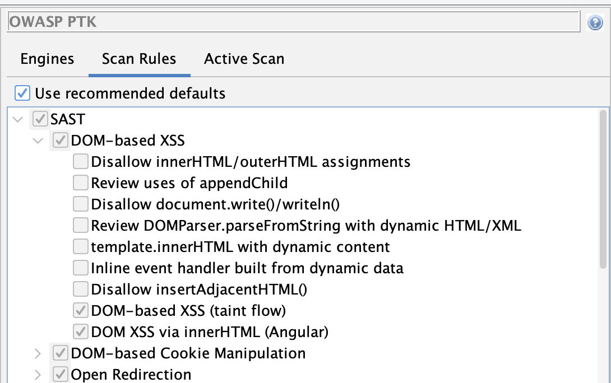
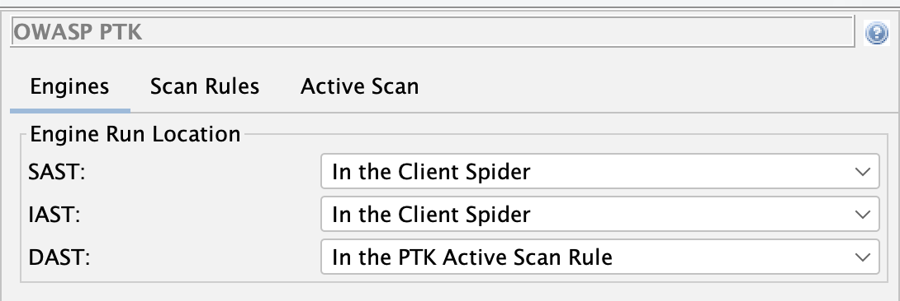

[OWASP PTK](https://pentestkit.co.uk/) is a great project, and such a great complement to ZAP that we are going to bundle it with ZAP by default from the next major ZAP release.

Because PTK runs inside the browser and ZAP runs as a proxy, the integration has been non-trivial - but we are getting close to the seamless experience we are aiming for.

## Recap

In [Phase 1](/blog/2026-05-06-automating-owasp-ptk-with-zap-phase-1/) we wired [OWASP PTK](https://pentestkit.co.uk/) into ZAP's Automation Framework via the Client Spider.

In [Phase 2](/blog/2026-06-05-automating-owasp-ptk-with-zap-phase-2/) we replaced that approach with a dedicated **PTK active scan rule** - one that cleanly separates exploration from attacking, the way ZAP expects.

This post covers the follow-up work: the changes in add-on version 0.7.0 that graduate PTK to beta and tighten up the integration.

## Passive Scanning in the Client Spider

One of the most significant improvements in 0.7.0 is that PTK's **SAST and IAST engines now run automatically
during the Client Spider** - no extra configuration needed.

SAST analyses JavaScript statically as each page loads. IAST instruments the browser at runtime,
tracking taint flows as the spider interacts with the application. Neither engine makes active attacks
or sends additional requests to the server. In ZAP terms, they are effectively **passive** - they
observe and analyse what the spider is already doing.

This is important because it means you get PTK's browser-level passive coverage for free whenever you
run a client spider. No active scan required.

A note on the [Client Spider](/docs/desktop/addons/client-side-integration/spider/) itself: 
it is ZAP's modern replacement for the [AJAX Spider](/docs/desktop/addons/ajax-spider/). We have been
doing a lot of work on it and it is nearly ready to be the default recommendation for anyone crawling
JavaScript-heavy applications. You can try it today, and we encourage you to - but it is not quite
ready for primetime, so keep the AJAX Spider in your toolkit for now.

As a step in that direction, we have updated the
[Baseline Scan](/docs/docker/baseline-scan/) and
[Full Scan](/docs/docker/full-scan/) packaged Docker scans to add an option to
use the Client Spider. If you use either of those, you can opt in and start getting PTK's passive
coverage as part of your existing pipeline today.

## Active Scan Rule Now On by Default

In Phase 2 the active scan rule was disabled by default - you had to explicitly opt in by adding
`ptk.activescan.rule.enabled: true` to your AF plan.

That extra step is gone. From 0.7.0 onwards the rule is **enabled by default**. Existing
installations will also have it switched on automatically when the add-on updates.

If you want to disable it for a specific run:

```yaml
env:
  configs:
    ptk.activescan.rule.enabled: false
```

## PTK Active Scan No Longer Crawls

In Phase 2 we flagged a rough edge:

> "A side effect of this is that the PTK rule will currently explore your application in the same way
> as the Client Spider. The plan is to disable this so that in the future it will only run against
> nodes in the Client Map that have been previously discovered."

That is now fixed. The PTK active scan rule passes `existingOnly: true` to the Client Spider it runs
internally. PTK's in-browser engines will only visit URLs **already present in the Client Map** - the
map built during your earlier spider run. It does not discover and visit new pages.

The practical effect: exploration and attacking stay properly separated. Run your spiders first to
build the Client Map, then run an active scan. PTK respects that boundary.

## Recommended Rules

PTK has a lot of rules. Some of them overlap with ZAP's own scan rules - XSS, SQL injection, security
headers. Running both means duplicate findings.

Version 0.7.0 introduces a **"Use recommended defaults"** option, enabled by default. It activates a
curated subset of PTK rules chosen to complement ZAP's existing coverage rather than duplicate it.

Under recommended defaults:

- **DAST rules turned off**: the ones that overlap with what ZAP already finds - SQL injection,
  reflected XSS, header checks, version control exposure, and a few others.
- **DAST rules kept on**: the ones that add unique value - AngularJS and client template injection,
  JWT injection, DOM XSS in single-page apps, WebSocket security, JSONP callback injection, and more.
- **IAST rules**: all kept on. IAST instruments the running browser and finds taint flows that neither
  ZAP nor PTK's DAST can detect from outside the browser.
- **SAST rules turned off**: the ones that overlap with ZAP - DOM XSS patterns, open redirection, and
  a few code-pattern checks already covered elsewhere.
- **SAST rules kept on**: the ones unique to PTK - cookie manipulation, web message checks, link
  manipulation, DOM data manipulation, and others.



You can review the recommended set from the PTK Options screen (**Tools → Options → OWASP PTK → Scan
Rules**). While "Use recommended defaults" is active, the rule tree is shown greyed-out so you can
see which rules are included without being able to change them. Uncheck the option to restore full
manual control.

To disable recommended defaults from an AF plan:

```yaml
env:
  configs:
    ptk.useRecommendedDefaults: false
```

## Engine Run Locations

The new **Engines** tab in the PTK Options dialog (**Tools → Options → OWASP PTK**) lets you control
*when* each PTK engine runs.

The three settings are:

| Setting | Meaning |
|---|---|
| In the Client Spider | Engine runs while a browser-based spider explores the app |
| In the PTK Active Scan Rule | Engine runs during the active scan phase |
| Manually | Engine only runs when triggered from the PTK browser extension |



The defaults reflect what each engine is best suited for:

- **SAST** - runs during the Client Spider. SAST analyses JavaScript statically as pages load; it
  makes no additional requests, so it is safe to run during exploration.
- **IAST** - runs during the Client Spider. Same reasoning: IAST instruments runtime behaviour as the
  browser explores, adding no extra traffic.
- **DAST** - runs in the PTK Active Scan Rule. DAST fires active payloads to probe for
  vulnerabilities; it belongs in the active scan phase alongside ZAP's own active rules.

This matches ZAP's philosophy: spiders explore, active scans attack.

To override from an AF plan, use the values `CLIENT_SPIDER`, `ACTIVE_SCAN_RULE`, or `MANUAL`:

```yaml
env:
  configs:
    ptk.engine.SAST.runLocation: ACTIVE_SCAN_RULE
    ptk.engine.IAST.runLocation: ACTIVE_SCAN_RULE
    ptk.engine.DAST.runLocation: ACTIVE_SCAN_RULE
```

## An Updated Automation Plan

Putting it all together, a minimal AF plan for PTK in 0.7.0 is shorter than before - the active scan
rule no longer needs to be explicitly enabled:

```yaml
---
env:
  contexts:
  - name: "default"
    urls:
    - "https://your-target.example.com"
  parameters:
    failOnError: true
    progressToStdout: true

jobs:
- type: spider
- type: spiderClient
  parameters:
    browserId: "firefox-headless"
    numberOfBrowsers: 2
- type: passiveScan-wait
- type: activeScan
- type: report
  parameters:
    template: "modern"
    reportFile: "ptk-report.html"
```

The `spiderClient` job builds the Client Map and runs PTK's SAST and IAST engines as it goes.
The `activeScan` job runs ZAP's active rules plus the PTK Scan Rules rule, which revisits the
already-discovered Client Map nodes with PTK DAST - no additional crawling.

> [!IMPORTANT]
> Make sure your OWASP PTK, Client Side Integration, and Automation Framework add-ons are all up to
> date before running.

## Beta Status

The PTK add-on has been promoted from alpha to beta. The integration is stable enough to use in
automated pipelines - the Phase 1 and Phase 2 feedback shaped the architecture, and the 0.7.0
changes address the rough edges we flagged at release.

## What's Still on the Roadmap

Three items remain on the roadmap:

- **Client Spider as the default.** The Client Spider is nearly ready to replace the AJAX Spider as
  the default recommendation for JavaScript-heavy applications. Switching the packaged scans over to
  use it by default is the next step.
- **PTK rules in ZAP's standard scan rule management.** Recommended defaults are a practical
  workaround for now; the goal is for PTK rules to appear alongside all other ZAP scan rules in the
  same place.
- **Deprecation of the DOM XSS Scan Rule.** The
  [Cross Site Scripting (DOM Based)](/docs/alerts/40026/) rule is outclassed by PTK's client-side
  coverage. We plan to deprecate it.

## Links

- [Automating OWASP PTK with ZAP (Phase 2)](/blog/2026-06-05-automating-owasp-ptk-with-zap-phase-2/)
- [Automating OWASP PTK with ZAP (Phase 1)](/blog/2026-05-06-automating-owasp-ptk-with-zap-phase-1/)
- [OWASP PTK Integration with ZAP](/blog/2026-01-19-owasp-ptk-add-on/)
- [OWASP PTK add-on docs](/docs/desktop/addons/owasp-ptk/)
- [OWASP PTK Options](/docs/desktop/addons/owasp-ptk/ptk-options/)
- [OWASP PTK alert tags in ZAP](/alerttags/tool_ptk/)
- [Client Spider docs](/docs/desktop/addons/client-side-integration/spider/)
- [Automation Framework docs](/docs/desktop/addons/automation-framework/)
