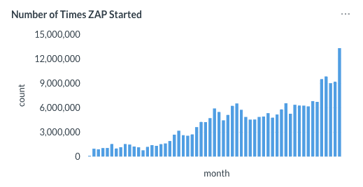

## Highlights

### 13 Million Runs in July

ZAP was started **13,295,706 times** in July, up from 9.17 million in June - a jump of nearly 45% in a single month. Active scans very nearly doubled too, from 2.18 million to 4.37 million, and along the way ZAP raised over 3 billion alerts and sent 5.4 billion attack requests.

We don't know for certain what's driving this, but our best guess is the same one we floated back in [April](/blog/2026-04-15-vibe-coding-security-fixes/): **vibe coding**. More people than ever are shipping AI-generated code, and more of them are running a scanner to check what came back. If that's what's happening, July suggests it's still accelerating.

### Client Spider Is Now Officially Recommended

On [6 July](/blog/2026-07-06-client-spider-now-recommended/) we made it official: the [Client Spider](/docs/desktop/addons/client-side-integration/spider/) is now our recommended way to crawl modern, JavaScript-heavy applications, replacing the AJAX Spider. It finds more endpoints, scales far better on large apps, and - as covered last month - unlocks OWASP PTK's passive SAST/IAST coverage for free.

The Quick Start Automated Scan tab already defaults to it, and the Docker packaged scans (`zap-baseline.py` / `zap-full-scan.py`) now default to the Client Spider in nightly and weekly releases too. The stable release update for August will also include this change.

## Ongoing Work

### Splitting Authentication and Verification

We've started separating the "verification" strategy (how ZAP checks whether a session is still authenticated) from the authentication method itself in ZAP's core. The Context dialog will have a dedicated **Verification** panel, split out of the old Authentication panel, and everything will remain backwards compatible for now. This is the first step of a larger cleanup - more to come.

### AI Integration - Coming Soon

Behind the scenes, a new **LLM Support** add-on has been getting a lot of attention this month: support for Claude alongside Gemini, Azure OpenAI, Ollama, and OpenAI Compatible providers (OpenRouter, LM Studio, etc), a tabbed chat panel, a toolbar provider switcher, and - most interestingly - integration with our [MCP add-on](/docs/desktop/addons/mcp/), so the chat can call ZAP's tools directly and show you exactly what it called and what came back.

None of this has shipped yet - the add-on is still alpha and not included in any release - but it's a strong preview of where ZAP's AI integration is heading. Watch for it in a future release, and for a dedicated blog post once it goes out.

## New Contributors
A very warm welcome to the people who started to contribute to ZAP this month!

* [City-busz](https://github.com/City-busz)
* [Vitorrodrys](https://github.com/Vitorrodrys)
* [Chinmay048](https://github.com/Chinmay048)
* [rylena](https://github.com/rylena)
* [bharat3645](https://github.com/bharat3645)
* [sainadh777](https://github.com/sainadh777)
* [Char0n1507](https://github.com/Char0n1507)
* [lxcxjxhx](https://github.com/lxcxjxhx)

## GitHub Pulse
Here are some statistics for the two main ZAP repositories:

[zaproxy](https://github.com/zaproxy/zaproxy/pulse/monthly)  
Excluding merges, 6 authors have pushed 20 commits to main and 23 commits to all branches. On main, 47 files have changed and there have been 360 additions and 121 deletions.

[zap-extensions](https://github.com/zaproxy/zap-extensions/pulse/monthly)  
Excluding merges, 6 authors have pushed 90 commits to main and 90 commits to all branches. On main, 1,172 files have changed and there have been 401,643 additions and 350,949 deletions.

A total of [66 human PRs were merged](https://github.com/search?q=org%3Azaproxy+type%3Apr+-author%3Azapbot+-author%3Aapp%2Fdependabot+sort%3Aupdated-asc+closed%3A2026-07+is%3Amerged&type=pullrequests) on the ZAP repos.

## Released Add-ons - Full Changelog
In July 2026, we released updated versions of 20 add-ons:

##### Active scanner rules (alpha)
**v58**  
Changed
- Maintenance changes.

##### Ajax Spider
**v23.32.0**  
Changed
- Help to show that the Client Spider is now the recommended option for modern apps.

##### Call Home
**v0.23.0**  
Added
- SSE stats to telemetry.

##### Client Side Integration
**v0.30.0**  
Changed
- Wait always after component navigation while crawling.
- Follow any navigation component while crawling.
- Crawl component state changes.
- Help to show that the Client Spider is now the recommended option for modern apps.

Fixed
- Normalise behaviour of Delete context menu item.

##### Common Library
**v1.43.0**  
Added
- UriUtils class for standardising URI checking.

Changed
- Update dependencies.
- Updated Bank Identification Number data from a new source (https://github.com/venelinkochev/bin-list-data/).
- Added help page documenting the BIN list data and how it is used by scan rules.

##### Forced Browse
**v21**  
Changed
- Maintenance changes.

Fixed
- Bug: tested the wrong condition when detecting "file not found" responses.

##### Import/Export
**v0.21.0**  
Added
- Allow to import HAR data directly through the API.

##### Linux WebDrivers
**v213**  
Changed
- Update ChromeDriver to 151.0.7922.71.

**v212**  
Changed
- Update ChromeDriver to 150.0.7871.181.

**v211**  
Changed
- Update geckodriver to 0.37.1.

**v210**  
Changed
- Update ChromeDriver to 150.0.7871.128.

**v209**  
Changed
- Update ChromeDriver to 150.0.7871.124.

**v208**  
Changed
- Update ChromeDriver to 150.0.7871.114.

**v207**  
Changed
- Update ChromeDriver to 150.0.7871.100.

**v206**  
Changed
- Update ChromeDriver to 150.0.7871.46.

##### OpenAPI Support
**v57**  
Changed
- Maintenance changes.
- Dependency update.

Fixed
- Bug where values were used for objects, instead of just for primitives.

##### Passive scanner rules
**v75**  
Changed
- Maintenance changes.
- Modern scan rule to refer to the Client Spider.

##### Quick Start
**v59**  
Added
- Allow to choose and open the browser directly from the tool bar.

Changed
- Depend on newer version of Selenium add-on.

**v58**  
Changed
- Maintenance changes.
- Default to Client Spider for modern apps.

##### Report Generation
**v0.46.0**  
Added
- Added script diagnostics section to Traditional Reports.
- Templates that include Insights now also identify the Insight that stopped the scan, if applicable.

Fixed
- Invalid alerts, ones without a corresponding message, are now excluded from generated reports. Previously these could break templates that reference message fields (e.g. SARIF, modern, `*-plus`) (Issue 6880).

Changed
- Help content related to the params add-on was updated (Issue 9210).

##### Retire.js
**v0.62.0**  
Changed
- Updated with upstream retire.js pattern changes.

**v0.61.0**  
Changed
- Updated with upstream retire.js pattern changes.

##### Script Console
**v45.20.0**  
Added
- GUI support for Zest script chains and failure level in the Automation Framework Script job dialog (via the Use Script Chain checkbox, and Chains tab).

Changed
- Update dependency.

**v45.19.0**  
Added
- Functionality to store script diagnostics and provides them to Reports. Depends on the database add-on.
- The Script Job Run action now supports a `failureLevel` parameter (`info`, `warning`, `error`) to control the Automation Framework progress level used when a script or chain execution fails (defaults to `error`).

Changed
- Update dependency.
- Revised error handling for chained scripts, output is now more detailed/specific.
- The Run Script action display for chains in the Automation panel has been updated to display the names of scripts in the chain instead of being blank.
- Maintenance changes.
- Formatted JavaScript files for consistency.

##### Selenium
**v15.53.0**  
Changed
- Update Selenium to version 4.46.0.

**v15.52.0**  
Added
- Provide icons for the browsers.

##### Server-Sent Events
**v14**  
Added
- Stats for event and event streams.

Changed
- Update minimum ZAP version to 2.17.0.

Fixed
- No longer fire a spurious empty event for a leading blank line (e.g. keep-alive) in an event stream.

##### Technology Detection
**v21.56.0**  
Changed
- Updated with enthec upstream icon and pattern changes.
- Dependency update.

##### Windows WebDrivers
**v214**  
Changed
- Update ChromeDriver to 151.0.7922.71.

**v213**  
Changed
- Update ChromeDriver to 150.0.7871.181.

**v212**  
Changed
- Update geckodriver to 0.37.1.

**v211**  
Changed
- Update ChromeDriver to 150.0.7871.128.

**v210**  
Changed
- Update ChromeDriver to 150.0.7871.124.

**v209**  
Changed
- Update ChromeDriver to 150.0.7871.114.

**v208**  
Changed
- Update ChromeDriver to 150.0.7871.100.

**v207**  
Changed
- Update ChromeDriver to 150.0.7871.46.

##### Zest - Graphical Security Scripting Language
**v48.14.0**  
Added
- Browser screenshots are now automatically captured on Zest client step failures, and script print output is included in the diagnostics report. For chain runs, each output is clearly attributed to the specific script that produced it.

Changed
- Update minimum `scripts` add-on version to 45.19.0.
- Chained scripts now have provenance information preserved for troubleshooting purposes.
- Update Zest library to 0.36.0:
  - Update dependencies.
  - Restore JSON deserialization behaviour.
  - Handle text (and similar) input elements which only become visible when interacted with.
- Maintenance changes.

Fixed
- Fix exception when adding/editing Zest non-standalone type scripts through the GUI.
- Prevent exception with scripts when their engine isn't installed or present, which may be encountered when the zest add-on is uninstalled/updated.

##### macOS WebDrivers
**v213**  
Changed
- Update ChromeDriver to 151.0.7922.71.

**v212**  
Changed
- Update ChromeDriver to 150.0.7871.181.

**v211**  
Changed
- Update geckodriver to 0.37.1.

**v210**  
Changed
- Update ChromeDriver to 150.0.7871.128.

**v209**  
Changed
- Update ChromeDriver to 150.0.7871.124.

**v208**  
Changed
- Update ChromeDriver to 150.0.7871.114.

**v207**  
Changed
- Update ChromeDriver to 150.0.7871.100.

**v206**  
Changed
- Update ChromeDriver to 150.0.7871.46.

