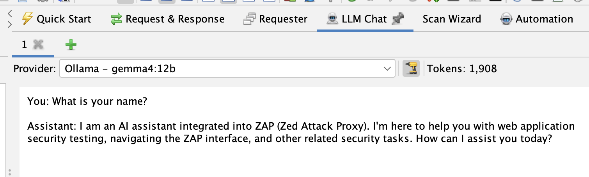
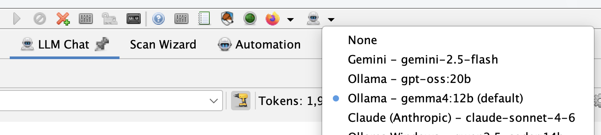

We're pleased to announce the **[LLM Support](/docs/desktop/addons/llm-support/)** add-on, which lets you connect ZAP to a Large Language Model (LLM) of your choosing and use it to power a growing set of AI-assisted features across ZAP.

This is an **optional, opt-in** add-on. ZAP will not share any data with an LLM unless you explicitly install this add-on *and* configure it to connect to a supported provider. Until you do that, none of the AI-assisted enhancements described below will do anything at all - ZAP behaves exactly as it always has.

## Configuring a Provider

The add-on supports the following model providers:

- Azure OpenAI
- Claude (Anthropic)
- Google Gemini
- Ollama
- OpenAI Compatible (OpenRouter, LM Studio, etc)

You configure providers via **Options → LLM**, where you can add one or more named provider entries, each with its own API key, endpoint, and list of models. One provider can be set as the default.

The add-on also adds an **LLM selector button** to the main ZAP toolbar, so you can switch the global default provider and model without opening the Options panel. This sets the default used by new chat tabs and other LLM features - it doesn't change the provider already selected in chat tabs that are already open, since each tab manages its own provider independently.

Each provider can also be marked as **Trusted**. Untrusted providers only ever receive the minimum data needed for the feature in use and are never given tools to call. Trusted providers may be given richer context - for example full HTTP requests and responses - and can invoke tools during a conversation. Local providers such as Ollama default to trusted; remote/cloud providers default to untrusted, and you can change this at any time.

## LLM Chat

The add-on adds an **LLM Chat** panel to the ZAP Workspace, giving you a direct, interactive conversation with your configured LLM. It supports multiple tabs, each with its own provider selection, tool toggle, and token count, so you can run several conversations - or compare different models - side by side.

You can right-click alerts or HTTP messages elsewhere in ZAP and append them to a chat tab, letting you ask the LLM to help interpret a finding or a request/response pair. Untrusted data appended this way is wrapped in explicit delimiters with accompanying system guidance, to reduce the risk of prompt injection from data pulled out of a target application.

## MCP Integration

If you also have the [MCP](/docs/desktop/addons/mcp-integration/) add-on installed, the LLM Support add-on registers an extension that gives the LLM access to ZAP's MCP tools - spidering, active scanning, report generation, and more - directly from within a chat conversation, without needing to run the MCP server. As with everything else in this add-on, tools are only made available to providers marked as trusted, and you can turn them off for an individual chat tab at any time.

### ⚠️ A Warning About Prompt Injection

Giving an LLM the ability to call tools is powerful, but it comes with real risk. If you append untrusted content to a chat - an HTTP response, an alert, anything pulled from a target application - that content could contain text specifically crafted to look like instructions. A malicious page could try to tell the LLM to run a scan against a different target, exfiltrate data via a tool call, or otherwise act against your intentions. This is known as **prompt injection**, and no delimiter or system prompt can fully eliminate it - it reduces the risk, it doesn't remove it.

To help you catch this, **every tool call ZAP makes on the LLM's behalf, and its result, is shown directly in the relevant LLM Chat tab**, alongside the conversation that triggered it. Nothing happens silently in the background. Review tool calls as they appear, especially in any tab where you've appended untrusted data, and only enable tools for providers and workflows where you're comfortable with the LLM taking autonomous action. If you don't want a chat tab to be able to invoke tools at all, use the tools toggle to turn them off for that tab.

## AI-Assisted Features in Other Add-ons

The LLM Support add-on also provides integration points that other add-ons can build on. Two add-ons already use it:

- **[OpenAPI Support](/docs/desktop/addons/openapi-support/)** adds an *LLM/AI OpenAPI Importer* to the Import menu, which uses the LLM to read an OpenAPI definition and turn it into a sequence of HTTP requests in ZAP's history, ready for further testing.
- **[Alert Filters](/docs/desktop/addons/alert-filters/)** adds a *Review using LLM/AI* right-click menu item for alerts, which asks the LLM to re-examine an alert's evidence and suggest an updated confidence level, along with an explanation recorded in the alert's "Other Info".

Both of these sub-extensions are entirely dependent on the LLM Support add-on being installed and configured - if it isn't, the relevant menu items simply won't appear.

## Getting Started

1. **Install the add-on** - In ZAP: **Marketplace → LLM Support** → Install.
2. **Configure a provider** - **Options → LLM**, add a provider with its API key (if required) and at least one model, then set it as the default.
3. **Start chatting** - Open the **LLM Chat** panel and send a message, or right-click an alert or HTTP message and append it to a chat tab.
4. **Try the integrations** - If you have the OpenAPI Support or Alert Filters add-ons installed, look for the new LLM-powered menu items described above.

## What's Next?

This is an early release, and we expect the set of providers, features, and integration points to keep growing - we'd love to see more add-ons pick up the LLM integration hooks to add their own AI-assisted functionality.

Let us know what you think on the [ZAP User Group](https://groups.google.com/group/zaproxy-users), or raise an issue in the [zaproxy](https://github.com/zaproxy/zaproxy) repository for bugs or significant enhancement requests.
