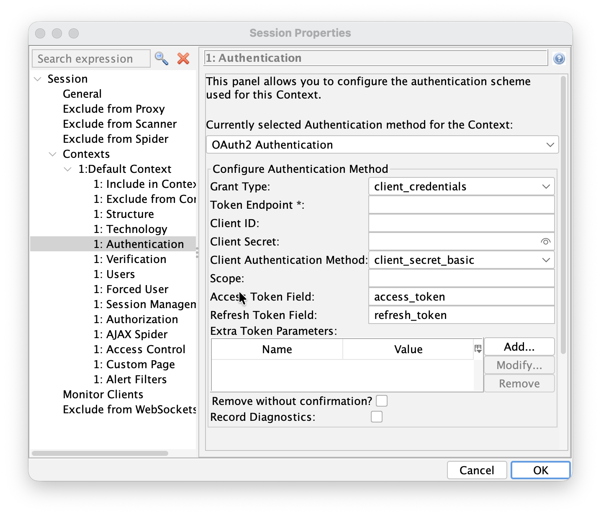

## OAuth2.0 support has landed in Authentication Helper

We're pleased to announce the first version of OAuth2.0 support in the [Authentication Helper add-on](/docs/desktop/addons/authhelper/). 
The new authentication method is configured against a single token endpoint and handles the non-interactive grant types that work well with automated and CI-driven scanning:

- **client_credentials** (the default)
- **password** (resource owner password credentials)

Note that we recommend only using this new method for authenticating to APIs (where relevant), not for
web apps that use OAuth2.0.

If you have a web app that has an authentication flow that uses web based login screens then you should
continue to use either [Browser Based Authentication](/docs/desktop/addons/authentication-helper/browser-auth/)
or [Client Script Authentication](/docs/desktop/addons/authentication-helper/client-script/),
even if those screens drive OAuth2.0 in the background.
These options are needed in order to explore your app with the modern spiders.

## How to configure it

Update to the latest version of the [Authentication Helper add-on](/docs/desktop/addons/authhelper/) add-on, or use the latest [weekly release](/download/#weekly).

### Desktop UI

1. Double click on the Context you want to configure
1. Select the Authentication screen
1. Select OAuth2 Authentication in the authentication pulldown



### Automation Framework

An example Automation Framework configuration looks like:

```yaml
env:
  contexts:
  - name: "oauth2-context"
    urls:
    - "https://api.example.com"
    includePaths:
    - "https://api\\.example\\.com.*"
    excludePaths: []
    authentication:
      method: "oauth2"
      parameters:
        grantType: "client_credentials"
        tokenEndpoint: "https://authserver.example.com/token"
        clientId: "test-client"
        clientSecret: "test-secret"
        clientAuthMethod: "client_secret_basic"
        extraTokenParams:
          require_client_auth_method: "client_secret_basic"
      verification:
        method: "response"
        loggedInRegex: "\\Q 200 OK\\E"
        loggedOutRegex: "\\Q 401 Unauthorized\\E"
    sessionManagement:
      method: "headers"
      parameters:
        Authorization: "Bearer "
    users:
    - name: "test-user"
      credentials: {}
```

For more details see the OAuth2.0 Automation Framework [help](/docs/desktop/addons/authentication-helper/auth2-auth/).

### API

The OAuth2 method is available through the ZAP API. To check which authentication methods are available for a context, request:

```bash
curl -X GET "http://localhost:8080/JSON/authentication/view/getSupportedAuthenticationMethods/"
```

The OAuth2 method is listed as `oauth2Authentication`. To set the method and its configuration on a context (ID 1), send a request such as:

```bash
curl -X POST "http://localhost:8080/JSON/authentication/action/setAuthenticationMethod/" -d \
"contextId=1&authMethodName=oauth2Authentication&\
authMethodConfigParams=grantType%3D\client_credentials%26\
tokenEndpoint%3Dhttps%3A%2F%2Fauthserver.example.com%2Ftoken%26\
clientId%3Dtest-client%26\
clientSecret%3Dtest-secret%26\
clientAuthMethod%3Dclient_secret_basic"
```

The `authMethodConfigParams` object supports the same parameters as the desktop UI: `grantType`, `tokenEndpoint`, `clientId`, `clientSecret`, `clientAuthMethod`, `scope`, `accessTokenField`, `refreshTokenField` and `extraTokenParams`. 

## OAuth2 configuration parameters

For each of the grant types you can configure the token endpoint URL, client identifier and secret, the client authentication method (client_secret_basic, client_secret_post, or none for public clients), the scope, custom JSON field names for the access and refresh tokens, and any extra parameters to send to the token endpoint.

When a token is obtained, the add-on normalises the token response so the tokens are always available under the canonical `access_token` / `refresh_token` JSON keys, and it feeds them into the configured session management method. That means templating such as `Authorization: Bearer ` in 
[Header Based Session Management](/docs/desktop/addons/authentication-helper/session-header/) works with OAuth2 as you'd expect.

## What's not yet supported

This is an early release, and there are a few important gaps to be aware of before you rely on it:

- **Limited Autodetection for Verification and Session Management.** This may work in some cases but has not been tested, so should not be relied upon.
- **The interactive "Authorization Code" grant is not supported.** The Authentication Helper only handles non-interactive grants that exchange directly against a token endpoint. The browser-based flow — where a user signs in on an authorization endpoint, is redirected back with a code, and the code is exchanged for a token — is not yet implemented.
- **No proactive token refresh.** The method does not currently read `expires_in` or refresh tokens on its own. If a token expires mid-scan, ZAP will see a 401 on a subsequent request and trigger re-authentication, rather than silently refreshing the token first.
- **PKCE is not yet supported.** Public clients can be configured with `client_auth: none`, but the PKCE challenge/response is not yet enforced.
- **Other grant types and OIDC extensions** (e.g. JWT bearer, dynamic client registration, userinfo) are not part of this initial release.

You can see the full behaviour, including the known gaps, in the [help](/docs/desktop/addons/authentication-helper/auth2-auth/).

As you can see we have plenty of things left to do and we want your feedback to help us prioritise it. 

## Give us your feedback

We'd love to hear from you. Try the new method against your IdP and let us know how it goes:

- On the [ZAP User Group](https://groups.google.com/group/zaproxy-users)
- By raising [issues](https://github.com/zaproxy/zaproxy/issues) for bugs - please include enough information for us to reproduce the problem

The more real-world feedback we get, the better the next release will be.
